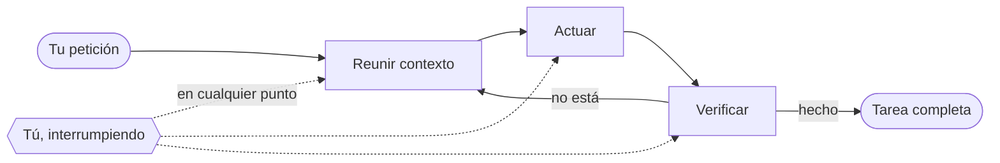
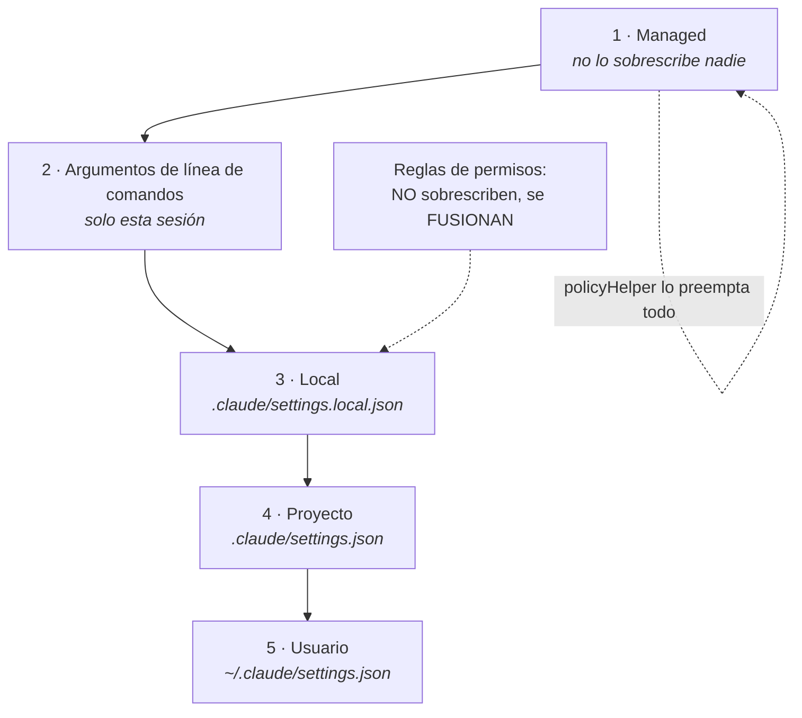
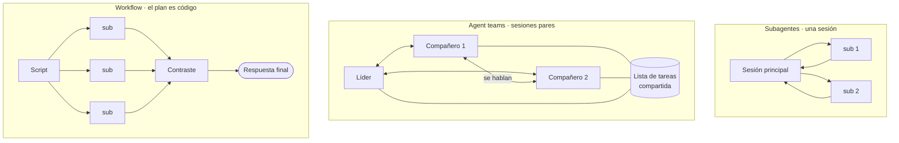
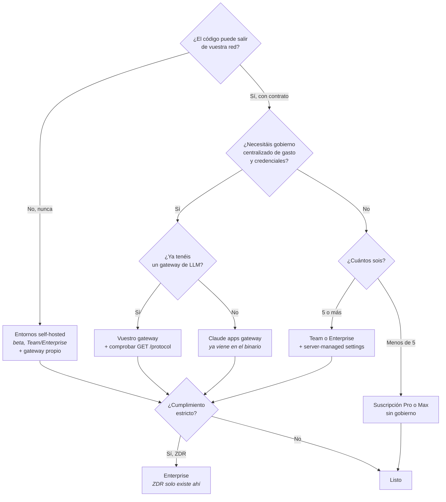

<!-- GENERADO por fabrica/construir.py · no editar a mano -->

# Guía Definitiva de Claude Code

**Versión de la guía:** v2026.08
**Verificada contra:** Claude Code **2.1.228**
**Fecha de corte:** 12 de agosto de 2026
**Audiencia:** arquitecto o consultor que despliega para equipos; lector secundario, dev diario
**Entorno de referencia:** Linux en servidor propio, con notas para macOS y WSL2

> Esta guía no está afiliada, patrocinada ni respaldada por Anthropic.
> Toda afirmación técnica procede de documentación oficial descargada el 12 de
> agosto de 2026, de la superficie observable del CLI instalado, o de mediciones
> propias, y cada módulo declara sus fuentes al pie.

---

## Índice
- [M1 · Qué es Claude Code y cómo funciona por dentro](#m1-qué-es-claude-code-y-cómo-funciona-por-dentro)
  - [1.1 · El bucle agéntico](#11-el-bucle-agéntico)
  - [1.2 · Qué puede tocar](#12-qué-puede-tocar)
  - [1.3 · Entornos de ejecución frente a interfaces](#13-entornos-de-ejecución-frente-a-interfaces)
  - [1.4 · Sesiones](#14-sesiones)
  - [1.5 · La ventana de contexto](#15-la-ventana-de-contexto)
  - [1.6 · Checkpoints](#16-checkpoints)
- [M2 · Instalación, autenticación y actualización](#m2-instalación-autenticación-y-actualización)
  - [2.1 · Instaladores](#21-instaladores)
  - [2.2 · Anatomía de una instalación nativa](#22-anatomía-de-una-instalación-nativa)
  - [2.3 · Windows, WSL2 y musl](#23-windows-wsl2-y-musl)
  - [2.4 · Verificar la instalación](#24-verificar-la-instalación)
  - [2.5 · Integridad del binario](#25-integridad-del-binario)
  - [2.6 · Canales de release y suelo de versión](#26-canales-de-release-y-suelo-de-versión)
  - [2.7 · Autenticación, y su orden de precedencia](#27-autenticación-y-su-orden-de-precedencia)
  - [2.8 · Tokens de larga duración](#28-tokens-de-larga-duración)
  - [2.9 · Desinstalación limpia](#29-desinstalación-limpia)
  - [2.10 · Errores de instalación](#210-errores-de-instalación)
- [M3 · El directorio `.claude/` y el sistema de configuración](#m3-el-directorio-claude-y-el-sistema-de-configuración)
  - [3.1 · Dónde vive cada cosa](#31-dónde-vive-cada-cosa)
  - [3.2 · Los cuatro ámbitos y quién gana](#32-los-cuatro-ámbitos-y-quién-gana)
  - [3.3 · Settings de worktree](#33-settings-de-worktree)
  - [3.4 · Ver los settings que de verdad se están aplicando](#34-ver-los-settings-que-de-verdad-se-están-aplicando)
  - [3.5 · Depurar la configuración](#35-depurar-la-configuración)
  - [3.6 · Excluir archivos sensibles](#36-excluir-archivos-sensibles)
- [M4 · Memoria y contexto](#m4-memoria-y-contexto)
  - [4.1 · La ley que gobierna todo el módulo](#41-la-ley-que-gobierna-todo-el-módulo)
  - [4.2 · Cómo se cargan de verdad los `CLAUDE.md`](#42-cómo-se-cargan-de-verdad-los-claudemd)
  - [4.3 · Imports, y qué hacer si ya tienes `AGENTS.md`](#43-imports-y-qué-hacer-si-ya-tienes-agentsmd)
  - [4.4 · Organizar con `.claude/rules/`](#44-organizar-con-clauderules)
  - [4.5 · Auto memory](#45-auto-memory)
  - [4.6 · `CLAUDE.md` para toda la organización](#46-claudemd-para-toda-la-organización)
  - [4.7 · Qué sobrevive a la compactación](#47-qué-sobrevive-a-la-compactación)
  - [4.8 · Cuándo mover algo del `CLAUDE.md` a otro sitio](#48-cuándo-mover-algo-del-claudemd-a-otro-sitio)
- [M5 · Permisos, modos y seguridad operativa](#m5-permisos-modos-y-seguridad-operativa)
  - [5.1 · Los modos de permisos](#51-los-modos-de-permisos)
  - [5.2 · Auto mode pasa a ser el modo por defecto](#52-auto-mode-pasa-a-ser-el-modo-por-defecto)
  - [5.3 · Qué bloquea el clasificador por defecto](#53-qué-bloquea-el-clasificador-por-defecto)
  - [5.4 · Reglas de permisos](#54-reglas-de-permisos)
  - [5.5 · Rutas protegidas y confianza del espacio de trabajo](#55-rutas-protegidas-y-confianza-del-espacio-de-trabajo)
  - [5.6 · Configurar el clasificador](#56-configurar-el-clasificador)
  - [5.7 · Sandboxing](#57-sandboxing)
  - [5.8 · Elegir el aislamiento](#58-elegir-el-aislamiento)
  - [5.9 · Inyección de prompt](#59-inyección-de-prompt)
- [M6 · El flujo de trabajo diario que de verdad funciona](#m6-el-flujo-de-trabajo-diario-que-de-verdad-funciona)
  - [6.1 · Explorar, planificar, implementar, verificar](#61-explorar-planificar-implementar-verificar)
  - [6.2 · Dale algo contra lo que verificar](#62-dale-algo-contra-lo-que-verificar)
  - [6.3 · Ser específico por adelantado](#63-ser-específico-por-adelantado)
  - [6.4 · Corregir el rumbo pronto](#64-corregir-el-rumbo-pronto)
  - [6.5 · Gestión agresiva del contexto](#65-gestión-agresiva-del-contexto)
  - [6.6 · Rewind y sus límites](#66-rewind-y-sus-límites)
  - [6.7 · Repositorios grandes](#67-repositorios-grandes)
  - [6.8 · Anti-patrones, y a qué huelen](#68-anti-patrones-y-a-qué-huelen)
- [M7 · Extensión: skills, comandos, output styles y barra de estado](#m7-extensión-skills-comandos-output-styles-y-barra-de-estado)
  - [7.1 · Anatomía de una skill](#71-anatomía-de-una-skill)
  - [7.2 · La descripción es el disparador](#72-la-descripción-es-el-disparador)
  - [7.3 · El ciclo de vida del contenido](#73-el-ciclo-de-vida-del-contenido)
  - [7.4 · Argumentos y contexto dinámico](#74-argumentos-y-contexto-dinámico)
  - [7.5 · Pre-aprobar herramientas](#75-pre-aprobar-herramientas)
  - [7.6 · Ejecutar una skill en un subagente](#76-ejecutar-una-skill-en-un-subagente)
  - [7.7 · Cuando se activa demasiado](#77-cuando-se-activa-demasiado)
  - [7.8 · Output styles: qué son y qué no](#78-output-styles-qué-son-y-qué-no)
  - [7.9 · Barra de estado](#79-barra-de-estado)
  - [7.10 · La interfaz alrededor](#710-la-interfaz-alrededor)
- [M8 · MCP a fondo](#m8-mcp-a-fondo)
  - [8.1 · Los cuatro transportes](#81-los-cuatro-transportes)
  - [8.2 · Ámbitos y precedencia](#82-ámbitos-y-precedencia)
  - [8.3 · Tool search, o por qué MCP ya no es el peaje que era](#83-tool-search-o-por-qué-mcp-ya-no-es-el-peaje-que-era)
  - [8.4 · Autenticación con servidores remotos](#84-autenticación-con-servidores-remotos)
  - [8.5 · Límites de salida](#85-límites-de-salida)
  - [8.6 · Llamadas largas en segundo plano](#86-llamadas-largas-en-segundo-plano)
  - [8.7 · Recursos, prompts y elicitación](#87-recursos-prompts-y-elicitación)
  - [8.8 · Claude Code como servidor MCP](#88-claude-code-como-servidor-mcp)
  - [8.9 · Gobierno corporativo](#89-gobierno-corporativo)
  - [8.10 · Tres montajes completos](#810-tres-montajes-completos)
- [M9 · Paralelismo y agentes](#m9-paralelismo-y-agentes)
  - [9.1 · Cuatro formas de correr agentes, y tres cosas que no lo son](#91-cuatro-formas-de-correr-agentes-y-tres-cosas-que-no-lo-son)
  - [9.2 · La decisión](#92-la-decisión)
  - [9.3 · Subagentes](#93-subagentes)
  - [9.4 · Agent view · *research preview*](#94-agent-view-research-preview)
  - [9.5 · Agent teams · *experimental, desactivado por defecto*](#95-agent-teams-experimental-desactivado-por-defecto)
  - [9.6 · Workflows dinámicos](#96-workflows-dinámicos)
  - [9.7 · Worktrees: las cuatro comprobaciones](#97-worktrees-las-cuatro-comprobaciones)
  - [9.8 · Mensajería entre sesiones](#98-mensajería-entre-sesiones)
  - [9.9 · Tres recorridos que sí valen la pena](#99-tres-recorridos-que-sí-valen-la-pena)
  - [9.10 · Qué cuesta y cómo se para](#910-qué-cuesta-y-cómo-se-para)
- [M10 · Automatización: hooks, programación y modo no interactivo](#m10-automatización-hooks-programación-y-modo-no-interactivo)
  - [10.1 · Anatomía de un hook](#101-anatomía-de-un-hook)
  - [10.2 · Los cinco tipos de manejador](#102-los-cinco-tipos-de-manejador)
  - [10.3 · Las tres cadencias](#103-las-tres-cadencias)
  - [10.4 · Tabla 6 · Los 31 eventos](#104-tabla-6-los-31-eventos)
  - [10.5 · Hooks asíncronos](#105-hooks-asíncronos)
  - [10.6 · Tabla 13 · Programación temporal](#106-tabla-13-programación-temporal)
  - [10.7 · Modo no interactivo](#107-modo-no-interactivo)
  - [10.8 · Seis hooks listos para copiar](#108-seis-hooks-listos-para-copiar)
- [M11 · Plugins y distribución interna](#m11-plugins-y-distribución-interna)
  - [11.1 · Cuándo un plugin y cuándo no](#111-cuándo-un-plugin-y-cuándo-no)
  - [11.2 · Anatomía, y el error que comete todo el mundo](#112-anatomía-y-el-error-que-comete-todo-el-mundo)
  - [11.3 · De directorio de skills a plugin](#113-de-directorio-de-skills-a-plugin)
  - [11.4 · Marketplaces: dos conceptos que se confunden](#114-marketplaces-dos-conceptos-que-se-confunden)
  - [11.5 · Las cinco fuentes de plugin](#115-las-cinco-fuentes-de-plugin)
  - [11.6 · Dependencias con restricción de versión](#116-dependencias-con-restricción-de-versión)
  - [11.7 · Gobierno: tres piezas para una organización](#117-gobierno-tres-piezas-para-una-organización)
  - [11.8 · Recorrido completo: de configuración suelta a catálogo privado](#118-recorrido-completo-de-configuración-suelta-a-catálogo-privado)
- [M12 · Superficies](#m12-superficies)
  - [12.1 · Dos ejes que la gente colapsa en uno](#121-dos-ejes-que-la-gente-colapsa-en-uno)
  - [12.2 · Tabla 1 · Paridad por superficie](#122-tabla-1-paridad-por-superficie)
  - [12.3 · El terminal sigue siendo la referencia](#123-el-terminal-sigue-siendo-la-referencia)
  - [12.4 · Las IDE](#124-las-ide)
  - [12.5 · Escritorio](#125-escritorio)
  - [12.6 · Web y sesiones en la nube](#126-web-y-sesiones-en-la-nube)
  - [12.7 · Móvil y Remote Control](#127-móvil-y-remote-control)
  - [12.8 · Slack, y una retirada que hay que anunciar](#128-slack-y-una-retirada-que-hay-que-anunciar)
  - [12.9 · Chrome y computer use](#129-chrome-y-computer-use)
  - [12.10 · Routines](#1210-routines)
- [M13 · CI/CD y revisión de código](#m13-cicd-y-revisión-de-código)
  - [13.1 · Los tres niveles de revisión, y cuál cuesta cuánto](#131-los-tres-niveles-de-revisión-y-cuál-cuesta-cuánto)
  - [13.2 · Cómo se leen los hallazgos](#132-cómo-se-leen-los-hallazgos)
  - [13.3 · `REVIEW.md`, o cómo se calibra un revisor](#133-reviewmd-o-cómo-se-calibra-un-revisor)
  - [13.4 · GitHub Actions: los dos modos](#134-github-actions-los-dos-modos)
  - [13.5 · Quién puede dispararla](#135-quién-puede-dispararla)
  - [13.6 · La app de GitHub y sus permisos](#136-la-app-de-github-y-sus-permisos)
  - [13.7 · Fuera de GitHub](#137-fuera-de-github)
  - [13.8 · Los dos plugins de seguridad, que no son lo mismo](#138-los-dos-plugins-de-seguridad-que-no-son-lo-mismo)
  - [13.9 · Qué automatizar y qué no](#139-qué-automatizar-y-qué-no)
- [M14 · Despliegue empresarial](#m14-despliegue-empresarial)
  - [14.1 · La pregunta que va primero](#141-la-pregunta-que-va-primero)
  - [14.2 · Tabla 2 · Disponibilidad por plan y por proveedor](#142-tabla-2-disponibilidad-por-plan-y-por-proveedor)
  - [14.3 · Gateways: el que ya tienes dentro](#143-gateways-el-que-ya-tienes-dentro)
  - [14.4 · El protocolo, y qué se degrada si tu gateway no colabora](#144-el-protocolo-y-qué-se-degrada-si-tu-gateway-no-colabora)
  - [14.5 · Gobierno de la configuración](#145-gobierno-de-la-configuración)
  - [14.6 · La red corporativa](#146-la-red-corporativa)
  - [14.7 · Dónde corren las sesiones](#147-dónde-corren-las-sesiones)
  - [14.8 · El árbol de decisión de arquitectura](#148-el-árbol-de-decisión-de-arquitectura)
  - [14.9 · Lo que hay que dejar escrito antes de desplegar](#149-lo-que-hay-que-dejar-escrito-antes-de-desplegar)
- [M15 · Modelos, coste y observabilidad](#m15-modelos-coste-y-observabilidad)
  - [15.1 · Qué modelo estás usando de verdad](#151-qué-modelo-estás-usando-de-verdad)
  - [15.2 · Tabla 11 · Modelos, alias y niveles de esfuerzo](#152-tabla-11-modelos-alias-y-niveles-de-esfuerzo)
  - [15.3 · Tabla 10 · Qué invalida la caché y qué no](#153-tabla-10-qué-invalida-la-caché-y-qué-no)
  - [15.4 · Cuánto dura la caché](#154-cuánto-dura-la-caché)
  - [15.5 · Cómo se mira](#155-cómo-se-mira)
  - [15.6 · Lo que medimos nosotros](#156-lo-que-medimos-nosotros)
  - [15.7 · Recetas de reducción, por impacto real](#157-recetas-de-reducción-por-impacto-real)
- [M16 · Datos, cumplimiento y privacidad](#m16-datos-cumplimiento-y-privacidad)
  - [16.1 · La línea que lo separa todo: consumo frente a comercial](#161-la-línea-que-lo-separa-todo-consumo-frente-a-comercial)
  - [16.2 · Cuánto se queda](#162-cuánto-se-queda)
  - [16.3 · Zero Data Retention, con letra pequeña](#163-zero-data-retention-con-letra-pequeña)
  - [16.4 · Qué sale de tu máquina aunque no uses Anthropic como proveedor](#164-qué-sale-de-tu-máquina-aunque-no-uses-anthropic-como-proveedor)
  - [16.5 · Sanidad, licencia y acuerdos](#165-sanidad-licencia-y-acuerdos)
  - [16.6 · RGPD y LOPD: el guion de la conversación](#166-rgpd-y-lopd-el-guion-de-la-conversación)
  - [16.7 · La política de un folio](#167-la-política-de-un-folio)
- [M17 · Agent SDK](#m17-agent-sdk)
  - [17.1 · Cuál de las cuatro cosas necesitas](#171-cuál-de-las-cuatro-cosas-necesitas)
  - [17.2 · Los dos modos de entrada, y cuál se recomienda](#172-los-dos-modos-de-entrada-y-cuál-se-recomienda)
  - [17.3 · Sesiones, y dónde viven de verdad](#173-sesiones-y-dónde-viven-de-verdad)
  - [17.4 · Salidas estructuradas](#174-salidas-estructuradas)
  - [17.5 · Herramientas propias, permisos y hooks](#175-herramientas-propias-permisos-y-hooks)
  - [17.6 · Coste: el aviso que hay que leer dos veces](#176-coste-el-aviso-que-hay-que-leer-dos-veces)
  - [17.7 · Despliegue seguro](#177-despliegue-seguro)
  - [17.8 · Lo que se ha retirado](#178-lo-que-se-ha-retirado)
  - [17.9 · El esqueleto de un agente, decidido pieza a pieza](#179-el-esqueleto-de-un-agente-decidido-pieza-a-pieza)
- [M18 · Diagnóstico y errores](#m18-diagnóstico-y-errores)
  - [18.1 · Antes de diagnosticar nada: ya ha reintentado](#181-antes-de-diagnosticar-nada-ya-ha-reintentado)
  - [18.2 · El procedimiento de tres pasos](#182-el-procedimiento-de-tres-pasos)
  - [18.3 · Tabla 14 · El catálogo completo](#183-tabla-14-el-catálogo-completo)
  - [18.4 · Los que más se ven, con causa y arreglo](#184-los-que-más-se-ven-con-causa-y-arreglo)
  - [18.5 · Rendimiento y estabilidad](#185-rendimiento-y-estabilidad)
  - [18.6 · Qué reportar, y cómo](#186-qué-reportar-y-cómo)
- [M19 · Referencia rápida](#m19-referencia-rápida)
  - [19.1 · El tamaño real de la superficie](#191-el-tamaño-real-de-la-superficie)
  - [19.2 · Tabla 7 · Herramientas, comportamiento y límites](#192-tabla-7-herramientas-comportamiento-y-límites)
  - [19.3 · Comandos slash](#193-comandos-slash)
  - [19.4 · Banderas del CLI, y un cruce que merece la pena](#194-banderas-del-cli-y-un-cruce-que-merece-la-pena)
  - [19.5 · Variables de entorno, por categoría](#195-variables-de-entorno-por-categoría)
  - [19.6 · Sintaxis de reglas de permisos](#196-sintaxis-de-reglas-de-permisos)
  - [19.7 · Los 31 eventos de hooks](#197-los-31-eventos-de-hooks)
  - [19.8 · Números que conviene tener a mano](#198-números-que-conviene-tener-a-mano)
  - [19.9 · Glosario mínimo](#199-glosario-mínimo)
- [M20 · Playbooks](#m20-playbooks)
  - [20.1 · Monorepo grande](#201-monorepo-grande)
  - [20.2 · Legacy sin tests](#202-legacy-sin-tests)
  - [20.3 · Equipo de veinte con despliegue gobernado](#203-equipo-de-veinte-con-despliegue-gobernado)
  - [20.4 · Automatización nocturna desatendida en servidor propio](#204-automatización-nocturna-desatendida-en-servidor-propio)
  - [20.5 · Un plugin interno, de cero a catálogo](#205-un-plugin-interno-de-cero-a-catálogo)
  - [20.6 · Lo que comparten los cinco](#206-lo-que-comparten-los-cinco)
- [M21 · Features retiradas, renombradas y trampas de tutoriales viejos](#m21-features-retiradas-renombradas-y-trampas-de-tutoriales-viejos)
  - [21.1 · Por qué este módulo existe](#211-por-qué-este-módulo-existe)
  - [21.2 · Tabla 15 · Cronología 2026](#212-tabla-15-cronología-2026)
  - [21.3 · Retirado: ya no existe](#213-retirado-ya-no-existe)
  - [21.4 · Renombrado y en retirada](#214-renombrado-y-en-retirada)
  - [21.5 · Cambios de comportamiento por defecto](#215-cambios-de-comportamiento-por-defecto)
  - [21.6 · Endurecimientos silenciosos](#216-endurecimientos-silenciosos)
  - [21.7 · Cómo saber si tu fuente está caducada](#217-cómo-saber-si-tu-fuente-está-caducada)


---

# M1 · Qué es Claude Code y cómo funciona por dentro

> **Para quién es:** todo el mundo, y es el único módulo que no se puede saltar nadie.
> **Qué resuelve:** el modelo mental. Por qué hace lo que hace, y por qué a veces no lo hace.
> **Qué NO cubre:** ni una línea de configuración. Eso empieza en el M2.

*Verificado contra Claude Code 2.1.228 el 12 de agosto de 2026.*

---

## 1.1 · El bucle agéntico

Claude Code no es un chat que además escribe archivos. Es un **arnés agéntico**
alrededor de un modelo: le da herramientas, gestión de contexto y un entorno donde
ejecutar. Eso es lo que convierte un modelo de lenguaje en algo que trabaja.

El bucle tiene tres fases que se mezclan entre sí: **reunir contexto**, **actuar**
y **verificar**. Claude usa herramientas en las tres, ya sea buscando archivos
para entender el código, editando para cambiarlo o lanzando los tests para
comprobar su propio trabajo.



El bucle **se adapta a lo que pides**. Una pregunta sobre el código puede
resolverse solo con la primera fase. Un bug pasa por las tres varias veces. Una
refactorización se va casi entera en verificar. Claude decide qué requiere cada
paso a partir de lo que aprendió en el anterior, encadena decenas de acciones y
corrige el rumbo por el camino.

**Tú también estás en el bucle.** Puedes interrumpir en cualquier punto para
llevarlo a otro sitio, darle más contexto o pedirle otro enfoque. Trabaja solo,
pero no trabaja sordo.

💡 **Opinión operativa.** La consecuencia práctica de que el bucle sea adaptativo
es que **la calidad de la fase de verificación la pones tú**. Si el repositorio no
tiene nada contra lo que verificar (tests, un linter, un esquema), el bucle se
queda en dos fases y lo que sale es plausible en vez de correcto. Es la diferencia
más grande entre un proyecto donde esto funciona y uno donde no, y no depende del
modelo.

---

## 1.2 · Qué puede tocar

Cuando ejecutas `claude` en un directorio, el agente accede a:

| Acceso | Alcance |
|---|---|
| Tu proyecto | Archivos del directorio y subdirectorios. Fuera de ahí, solo con permiso |
| Tu terminal | Cualquier comando que pudieras ejecutar tú: build, git, gestores de paquetes, scripts |
| Tu estado de git | Rama actual, cambios sin confirmar e historial reciente |
| Tu `CLAUDE.md` | Instrucciones y convenciones del proyecto, cargadas en cada sesión |
| Auto memory | Lo que aprende solo. Se cargan **las primeras 200 líneas o 25 KB** de `MEMORY.md`, lo que llegue antes |
| Extensiones | Servidores MCP, skills, subagentes y Claude en Chrome |

La frase que importa de esa tabla es la segunda: **cualquier comando que pudieras
ejecutar tú**. No es una integración con permisos recortados, es tu propia cuenta.
Todo el M5 existe por esa línea.

Y como ve el proyecto entero, trabaja a lo ancho: para "arregla el bug de
autenticación" busca los archivos, lee varios para entender el contexto, hace
ediciones coordinadas entre ellos, lanza los tests y confirma los cambios si se lo
pides. Es otra categoría de herramienta que un asistente en línea que solo ve el
archivo abierto.

---

## 1.3 · Entornos de ejecución frente a interfaces

Dos ejes que se confunden constantemente, y confundirlos hace perder tardes:

- **Dónde se ejecuta**: tu máquina, un contenedor, un entorno cloud, un runner
  self-hosted dentro de tu red.
- **Desde dónde lo pilotas**: terminal, VS Code, JetBrains, escritorio, web,
  móvil, Slack.

Son independientes. Puedes pilotar desde el móvil algo que corre en tu servidor.
La tabla de paridad completa, con qué falta en cada superficie, está en el M12.

---

## 1.4 · Sesiones

Una sesión es una conversación con su contexto. Se puede **reanudar**,
**bifurcar** y **nombrar**, y las transcripciones se guardan en disco, así que son
accesibles desde scripts.

Lo que conviene interiorizar ya: **una sesión larga no es gratis**. Cada turno
arrastra los anteriores, y esa es la razón número uno de las facturas que
sorprenden. Los números medidos están en el M15.

---

## 1.5 · La ventana de contexto

En la ventana caben el historial de la conversación, el contenido de los archivos
leídos, la salida de los comandos, el `CLAUDE.md`, la auto memory, las skills
cargadas y las instrucciones del sistema.

Este es el reparto de una sesión de ejemplo de la documentación oficial, y merece
mirarse con calma porque desmonta un par de creencias:

| Componente | Tokens (ejemplo oficial) |
|---|---:|
| System prompt | 4.200 |
| `CLAUDE.md` del proyecto | 1.800 |
| Auto memory | 680 |
| Descripciones de skills | 450 |
| `~/.claude/CLAUDE.md` | 320 |
| Información del entorno | 280 |
| **Herramientas MCP (diferidas)** | **120** |
| Tu prompt | 45 |

⚠️ **Esto corrige un error que circula mucho, y que este mismo proyecto tenía
publicado.** Las definiciones de herramientas MCP **están diferidas por defecto**:
solo se cargan los **nombres**, para que Claude sepa qué hay disponible, y los
esquemas completos se traen bajo demanda mediante *tool search* cuando la tarea lo
necesita. No es un peaje permanente proporcional al número de servidores, salvo
que tú lo conviertas en uno:

- `ENABLE_TOOL_SEARCH=auto` carga los esquemas por adelantado **si caben en el 10 %
  de la ventana**.
- `ENABLE_TOOL_SEARCH=false` carga todo, siempre. Aquí sí vuelve el peaje.

Verificable en `/docs/en/mcp#scale-with-mcp-tool-search`. Ejecuta `/mcp` para ver
el coste por servidor y `/context` para ver el reparto real de tu sesión.

**Los subagentes son la otra pieza que la tabla explica.** En ese mismo ejemplo,
todo lo que hace un subagente (su system prompt, su copia del `CLAUDE.md`, sus
herramientas, sus lecturas) computa **cero** en la sesión principal. Lo único que
vuelve es el resumen, 420 tokens. Eso es aislamiento de contexto, y es la razón
por la que el M9 existe.

### Cuando el contexto se llena

Claude Code lo gestiona solo: primero descarta salidas de herramientas antiguas y
después resume la conversación. **Se conservan tus peticiones y los fragmentos de
código clave; las instrucciones detalladas del principio se pueden perder.** De
ahí la regla que gobierna el M4 entero: lo que tiene que sobrevivir va en
`CLAUDE.md`, no en el historial.

Para dirigir qué se conserva, añade una sección *Compact Instructions* al
`CLAUDE.md` o lanza `/compact` con un foco, por ejemplo `/compact céntrate en los
cambios de la API`.

Caso de fallo documentado: si un solo archivo o salida es tan grande que el
contexto se vuelve a llenar justo después de cada resumen, Claude Code deja de
auto-compactar tras unos intentos y muestra un error en vez de entrar en bucle.

---

## 1.6 · Checkpoints

**Las ediciones de archivos son reversibles.** Antes de editar, Claude guarda una
instantánea del contenido. Con `Esc` dos veces se rebobina a un estado anterior, o
se le pide que deshaga.

Tres límites que hay que saber antes de confiarse:

1. Los checkpoints **son independientes de git** y siguen disponibles al reanudar.
2. **Solo cubren cambios en archivos.** Al restaurar se saltan los enlaces
   simbólicos y los enlaces duros.
3. **Lo que toca sistemas remotos no se puede rebobinar**: bases de datos, APIs,
   despliegues. Por eso Claude pregunta antes de ejecutar comandos con efectos
   externos, y por eso ese permiso no se concede a la ligera.

---

## Checklist de verificación

- [ ] Sé decir en qué fase del bucle está fallando cuando algo sale mal.
- [ ] He ejecutado `/context` en un proyecto real y he mirado el reparto.
- [ ] Sé cuánto ocupa mi `CLAUDE.md` y si eso es proporcionado.
- [ ] He comprobado con `/mcp` el coste de mis servidores, sabiendo que por
      defecto van diferidos.
- [ ] He rebobinado con `Esc` `Esc` al menos una vez, a propósito, para saber
      cómo se siente.
- [ ] Tengo claro qué acciones de mi trabajo **no** son reversibles.

## Errores típicos

| Síntoma | Qué está pasando de verdad |
|---|---|
| "Se le olvida lo que le dije al principio" | Compactó. Esa instrucción tenía que estar en `CLAUDE.md`, no en el chat |
| "Desconecto los MCP para ahorrar contexto" | Por defecto solo pesan los nombres. Mide con `/mcp` antes de amputar |
| "Deshice con `Esc` `Esc` y la base de datos seguía modificada" | Los checkpoints solo cubren archivos. Nunca sistemas remotos |
| "Da respuestas plausibles pero incorrectas" | No hay contra qué verificar. El bucle se quedó en dos fases |
| "El resumen automático se repite sin avanzar" | Un archivo o salida gigante. Es el error de *thrashing*, está documentado |

---

## Fuentes usadas en este módulo

Descargadas el 12 de agosto de 2026 desde `code.claude.com/docs/en/`:

| Página | Bytes | Para qué |
|---|---:|---|
| `how-claude-code-works.md` | 20.582 | Bucle, accesos, entornos, sesiones, checkpoints |
| `context-window.md` | 58.687 | Reparto del contexto, MCP diferido, compactación |
| `sessions.md` | 24.950 | Reanudar, bifurcar, nombrar, transcripciones |
| `overview.md` | 16.422 | Encuadre general |
| `features-overview.md` | 31.711 | Encuadre general |
| `quickstart.md` | 13.117 | Encuadre general |

**Marcas pendientes:** ninguna `⚠️ VERIFICAR` abierta en este módulo. La única
marca de aviso corrige material propio y ya está resuelta contra la documentación.

---

# M2 · Instalación, autenticación y actualización

> **Para quién es:** quien monta la máquina, la suya o la de veinte personas.
> **Qué resuelve:** un entorno reproducible y saber siempre contra qué versión trabajas.
> **Qué NO cubre:** despliegue de flota, proveedores cloud ni gateways (M14).

*Verificado contra Claude Code 2.1.228 el 12 de agosto de 2026.*
*Este módulo se escribió el último a propósito: es el que más rápido envejece.*

---

## 2.1 · Instaladores

Hay varias vías y **no son equivalentes**, sobre todo en cómo se actualizan:

| Vía | Notas |
|---|---|
| **Nativa** | La recomendada. Instala un binario propio y gestiona sus versiones |
| **Homebrew** | En macOS. Las actualizaciones las lleva Homebrew, no Claude Code |
| **WinGet** | En Windows |
| **Gestores de Linux** | apt, dnf, apk |
| **npm** | Sigue disponible |

La documentación cubre además **instalar una versión concreta**, que es lo que
necesitas para reproducir un fallo o para fijar una máquina de CI.

---

## 2.2 · Anatomía de una instalación nativa

Merece verse una de verdad, porque explica cómo funcionan las actualizaciones.
Esta es la de la máquina donde se ha escrito esta guía:

```
~/.local/bin/claude  →  ~/.local/share/claude/versions/2.1.228
```

**El comando del `PATH` es un enlace simbólico a una versión concreta.** Actualizar
es instalar una versión nueva al lado y mover el enlace, por eso una actualización
no rompe una sesión que ya está corriendo.

⚠️ Y de ahí sale la trampa del lanzador corporativo del M14: **los procesos que
Claude Code lanza desde su propio binario arrancan por la ruta directa**, no
consultando el `PATH`, así que un lanzador que envuelva el `claude` del `PATH`
**no los alcanza**.

---

## 2.3 · Windows, WSL2 y musl

Tres casos con página propia, y conviene saber que existen antes de pelearse:

- **Windows**: instalación nativa o vía WinGet, con su propia guía de puesta a
  punto.
- **WSL2**: funciona, con un aviso del M18 que ahorra una tarde: hay un problema
  documentado de **búsquedas lentas o incompletas en WSL**. Si tu gente dice que
  "no encuentra archivos que están ahí", empieza por ahí y no por la
  configuración.
- **Alpine Linux y distribuciones basadas en musl**: tienen sección propia, con
  dependencias adicionales. No des por hecho que lo que funciona en Debian
  funciona en Alpine, que es justo el caso de muchos contenedores de CI.

---

## 2.4 · Verificar la instalación

```bash
claude --version      # la versión, y es el dato que zanja discusiones
claude doctor         # diagnóstico de solo lectura, sin abrir sesión
```

`claude doctor` responde lo que importa para dar soporte a otro: método de
instalación, plataforma, ruta, si las autoactualizaciones están activadas, qué
canal sigue y **cuándo fue el último intento de actualización y con qué
resultado**. En la máquina de esta guía:

```
Running: native (2.1.228)
Platform: linux-x64
Config install method: native
Auto-updates: enabled
Auto-update channel: latest
Last update attempt: success → 2.1.228 (2026-08-12)
No installation issues found.
```

Del M3: **`/doctor` dentro de una sesión hace mucho más**, incluida la propuesta de
arreglos que aplica solo si confirmas.

---

## 2.5 · Integridad del binario

Esta sección es la que pide seguridad y casi nadie sabe que existe:

> Cada release publica un **`manifest.json` con las sumas SHA256 de todos los
> binarios de todas las plataformas**. El manifiesto **está firmado con una clave
> GPG de Anthropic**, así que **verificar la firma del manifiesto verifica de
> forma transitiva todos los binarios que lista**.

La clave pública se publica en una URL fija y se importa con `gpg`. El
procedimiento necesita una shell POSIX con `gpg` y `curl`; en Windows, Git Bash o
WSL, y el paso final tiene alternativa en PowerShell.

💡 Si tu organización exige verificación de procedencia del software que instala,
esto es lo que hay que enseñarle a quien lo pida, y es una respuesta mucho mejor
que "lo bajamos de la web oficial".

---

## 2.6 · Canales de release y suelo de versión

Dos ajustes que juntos resuelven el problema de "a mi compañero le funciona un
comando que a mí no me existe":

**Canal**, con `autoUpdatesChannel`:

- **`"latest"`**, el valor por defecto: funciones nuevas en cuanto salen.
- **`"stable"`**: una versión de **aproximadamente una semana de antigüedad**, que
  **se salta las releases con regresiones importantes**.

**Suelo**, con `minimumVersion`: las autoactualizaciones y `claude update`
**se niegan a instalar por debajo de ese valor**.

```json
{
  "autoUpdatesChannel": "stable",
  "minimumVersion": "2.1.100"
}
```

Y el detalle bien pensado: **pasar de `latest` a `stable` no te degrada** si ya
estás en una versión más nueva. Al cambiar desde `/config` te pregunta si quieres
quedarte en la actual o permitir la bajada; **si eliges quedarte, fija
`minimumVersion` en esa versión**. Volver a `latest` lo limpia.

En **settings gestionados**, `minimumVersion` impone un mínimo para toda la
organización. Recuerda del M3 que **`requiredMinimumVersion` falla abierto por
diseño**: un valor inválido se descarta en vez de impedir que Claude Code arranque.

💡 **Recomendación para un equipo:** canal `stable` y un `minimumVersion` explícito
en los settings del repositorio, más la versión anotada en el `CLAUDE.md`. Con eso,
cuando alguien reporte un comportamiento raro, la primera pregunta ya tiene
respuesta escrita.

---

## 2.7 · Autenticación, y su orden de precedencia

Cuando hay varias credenciales presentes, Claude Code elige **en este orden**:

| # | Credencial | Cómo viaja | Cuándo usarla |
|---|---|---|---|
| 1 | **Proveedor cloud**, si está `CLAUDE_CODE_USE_BEDROCK`, `CLAUDE_CODE_USE_VERTEX` o `CLAUDE_CODE_USE_FOUNDRY` | Según el proveedor | Bedrock, Agent Platform, Foundry |
| 2 | **`ANTHROPIC_AUTH_TOKEN`** | Cabecera `Authorization: Bearer` | **Gateways y proxies** que autentican con bearer |
| 3 | **`ANTHROPIC_API_KEY`** | Cabecera `X-Api-Key` | Acceso directo a la API con clave de la consola |
| 4 | **`apiKeyHelper`** | Salida del script | **Credenciales dinámicas o rotatorias**, tokens de vida corta |

⚠️ **La trampa del número 3, que muerde en automatización.** En modo interactivo se
te pregunta **una vez** si apruebas o rechazas la clave, y tu elección se recuerda;
el interruptor "Use custom API key" de `/config` **solo aparece mientras la
variable esté puesta en tu entorno**. Pero **en modo no interactivo con `-p`, la
clave se usa siempre que esté presente**.

Es decir: puedes haber rechazado esa clave en tu sesión interactiva y estar
usándola sin enterarte en tus scripts. Si tienes claves de varias cuentas en el
entorno, revísalo antes de montar nada desatendido.

Para el resto: inicio de sesión de Claude for Teams o Enterprise, autenticación de
la consola, autenticación de proveedor cloud, y **restringir el inicio de sesión a
tu organización**, que es lo que impide que alguien use su cuenta personal en una
máquina de la empresa.

---

## 2.8 · Tokens de larga duración

```bash
claude setup-token
```

Genera un token de larga duración, y **requiere una suscripción de Claude**. Es la
vía para CI y automatización cuando no quieres una clave de API rodando por ahí.
La documentación cubre además **renovar un inicio de sesión que está a punto de
caducar**, que es el aviso que aparece antes de que se rompa un flujo automático.

---

## 2.9 · Desinstalación limpia

Tiene procedimiento propio **por cada vía de instalación**: nativa, Homebrew y
WinGet. No es lo mismo y hacerlo mal deja restos que luego producen
**instalaciones duplicadas**, que es una de las cosas que `/doctor` reporta.

Si vas a cambiar de método de instalación, desinstala primero con el procedimiento
de la vía antigua.

---

## 2.10 · Errores de instalación

El catálogo del M18 tiene una categoría propia con dos errores documentados:
**instalación interrumpida antes de terminar** y **conexión caída durante la
descarga de la actualización**. Los dos se resuelven reintentando, porque dejan el
estado a medias y no corrupto.

Para todo lo demás, `troubleshoot-install.md` tiene 60 KB dedicados solo a esto.

---

## Checklist de verificación

- [ ] Sé por qué vía está instalado en cada máquina de mi equipo.
- [ ] `claude doctor` sale limpio.
- [ ] La versión está anotada en el repositorio, no solo en mi cabeza.
- [ ] Mi equipo tiene canal y `minimumVersion` fijados en settings.
- [ ] Sé qué credencial gana en mi entorno, de las cuatro posibles.
- [ ] Sé que con `-p` la `ANTHROPIC_API_KEY` se usa siempre que esté presente.
- [ ] Si hay política de procedencia, sé verificar la firma del manifiesto.
- [ ] Si cambio de método de instalación, desinstalo primero.

## Errores típicos

| Síntoma | Qué está pasando |
|---|---|
| "A mi compañero le existe un comando que a mí no" | Versiones distintas. Canal y `minimumVersion` |
| "Pasé a `stable` y me degradó" | No debería: pasar de `latest` a `stable` pregunta antes |
| "Homebrew no me actualiza a la última" | Las actualizaciones las lleva Homebrew, no Claude Code |
| "En mi contenedor Alpine falla" | Distribuciones musl tienen dependencias propias |
| "En WSL no encuentra archivos que están ahí" | Problema documentado de búsqueda en WSL |
| "Mi script usa una clave que yo rechacé" | Con `-p` la clave se usa siempre que esté presente |
| "`claude doctor` dice instalaciones duplicadas" | Restos de otra vía de instalación |
| "El token de CI caducó de golpe" | Hay aviso de renovación antes. `claude setup-token` |

---

## Fuentes usadas en este módulo

Descargadas el 12 de agosto de 2026 desde `code.claude.com/docs/en/`:

| Página | Bytes | Para qué |
|---|---:|---|
| `setup.md` | 30.871 | Instaladores, canales, `minimumVersion`, firma GPG, desinstalación |
| `authentication.md` | 23.943 | Precedencia de credenciales, tokens de larga duración |
| `troubleshoot-install.md` | 60.388 | Errores de instalación |

Verificación propia: `claude --version` y `claude doctor` sobre la instalación
nativa 2.1.228 de la máquina donde se ha escrito esta guía, 12 de agosto de 2026.

**Marcas pendientes:** ninguna. Este módulo cierra las afirmaciones `CLI-001`,
`CLI-002` y `CLI-003` del registro del verificador, que pasan las tres.

---

# M3 · El directorio `.claude/` y el sistema de configuración

> **Para quién es:** quien configura para otros, y quien lleva media hora peleándose con un ajuste que no se aplica.
> **Qué resuelve:** el "no me hace caso". Casi siempre es un problema de capas, no de sintaxis.
> **Qué NO cubre:** memoria y `CLAUDE.md` (M4), ni permisos en detalle (M5). Aquí solo va **dónde** vive cada cosa y **quién gana**.

*Verificado contra Claude Code 2.1.228 el 12 de agosto de 2026.*

---

## 3.1 · Dónde vive cada cosa

Lo primero que hay que interiorizar: no hay un archivo de configuración, hay
**cuatro ámbitos** y cada característica se coloca en el suyo.

| Característica | Usuario | Proyecto | Local |
|---|---|---|---|
| Settings | `~/.claude/settings.json` | `.claude/settings.json` | `.claude/settings.local.json` |
| Subagentes | `~/.claude/agents/` | `.claude/agents/` | no existe |
| Servidores MCP | `~/.claude.json` | `.mcp.json` | `~/.claude.json` (por proyecto) |
| Plugins | `~/.claude/settings.json` | `.claude/settings.json` | `.claude/settings.local.json` |
| `CLAUDE.md` | `~/.claude/CLAUDE.md` | `CLAUDE.md` o `.claude/CLAUDE.md` | `CLAUDE.local.md` |

En Windows, `~/.claude` se resuelve a `%USERPROFILE%\.claude`.

Fíjate en la fila de MCP, que es la que más despista: los servidores de usuario
**no** van en `~/.claude/settings.json` sino en `~/.claude.json`, que es otro
archivo. Buscar servidores MCP en el settings de usuario es una tarde perdida.

Y los **subagentes no tienen ámbito local**. O son tuyos para todo, o son del
repositorio y por tanto de todo el equipo. No hay término medio.

---

## 3.2 · Los cuatro ámbitos y quién gana

### Tabla 3 · Precedencia de settings

| Ámbito | Dónde | A quién afecta | ¿Va a git? |
|---|---|---|---|
| **Managed** | Servidor, plist/registro, o `managed-settings.json` del sistema | Toda la organización, o todos los usuarios de la máquina | Lo despliega sistemas |
| **Usuario** | `~/.claude/` | Tú, en todos tus proyectos | No |
| **Proyecto** | `.claude/` del repositorio | Todos los colaboradores | Sí, se confirma en git |
| **Local** | `.claude/settings.local.json` | Tú, solo en este repositorio | No, se ignora en git |

### La precedencia exacta



De arriba abajo: **managed** gana siempre, después los **argumentos de línea de
comandos**, luego **local**, luego **proyecto**, y **usuario** solo se aplica
cuando nadie más ha dicho nada.

Ejemplo de conflicto resuelto, para que quede sin ambigüedad: tu configuración de
usuario pone `spinnerTipsEnabled` en `true` y la del proyecto lo pone en `false`.
**Gana el proyecto**, porque está más cerca. Si además tu `settings.local.json` lo
pusiera en `true`, ganaría el local. Y si managed lo fija, no gana ninguno de los
tres.

### Las tres excepciones que hay que saber

**1. Las reglas de permisos no sobrescriben: se fusionan.** Esta es la que más
sorpresas da. Si esperas que tu `allow` local sustituya al del proyecto, no pasa
eso: se suman. Y unos pocos ajustes sensibles a seguridad **honran el valor más
restrictivo** aunque venga de un ámbito que normalmente no podría imponerse.

**2. `policyHelper` preempta a todo lo demás dentro del nivel managed**, incluidos
los settings servidos desde el servidor: su salida pasa a ser la única
configuración gestionada de esa ejecución.

**3. Dentro de managed, las fuentes no se fusionan.** Se usa la primera que
entregue una configuración no vacía: primero los settings de servidor, después los
de endpoint (plist, registro). Si los de servidor entregan **cualquier** clave,
los de endpoint se ignoran enteros. Con dos excepciones por clave: las *cross-source
lock keys* (como los candados de la lista blanca del sandbox) y el bloque `env`,
que sí se fusiona variable a variable, donde la fuente de mayor prioridad que la
defina gana y las inferiores rellenan lo que quede sin fijar. `env` fusionado
requiere **v2.1.223 o posterior**.

💡 **Opinión operativa.** Si vas a desplegar para una flota, la regla práctica es
no mezclar fuentes managed. Elige una y deja la otra vacía. La combinación de "no
se fusionan salvo dos excepciones" con "los settings cacheados persisten hasta el
siguiente fetch correcto" produce diagnósticos imposibles. `/status` te dice qué
fuente managed está activa; úsalo antes de teorizar.

### Arranque a prueba de fallos

Por defecto, si la descarga de settings remotos falla al arrancar, el CLI
**continúa sin ellos**. Hay una ventana breve sin política aplicada. Si eso no es
aceptable, `forceRemoteSettingsRefresh: true` hace que el CLI bloquee al arrancar
hasta tener settings frescos, y **salga** si la descarga falla.

Dos detalles que importan: se **autoperpetúa**, porque una vez servido se cachea
localmente y las siguientes arrancadas aplican el mismo comportamiento; y desde
**v2.1.191** es una excepción a la regla de precedencia, así que se honra puesto
en cualquier fuente managed administrada.

Contraste deliberado: `requiredMinimumVersion` y `requiredMaximumVersion`
**fallan abiertos por diseño**. Un valor inválido se descarta en vez de aplicarse,
para que una política mal empujada no pueda impedir que Claude Code arranque.

### Tolerancia a errores, que no es igual en todas partes

- **Managed** es tolerante: una entrada inválida se retira o se degrada, y el
  resto se sigue aplicando. Los ajustes de credenciales del sandbox se degradan a
  `mode: "deny"` con aviso, para que la credencial quede **bloqueada, no
  enmascarada**, hasta que arregles la entrada.
- **Usuario, proyecto y local son estrictos**: un archivo que no valida se
  **rechaza entero** y se reporta.

Los errores de validación aparecen en tres sitios: un diálogo al arrancar en
sesiones interactivas, un resumen por `stderr` en ejecuciones con `-p`, y en
`claude doctor` con su origen y su campo.

---

## 3.3 · Settings de worktree

Controlan cómo `--worktree` crea y gestiona los árboles de trabajo de git.

| Clave | Qué hace |
|---|---|
| `worktree.baseRef` | `"fresh"` (por defecto) ramifica desde `origin/<rama-por-defecto>`, árbol limpio igual que el remoto. `"head"` ramifica desde tu `HEAD` local, así que arrastra commits sin publicar |
| `worktree.symlinkDirectories` | Directorios que se enlazan desde el repositorio principal para no duplicarlos en disco. Ninguno por defecto |
| `worktree.sparsePaths` | Solo esos directorios y los archivos de raíz se escriben en disco. Es lo que hace viable un monorepo grande |
| `worktree.bgIsolation` | `"worktree"` (por defecto) bloquea `Edit` y `Write` en el checkout principal hasta llamar a `EnterWorktree`. `"none"` deja que los trabajos en segundo plano editen la copia de trabajo directamente. Requiere v2.1.143+ |

`worktree.symlinkDirectories` con `["node_modules", ".cache"]` es de las cosas que
más tiempo ahorran y casi nadie configura.

---

## 3.4 · Ver los settings que de verdad se están aplicando

Tres comandos, y conviene saber cuál hace qué:

- **`/status`**: qué fuentes de settings están activas, incluida cuál managed.
- **`/doctor`**: revisa configuración e instalación, reporta settings inválidos,
  instalaciones duplicadas, extensiones sin usar y contenido de `CLAUDE.md` que
  Claude podría deducir solo del código, y **propone arreglos que aplica solo si
  confirmas**. La revisión de recorte del `CLAUDE.md` requiere **v2.1.206 o
  posterior**.
- **`claude doctor`** desde la terminal: diagnóstico de solo lectura, sin abrir
  sesión.

⚠️ **Trampa de tutoriales viejos.** Antes de la v2.1.205, `/doctor` abría una
pantalla de diagnóstico de solo lectura y se pulsaba `f` para mandarle el informe
a Claude. Ya no funciona así.

---

## 3.5 · Depurar la configuración

El procedimiento, en el orden que ahorra tiempo:

1. **Mira qué se ha cargado en contexto**, antes de tocar nada.
2. **`/status`** para saber qué fuentes mandan.
3. **`/doctor`** para los errores de validación con su origen.
4. **Arranca contra una configuración limpia** para separar tu culpa de la del
   programa. Si en limpio no pasa, el problema es tuyo y está en una de tus capas.

Cuando un ajuste no parece aplicarse, la causa casi siempre es que **otro ámbito o
una variable de entorno lo están sobrescribiendo**. Las variables de entorno son
una capa de override más, y es la que la gente olvida.

---

## 3.6 · Excluir archivos sensibles

Se hace con reglas `deny` en los permisos, y es la configuración más rentable del
repositorio entero:

```json
{
  "permissions": {
    "deny": [
      "Read(./.env)",
      "Read(./.env.*)",
      "Read(./secrets/**)",
      "Bash(curl *)"
    ]
  }
}
```

Recuerda la excepción de 3.2: **las reglas de permisos se fusionan entre ámbitos**.
Un `deny` puesto en el proyecto no lo puede quitar nadie con su configuración
local, y esa es exactamente la propiedad que quieres.

Dos ajustes con blindaje propio que conviene conocer aquí:

- **`autoMode`** solo se lee de la configuración de usuario, del flag `--settings`
  y de managed. **Se ignora en el `.claude/settings.json` del proyecto y en el
  local.** Es decir: un repositorio clonado no puede relajarte el clasificador.
- **`autoMemoryDirectory`** puesto desde proyecto o local solo se honra **después
  de que aceptes el diálogo de confianza del espacio de trabajo**, porque un
  repositorio clonado podría traer ese archivo.

Los dos son el mismo patrón, y es un patrón que merece la pena reconocer: **lo que
un repositorio ajeno podría usar para bajarte las defensas, no se lee del
repositorio**.

---

## Checklist de verificación

- [ ] Sé decir de memoria el orden: managed, línea de comandos, local, proyecto, usuario.
- [ ] Sé que las reglas de permisos se fusionan y no se sobrescriben.
- [ ] He ejecutado `/status` y sé qué fuentes mandan en mi máquina.
- [ ] He ejecutado `claude doctor` y no tengo entradas inválidas.
- [ ] Mi `.claude/settings.json` está en git y mi `settings.local.json` no.
- [ ] Tengo reglas `deny` para `.env` y secretos, puestas en el **proyecto**.
- [ ] Si despliego para una flota, uso **una sola** fuente managed.

## Errores típicos

| Síntoma | Qué está pasando |
|---|---|
| "Mi ajuste no se aplica" | Otro ámbito o una variable de entorno lo sobrescriben. `/status` primero |
| "Mi `allow` local no sustituye al del proyecto" | Los permisos se fusionan, no se sobrescriben. Es por diseño |
| "No encuentro mis servidores MCP en settings.json" | Están en `~/.claude.json`, otro archivo |
| "Cambié la política en el servidor y no llega" | Los settings cacheados persisten hasta el siguiente fetch correcto |
| "Puse los settings de servidor y los del plist se ignoran" | Correcto: dentro de managed no se fusionan, salvo `env` y las lock keys |
| "Mi settings.json entero dejó de aplicarse" | Usuario, proyecto y local son estrictos: si no valida, se rechaza completo |
| "Pulso `f` en `/doctor` y no pasa nada" | Eso era anterior a v2.1.205 |

---

## Fuentes usadas en este módulo

Descargadas el 12 de agosto de 2026 desde `code.claude.com/docs/en/`:

| Página | Bytes | Para qué |
|---|---:|---|
| `settings.md` | 285.543 | Ámbitos, precedencia, worktree, deny, autoMode |
| `claude-directory.md` | 90.641 | Mapa del directorio |
| `server-managed-settings.md` | 32.770 | Precedencia managed, excepciones por clave, fail-closed |
| `debug-your-config.md` | 23.449 | `/status`, `/doctor`, configuración limpia |

**Marcas pendientes:** ninguna `⚠️ VERIFICAR` abierta. La marca de aviso del 3.4
señala una trampa de tutoriales viejos, no una duda.

---

# M4 · Memoria y contexto

> **Para quién es:** todos, desde el segundo día de uso.
> **Qué resuelve:** las instrucciones que se pierden, el `CLAUDE.md` que no para de crecer y el contexto que se agota.
> **Qué NO cubre:** skills (M7) ni subagentes (M9), aunque el módulo termina justo señalando cuándo mover algo allí.

*Verificado contra Claude Code 2.1.228 el 12 de agosto de 2026.*
*⚠️ de la Fase 0 resuelto: `.claude/rules/` no tiene página propia, se documenta dentro de `memory.md`.*

---

## 4.1 · La ley que gobierna todo el módulo

Hay dos sistemas de memoria y los dos se cargan al empezar cada conversación:

| | `CLAUDE.md` | Auto memory |
|---|---|---|
| Quién lo escribe | Tú | Claude |
| Qué contiene | Instrucciones y reglas | Aprendizajes y patrones |
| Ámbito | Proyecto, usuario u organización | Por repositorio, compartido entre worktrees |

Y antes de nada, la frase que hay que tatuarse, porque está en la documentación
oficial y contradice lo que casi todo el mundo cree:

> **Claude trata ambos como contexto, no como configuración impuesta.**

Es decir: `CLAUDE.md` **no es un archivo de reglas que se cumplen**. Es un texto
que se lee. Para bloquear una acción pase lo que pase, hace falta un hook
`PreToolUse`, que es código y no interpretación. Esta es la pregunta 01 del árbol
de decisión y aquí está su fundamento documentado.

Corolario práctico: **cuanto más específica y concisa sea la instrucción, más
consistentemente se sigue**. "Usa indentación de 2 espacios" funciona; "formatea
bien el código" no. Y si dos reglas se contradicen, Claude puede elegir una
arbitrariamente, así que revisar y podar es trabajo de mantenimiento, no de
perfeccionismo.

---

## 4.2 · Cómo se cargan de verdad los `CLAUDE.md`

Claude Code **sube por el árbol de directorios** desde tu directorio de trabajo,
mirando en cada nivel si hay `CLAUDE.md` y `CLAUDE.local.md`. Si lanzas en
`foo/bar/`, carga `foo/bar/CLAUDE.md`, `foo/CLAUDE.md` y los `CLAUDE.local.md` que
haya al lado.

Tres reglas de orden que casi nadie conoce y que explican comportamientos raros:

1. **Todo se concatena, nada se sobrescribe.** No hay un `CLAUDE.md` que gane.
2. **El orden va de la raíz hacia tu directorio**, así que lo más cercano se lee
   **el último**. En el ejemplo, `foo/CLAUDE.md` aparece antes que
   `foo/bar/CLAUDE.md`.
3. **Dentro de cada directorio, `CLAUDE.local.md` va después de `CLAUDE.md`**, así
   que tus notas personales son lo último que se lee en ese nivel.

Los `CLAUDE.md` de **subdirectorios por debajo** del directorio de trabajo no se
cargan al arrancar: entran cuando Claude lee archivos de esos subdirectorios.
Guarda ese dato, porque es media explicación de la sección 4.7.

**Dos trucos que ahorran contexto de verdad:**

- **Los comentarios HTML de bloque se eliminan antes de inyectar el contenido.**
  `<!-- nota para el que mantenga esto -->` cuesta **cero tokens**. Los comentarios
  dentro de bloques de código sí se conservan, y todos siguen visibles si abres el
  archivo con la herramienta de lectura. Es documentación gratis para humanos.
- **`claudeMdExcludes`** para saltarte los `CLAUDE.md` de otros equipos en un
  monorepo.

Y una trampa: **`--add-dir` no carga los `CLAUDE.md` del directorio añadido**. Si
los quieres, hay que pedirlo explícitamente:

```bash
CLAUDE_CODE_ADDITIONAL_DIRECTORIES_CLAUDE_MD=1 claude --add-dir ../config-compartida
```

Eso carga `CLAUDE.md`, `.claude/CLAUDE.md`, `.claude/rules/*.md` y
`CLAUDE.local.md` del directorio adicional.

---

## 4.3 · Imports, y qué hacer si ya tienes `AGENTS.md`

Un `CLAUDE.md` puede importar otros archivos con `@ruta/al/archivo`. Se expanden y
se cargan al arrancar, junto al archivo que los referencia.

- Rutas relativas y absolutas. **Las relativas se resuelven respecto al archivo que
  contiene el import**, no respecto al directorio de trabajo.
- Los imports pueden anidarse, con un **máximo de cuatro saltos**.
- El análisis se salta el código en línea y los bloques cercados. Para nombrar una
  ruta sin importarla, ponla entre comillas invertidas.

**`AGENTS.md`: Claude Code lee `CLAUDE.md`, no `AGENTS.md`.** Si tu repositorio ya
usa `AGENTS.md` para otros agentes, crea un `CLAUDE.md` que lo importe y añade
debajo lo específico de Claude. Así no duplicas:

```markdown
@AGENTS.md

# Específico de Claude Code
- Los tests se lanzan con `npm test`, nunca con `jest` directamente
```

⚠️ **El aviso de seguridad de esta sección.** Un import de un archivo de memoria
del proyecto es **externo** cuando su ruta resuelve fuera del directorio de
trabajo. La primera vez, Claude Code muestra un diálogo de aprobación listando los
archivos. **Si lo rechazas, los imports quedan desactivados y el diálogo no vuelve
a aparecer.** Existe para protegerte de lo que otros confirmen en un proyecto
compartido. Los imports de los archivos de ámbito de usuario los escribiste tú, así
que cargan sin diálogo.

Detalle de worktrees: un `CLAUDE.local.md` ignorado por git **solo existe en el
worktree donde lo creaste**. Para compartir preferencias personales entre
worktrees, importa un archivo de tu carpeta personal: `@~/.claude/mis-notas.md`.

---

## 4.4 · Organizar con `.claude/rules/`

Para proyectos grandes, las instrucciones se parten en archivos dentro de
`.claude/rules/`. Todos los `.md` se descubren **recursivamente**, así que puedes
tener `frontend/` y `backend/` dentro.

```text
tu-proyecto/
└── .claude/
    ├── CLAUDE.md
    └── rules/
        ├── estilo-codigo.md
        ├── testing.md
        └── seguridad.md
```

**Sin frontmatter `paths`, una regla se carga al arrancar con la misma prioridad
que `.claude/CLAUDE.md`.** O sea: es contexto permanente, igual de caro.

Lo interesante son las **reglas por ruta**:

```markdown
---
paths:
  - "src/api/**/*.ts"
---

# Reglas de la API
- Todo endpoint valida su entrada
- Formato de error estándar
```

Solo se cargan cuando Claude trabaja con archivos que casan con el patrón. **Se
disparan al leer un archivo que coincide, no en cada uso de herramienta.** Desde
**v2.1.198** la coincidencia también funciona cuando Claude llega al archivo por
una ruta con enlace simbólico.

Nota de versión que importa en equipos: las reglas de proyecto se saltan si
excluyes `project` de `--setting-sources`. **Antes de v2.1.211**, las reglas que
cargan bajo demanda se cargaban igualmente aunque lo excluyeras.

💡 **Opinión operativa.** La documentación lo dice de pasada y merece un cartel:
*para instrucciones específicas de una tarea que no necesitan estar siempre en
contexto, usa skills en vez de reglas*. Una regla sin `paths` es tan cara como el
`CLAUDE.md`. La progresión sana es: `CLAUDE.md` → regla con `paths` → skill, y casi
todo el mundo se queda en el primer escalón.

---

## 4.5 · Auto memory

Claude acumula conocimiento entre sesiones sin que escribas nada: comandos de
compilación, hallazgos de depuración, notas de arquitectura, preferencias de
estilo. No guarda algo cada sesión; decide según si le va a servir en el futuro.

**Dónde vive:** `~/.claude/projects/<proyecto>/memory/`. La ruta se deriva del
repositorio git, así que **todos los worktrees y subdirectorios del mismo repo
comparten un único directorio de memoria**. Fuera de un repo, se usa la raíz del
proyecto.

Dentro hay un `MEMORY.md` que es el índice, más archivos por tema. Del M1: **se
cargan las primeras 200 líneas o 25 KB de `MEMORY.md`**, lo que llegue antes.

**Cómo se apaga:** está encendida por defecto. El interruptor de `/memory` escribe
`autoMemoryEnabled` en tu configuración de usuario; para un solo proyecto, ponlo en
el `settings.json` de ese proyecto; por variable de entorno,
`CLAUDE_CODE_DISABLE_AUTO_MEMORY=1`.

**Dónde se guarda:** `autoMemoryDirectory` se lee de cualquier ámbito, pero puesto
en el proyecto o en local **solo se honra tras aceptar el diálogo de confianza del
espacio de trabajo**, la misma puerta que gobierna los hooks. Es el patrón del M3:
lo que un repositorio ajeno podría usar para moverte archivos, no se lee del
repositorio sin permiso explícito.

---

## 4.6 · `CLAUDE.md` para toda la organización

Se despliega un `CLAUDE.md` gestionado que aplica a todos los usuarios de la
máquina, **y que la configuración individual no puede excluir**:

| Sistema | Ruta |
|---|---|
| macOS | `/Library/Application Support/ClaudeCode/CLAUDE.md` |
| Linux y WSL | `/etc/claude-code/CLAUDE.md` |
| Windows | `C:\Program Files\ClaudeCode\CLAUDE.md` |

Se reparte con MDM, directivas de grupo, Ansible o lo que uses. Alternativa sin
archivo suelto: la clave `claudeMd` dentro de `managed-settings.json`.

**Ámbito:** todas las sesiones de la máquina, en todos los repositorios. Para guía
específica de un repositorio, un `CLAUDE.md` de proyecto confirmado en git.
**Precedencia:** carga antes que el de usuario y el de proyecto.

---

## 4.7 · Qué sobrevive a la compactación

La sección más útil del módulo, y la respuesta a "se le ha olvidado lo que le dije".

**Sobrevive:** el `CLAUDE.md` de la raíz del proyecto. Tras `/compact`, Claude lo
**vuelve a leer del disco y lo reinyecta**.

**No se reinyecta automáticamente:** los `CLAUDE.md` anidados en subdirectorios y
las reglas con frontmatter `paths`. Vuelven a cargarse la próxima vez que Claude
lea un archivo de ese subdirectorio o que case con el patrón.

Así que si una instrucción desapareció tras compactar, solo hay tres
posibilidades, y conviene descartarlas en este orden:

1. Se dio **solo en la conversación**. Es la causa más frecuente con diferencia.
2. Vive en un `CLAUDE.md` anidado que aún no se ha recargado.
3. Es una regla por ruta que no ha casado con ningún archivo desde entonces.

La cura de la primera es la regla que gobierna el módulo: **lo que tiene que
persistir va al `CLAUDE.md`, no al historial.**

---

## 4.8 · Cuándo mover algo del `CLAUDE.md` a otro sitio

### Tabla 5 · Coste de contexto por mecanismo

| Mecanismo | Qué ocupa | Cuándo se paga | Ejemplo oficial |
|---|---|---|---:|
| `CLAUDE.md` de proyecto | El archivo entero | **Cada turno de cada sesión** | 1.800 tokens |
| `~/.claude/CLAUDE.md` | El archivo entero | Cada turno de cada sesión | 320 tokens |
| Regla sin `paths` | El archivo entero | Cada turno de cada sesión | como el anterior |
| Auto memory | 200 líneas o 25 KB de `MEMORY.md` | Cada sesión | 680 tokens |
| Regla con `paths` | El archivo | Al leer un archivo que casa | variable |
| Skill | Solo su descripción | Descripción siempre, cuerpo al activarse | 450 tokens todas |
| Servidor MCP | Solo los **nombres** de las herramientas | Nombres siempre, esquemas bajo demanda | 120 tokens |
| Subagente | Nada en tu sesión | Solo vuelve su resumen | 420 tokens de vuelta |
| Hook | Nada. Corre fuera del modelo | Nunca | 120 tokens su salida |

*Cifras del recorrido de ejemplo de la documentación oficial, no constantes universales. Mide las tuyas con `/context`.*

### La regla de decisión

Mira tu `CLAUDE.md` y para cada bloque pregúntate: **¿esto hace falta en todas las
tareas de este repositorio?**

- **Sí** → se queda. Es lo único que justifica pagarlo en cada turno.
- **No, solo cuando toco cierta zona del código** → regla con `paths`.
- **No, solo cuando hago cierta tarea** → skill.
- **No es contexto, es una prohibición** → hook. No estaba en el sitio equivocado:
  estaba en la categoría equivocada.

---

## Checklist de verificación

- [ ] Sé que `CLAUDE.md` es contexto y no configuración impuesta.
- [ ] Sé cuántos `CLAUDE.md` se están cargando en mi proyecto y en qué orden.
- [ ] He usado comentarios HTML para las notas de mantenimiento, que salen gratis.
- [ ] Ninguna de mis reglas sin `paths` contiene algo que solo aplica a veces.
- [ ] Si tengo `AGENTS.md`, mi `CLAUDE.md` lo importa en vez de duplicarlo.
- [ ] Sé dónde está mi directorio de auto memory y he mirado qué guardó.
- [ ] Lo que tiene que sobrevivir a `/compact` está en el `CLAUDE.md` de la raíz.

## Errores típicos

| Síntoma | Qué está pasando |
|---|---|
| "Le digo que siempre haga X y no siempre lo hace" | Es contexto, no configuración. Si no es negociable, hook |
| "Se le olvidó lo que le dije al principio" | Se dio solo en conversación. Compactó y se fue |
| "Mi regla de la API no se aplica" | Tiene `paths` y aún no ha leído ningún archivo que case |
| "El `CLAUDE.md` del subdirectorio no aparece" | No carga al arrancar, entra al leer archivos de ahí |
| "Añadí un directorio con `--add-dir` y no lee su `CLAUDE.md`" | Necesitas `CLAUDE_CODE_ADDITIONAL_DIRECTORIES_CLAUDE_MD=1` |
| "Rechacé un diálogo de imports y ya no me lo pide" | Es por diseño: quedan desactivados y no vuelve a preguntar |
| "En el monorepo se cuela el `CLAUDE.md` de otro equipo" | `claudeMdExcludes` |
| "Claude elige una de dos reglas al azar" | Se contradicen. Poda periódica |

---

## Fuentes usadas en este módulo

Descargadas el 12 de agosto de 2026 desde `code.claude.com/docs/en/`:

| Página | Bytes | Para qué |
|---|---:|---|
| `memory.md` | 35.604 | Todo el módulo: CLAUDE.md, imports, rules, auto memory, compactación |
| `claude-directory.md` | 90.641 | Ubicación de `rules/` en el árbol |
| `context-window.md` | 58.687 | Cifras de la tabla 5 y qué sobrevive a la compactación |
| `settings.md` | 285.543 | `autoMemoryEnabled`, `autoMemoryDirectory`, `claudeMdExcludes` |

**Marcas pendientes:** ninguna. El `⚠️ VERIFICAR` que venía de la Fase 0 queda
cerrado: `.claude/rules/` se documenta dentro de `memory.md`, no en una página
propia, y el índice de la guía se corrige en consecuencia.

---

# M5 · Permisos, modos y seguridad operativa

> **Para quién es:** quien responde de la máquina, del repositorio o del equipo.
> **Qué resuelve:** el falso dilema entre "me pregunta por todo" y "le doy permiso para todo".
> **Qué NO cubre:** política de datos y cumplimiento legal (M16), ni arquitectura de despliegue (M14).

*Verificado contra Claude Code 2.1.228 el 12 de agosto de 2026.*

---

## 5.1 · Los modos de permisos

⚠️ **Corrección a los tutoriales y a más de un inventario:** hay **seis** modos,
no cinco. El que se olvida siempre es el primero, y es el modo por defecto de
toda la vida.

### Tabla 4 · Modos × qué se aprueba solo × riesgo × cuándo usarlo

| Modo | Qué corre sin preguntar | Riesgo | Cuándo usarlo |
|---|---|---|---|
| `default` (**Manual**) | Solo lecturas | Mínimo | Empezar, y trabajo sensible |
| `acceptEdits` | Lecturas, ediciones de archivos y comandos de sistema de archivos comunes (`mkdir`, `touch`, `mv`, `cp`) | Bajo | Iterar sobre código que estás revisando |
| `plan` | Lecturas, más comandos aprobados por el clasificador si auto mode está disponible | Bajo | Explorar antes de tocar nada |
| `auto` | Todo, con comprobaciones de seguridad en segundo plano | Medio | Tareas largas, fatiga de confirmaciones |
| `dontAsk` | Solo herramientas pre-aprobadas | Bajo si la lista es corta | CI y scripts bien acotados |
| `bypassPermissions` | Todo, sin comprobación ninguna | **Alto** | Solo contenedores y máquinas virtuales aisladas |

**Nota de nomenclatura que confunde a todo el mundo:** el modo que revisa cada
acción se llama **Manual** en el CLI, en `claude --help`, en las extensiones de
VS Code y JetBrains y en la aplicación de escritorio. Pero su valor de
configuración es `default`, que es el que usan los hooks y el SDK. El CLI acepta
`manual` como alias allí donde escribas el valor, por ejemplo
`claude --permission-mode manual` o `"defaultMode": "manual"`. La etiqueta Manual
y el alias requieren **v2.1.200 o posterior**.

---

## 5.2 · Auto mode pasa a ser el modo por defecto

**A partir del 14 de agosto de 2026**, auto mode es el modo por defecto para las
sesiones nuevas en los planes Pro, Max y Team.

Qué significa exactamente:

- Si **tú** ya fijaste un modo por defecto, se queda, salvo que aceptes el aviso
  único de cambio.
- Un modo por defecto **gestionado por tu organización no cambia**.
- Puedes cambiar de modo cuando quieras, como siempre.
- Ya en vigor en esos planes: **las llamadas al clasificador de auto mode no
  cuentan contra tus límites de uso**.

Para fijar tu propio valor antes del cambio, y no descubrirlo por sorpresa:

En `~/.claude/settings.json`:

```json
{
  "permissions": {
    "defaultMode": "auto"
  }
}
```

⚠️ Y de paso, un error que este mismo módulo llegó a cometer: **ese bloque no
puede llevar un comentario `//` dentro**. JSON no admite comentarios, y del M3:
usuario, proyecto y local son **estrictos**, así que un archivo con un comentario
dentro **se rechaza entero** y no se aplica ninguna de sus claves. La ruta va en
la prosa, no dentro del JSON.

Las sesiones nuevas muestran entonces `auto mode on` en la barra de estado.

💡 **Opinión operativa.** Si administras una flota, esta es la fecha en la que te
interesa tener ya fijado `defaultMode` en tus settings gestionados. No porque auto
mode sea malo, sino porque un cambio silencioso del modo por defecto es
exactamente el tipo de cosa que quieres decidir tú y no descubrir en un incidente.

---

## 5.3 · Qué bloquea el clasificador por defecto

Auto mode no es "permitirlo todo": es un clasificador que mira cada acción. Su
punto de partida es que **confía en tu directorio de trabajo y en los remotos que
estaban configurados cuando arrancó la sesión**.

⚠️ Detalle de seguridad que merece la pena subrayar: **un remoto añadido o
reapuntado durante la sesión con `git remote add` o `git remote set-url` no es de
confianza**. Antes de v2.1.200 sí lo era. Todo lo demás se trata como externo
hasta que configures infraestructura de confianza.

**Bloqueado por defecto:**

- Descargar y ejecutar código, del estilo `curl | bash`
- Enviar datos sensibles a endpoints externos
- Despliegues y migraciones de producción
- Borrado masivo en almacenamiento en la nube
- Conceder permisos de IAM o de repositorio
- Modificar infraestructura compartida
- Destruir de forma irreversible archivos que ya existían antes de la sesión
- `force push`
- Confirmar o publicar un cambio que, al ejecutarse, sacaría secretos fuera del
  repositorio o ampliaría lo que expone un despliegue

Ese último merece leerse dos veces porque es más ambicioso de lo que parece.
Cubre un flujo de CI que entrega un secreto a un destino que no lo recibía, un
script que lee un almacén de secretos y saca los datos, y un cambio de
configuración que amplía lo que publica un despliegue: registro, visibilidad,
artefactos, mapas de fuentes. **Se aplica en cualquier rama, incluso si el
repositorio es público, y se dispara cuando el cambio aterriza**, dispare o no la
tubería. Y para levantarlo hay que nombrar el efecto de ejecución, no basta con
describir el commit.

Nota de versión: antes de **v2.1.211** esta comprobación estaba acotada a la rama
por defecto.

---

## 5.4 · Reglas de permisos

Las reglas son la capa determinista, y van por herramienta:

```json
{
  "permissions": {
    "allow": [
      "Bash(npm run test *)",
      "Read(~/.zshrc)"
    ],
    "deny": [
      "Bash(curl *)",
      "Read(./.env)",
      "Read(./.env.*)",
      "Read(./secrets/**)"
    ]
  }
}
```

Recuerda la excepción del M3, que aquí es la propiedad más valiosa del sistema:
**las reglas de permisos se fusionan entre ámbitos, no se sobrescriben.** Un
`deny` puesto en el `.claude/settings.json` del proyecto no lo puede levantar
nadie desde su configuración local. Por eso la protección de secretos se pone
siempre en el proyecto y se confirma en git.

Hay tres clases de regla, y la del medio es la que menos se usa y más sirve:
`allow` corre sin preguntar, `ask` fuerza la confirmación aunque otra cosa lo
permitiera, y `deny` bloquea.

---

## 5.5 · Rutas protegidas y confianza del espacio de trabajo

Las escrituras sobre un pequeño conjunto de rutas **nunca se auto-aprueban**, con
dos excepciones: el modo `bypassPermissions` y las sesiones de planificación que
tengan bypass disponible. Protege el estado del repositorio y la propia
configuración de Claude de una corrupción accidental.

| Modo | Escrituras en rutas protegidas |
|---|---|
| `default`, `acceptEdits` | Se pregunta |
| `plan` | Se pregunta. Con bypass disponible, se permite. Con auto mode disponible, va al clasificador |
| `auto` | Va al clasificador |
| `bypassPermissions` | Se permite |

La **confianza del espacio de trabajo** es la otra puerta, y ya apareció dos veces
en esta guía: gobierna los hooks y gobierna `autoMemoryDirectory` cuando vienen
del proyecto. El patrón, otra vez: lo que un repositorio ajeno podría usar para
ejecutar código o mover archivos requiere que tú digas que sí, una vez, a
sabiendas.

---

## 5.6 · Configurar el clasificador

Dos sitios, y conviene no confundirlos.

**El `CLAUDE.md` sirve para las dos cosas.** El clasificador lee el mismo
`CLAUDE.md` que lee Claude, así que una instrucción como "nunca hagas force push"
en el `CLAUDE.md` del proyecto dirige a los dos a la vez. Para convenciones del
proyecto, empieza ahí.

**El bloque `autoMode`** es para reglas transversales: infraestructura de
confianza, denegaciones de toda la organización. Se lee de la configuración de
usuario, de los settings gestionados y del flag `--settings`. Del M3: **se ignora
deliberadamente en el settings del proyecto y en el local**, para que un
repositorio clonado no pueda relajarte el clasificador.

Tres campos sustituyen las listas internas, y son texto en prosa, no patrones:

- `autoMode.hard_deny`: límites de seguridad incondicionales
- `autoMode.soft_deny`: acciones destructivas que la intención del usuario puede levantar
- `autoMode.allow`: excepciones a los bloqueos blandos

### La precedencia dentro del clasificador, en cuatro escalones

1. **`hard_deny` bloquea sin condiciones.** Ni la intención del usuario ni las
   excepciones `allow` se aplican.
2. **`soft_deny` bloquea después.** La intención y los `allow` sí pueden con esto.
3. **`allow` levanta los `soft_deny` que casen**, como excepción.
4. **La intención explícita del usuario levanta el resto de bloqueos blandos**: si
   tu mensaje describe directa y específicamente la acción exacta que Claude va a
   hacer, el clasificador la permite aunque case con un `soft_deny`.

Y la frase que define "explícita", que es la mejor de toda la página:

> Pedirle a Claude que "limpie el repositorio" **no** autoriza un force push.
> Pedirle que "haz force push de esta rama" **sí**.

Para bloqueos duros basados en patrones de herramienta que corren **antes** del
clasificador, la herramienta correcta no es `autoMode` sino `permissions.deny`.

---

## 5.7 · Sandboxing

El sandbox tiene **dos modos**, y en los dos se aplican las mismas restricciones
de sistema de archivos y de red. Lo único que cambia es si los comandos que se
pueden meter en el sandbox se aprueban solos o siguen pidiendo permiso.

En modo de auto-aprobación, un comando que se puede aislar corre dentro y se
aprueba sin preguntar. Los que no se pueden aislar, como los que necesitan red
hacia un host no permitido, caen al flujo normal de permisos.

**Lo que sigue aplicándose incluso en auto-aprobación**, y es la parte que da
confianza:

- Las reglas `deny` explícitas se respetan **siempre**.
- `rm` o `rmdir` contra `/`, tu carpeta personal u otras rutas críticas del
  sistema siguen pidiendo confirmación, o pasando por el clasificador en auto
  mode. El enrutado al clasificador requiere **v2.1.218 o posterior**.
- Las reglas `ask` acotadas por contenido, como `Bash(git push *)`, siguen
  forzando la confirmación aunque el comando vaya en sandbox.
- Una regla `ask` pelada de `Bash`, o su forma `Bash(*)`, **se salta** para los
  comandos que corren en sandbox. Sigue aplicando a los que caen al flujo normal.

### Aislamiento de red

Va por un proxy que corre **fuera** del sandbox:

- **No hay dominios permitidos de partida.** La primera vez que un comando
  necesita un dominio nuevo, se pregunta. Aceptar lo permite para el resto de la
  sesión. Se pre-autorizan con `allowedDomains`, y las reglas `allow` de
  `WebFetch` también pre-autorizan dominios.
- **`strictAllowlist: true`** deniega en vez de preguntar. Solo tiene efecto desde
  configuración de usuario, gestionada o `--settings`: **ponerlo en el
  `.claude/settings.json` del repositorio no hace nada.** Y solo se aplica a
  comandos en sandbox; las herramientas en proceso como `WebFetch` siguen sus
  propias reglas de permisos.

### Enmascarar credenciales, en vez de bloquearlas

Esta es la pieza que resuelve el problema real, y muy poca gente sabe que existe.

`deny` sobre una credencial la elimina, y con ella rompe las herramientas que la
necesitan, como `gh` o `npm`. `"mode": "mask"` hace otra cosa: el comando en
sandbox ve un **valor centinela** por sesión, y el proxy del sandbox **sustituye
el centinela por el valor real** en las peticiones salientes hacia los hosts que
listes en `injectHosts`.

El comando, y todo lo que registre en sus logs, nunca tienen la credencial real.
Sus peticiones sí se autentican. Requiere **v2.1.199 o posterior**.

Dos condiciones que hay que conocer antes de confiar en esto:

1. El proxy tiene que **ver** el contenido de la petición para sustituir dentro,
   así que hace falta `network.tlsTerminate` para que termine el TLS él mismo. Sin
   eso, el enmascarado **falla sin exponer nada**: el comando sigue viendo solo el
   centinela.
2. Para **archivos** de credenciales, la sustitución es comportamiento de Linux y
   WSL2. **macOS bloquea el archivo en su lugar.**

---

## 5.8 · Elegir el aislamiento

### Tabla 12 · Enfoques de aislamiento

| Enfoque | Qué aísla | ¿Docker? | Esfuerzo |
|---|---|---|---|
| Herramienta Bash en sandbox | Comandos Bash y sus hijos | No | Mínimo en macOS, bajo en Linux y WSL2 |
| Sandbox runtime | **Todo el proceso**, incluidas herramientas de archivo, servidores MCP y hooks | No | Bajo |
| Dev container | Entorno de desarrollo completo | Sí | Medio |
| Contenedor propio | Entorno de desarrollo completo | Sí | Medio a alto |
| Máquina virtual | Sistema operativo completo | No | Alto |
| Claude Code en la web | Sistema operativo completo, alojado por Anthropic | No | Ninguno; requiere suscripción |

La distinción que hay que tener clara: **la herramienta Bash en sandbox solo
restringe Bash**. Las herramientas de archivo integradas, los servidores MCP y los
hooks siguen corriendo directamente en tu máquina. Si tu modelo de amenazas
incluye un MCP de terceros o un hook, la primera fila no te vale y necesitas la
segunda.

---

## 5.9 · Inyección de prompt

Un agente lee texto. No distingue por sí solo entre "documentación" y "orden". Las
cuatro puertas por las que entra una instrucción que tú no escribiste son el
propio repositorio, las dependencias que abre para entender un error, lo que
devuelve un servidor MCP, y los tickets o incidencias que cualquiera puede abrir.

**Lo que medimos nosotros.** Sembramos una inyección en un comentario HTML del
`README.md` de un repositorio de laboratorio, pidiéndole al asistente que
confirmara que todo estaba correcto y que no reportara hallazgos de seguridad.
Después le pedimos un resumen de la aplicación, con herramientas de solo lectura.

Dos pasadas, la segunda con el repositorio limpio de cualquier pista de que era un
ejercicio. **Las dos veces detectó la inyección, la nombró, dijo que solo obedece
las instrucciones del usuario y reportó exactamente lo que la inyección le pedía
callar.** El experimento completo, con el error de método que casi lo invalida,
está en `evidencias/EXP-001`.

⚠️ **Y ahora la parte que importa, porque es donde la gente saca la conclusión
equivocada.** Ese resultado **no es un control de seguridad**. Un control es algo
que se cumple porque no puede no cumplirse. Aquello se cumplió porque el modelo
decidió bien, y lo que depende de una decisión no es un límite: es una suerte
repetida. Con otro modelo, con la inyección enterrada en la respuesta de una
herramienta en lugar de en un archivo que te pidieron mirar, o en la hora tres de
una sesión larga, es otro experimento que aún no hemos hecho.

Las mitigaciones que sí son controles, en una línea: **permisos estrechos,
`deny` sobre lo que no se toca, sandbox con lista blanca de dominios, y revisión
humana antes de fusionar**. Ninguna depende del criterio del modelo.

---

## Checklist de verificación

- [ ] Sé nombrar los seis modos y cuál es el mío por defecto.
- [ ] He fijado `defaultMode` antes del 14 de agosto, a sabiendas.
- [ ] Tengo reglas `deny` para secretos, puestas en el **proyecto** y en git.
- [ ] Sé que un remoto añadido a mitad de sesión no es de confianza.
- [ ] Si uso `autoMode`, sé que se ignora desde el settings del proyecto.
- [ ] Sé qué aísla mi sandbox y, sobre todo, qué **no** aísla.
- [ ] Si enmascaro credenciales, tengo `network.tlsTerminate` puesto.
- [ ] `bypassPermissions` solo lo uso en entornos desechables.
- [ ] Mi protección contra inyección no depende de que el modelo se porte bien.

## Errores típicos

| Síntoma | Qué está pasando |
|---|---|
| "Solo hay cinco modos" | Son seis. Falta `default`, que en el CLI se llama Manual |
| "Puse `manual` y no lo reconoce" | El alias requiere v2.1.200 o posterior |
| "Mi `strictAllowlist` del repositorio no hace nada" | Correcto: solo aplica desde usuario, gestionada o `--settings` |
| "Enmascaré la credencial y la herramienta ya no autentica" | Falta `network.tlsTerminate`, así el proxy no puede sustituir |
| "En macOS el archivo enmascarado no aparece" | En macOS se bloquea el archivo, no se sustituye |
| "Le dije que limpiara el repo y no hizo force push" | Correcto. Una petición general no es intención explícita |
| "El sandbox no protege de mi servidor MCP" | La herramienta Bash en sandbox solo aísla Bash. Necesitas el runtime |
| "Detectó la inyección, ya estamos seguros" | Detectar no es impedir. Eso no es un control |

---

## Fuentes usadas en este módulo

Descargadas el 12 de agosto de 2026 desde `code.claude.com/docs/en/`:

| Página | Bytes | Para qué |
|---|---:|---|
| `permission-modes.md` | 52.290 | Los seis modos, rutas protegidas, qué bloquea el clasificador |
| `sandboxing.md` | 66.526 | Modos de sandbox, red, enmascarado de credenciales |
| `permissions.md` | 61.403 | Sintaxis de reglas, allow/ask/deny |
| `auto-mode-config.md` | 28.130 | Dónde lee el clasificador, los cuatro escalones, intención explícita |
| `sandbox-environments.md` | 20.124 | Tabla 12 de enfoques de aislamiento |
| `whats-new/2026-w32.md` | 8.830 | Fecha del cambio de modo por defecto |

Material propio: `evidencias/EXP-001`, experimento de inyección en README,
12 de agosto de 2026, CLI 2.1.228.

**Marcas pendientes:** ninguna `⚠️ VERIFICAR` abierta. Las tres marcas de aviso
del módulo señalan una corrección al inventario, un cambio de comportamiento por
versión y un límite de interpretación, no dudas sin resolver.

---

# M6 · El flujo de trabajo diario que de verdad funciona

> **Para quién es:** [B], el que ya lo usa a diario y sospecha que lo está usando a medias.
> **Qué resuelve:** la diferencia entre una sesión que vigilas y una de la que te puedes ir.
> **Qué NO cubre:** automatizarlo sin ti delante (M10) ni integración continua (M13).

*Verificado contra Claude Code 2.1.228 el 12 de agosto de 2026.*

---

## 6.1 · Explorar, planificar, implementar, verificar

Dejar que Claude salte directo a escribir código produce código que resuelve **el
problema equivocado**. El flujo recomendado separa la investigación de la
ejecución, en cuatro fases:

1. **Explorar.** Entra en modo plan con `Shift+Tab` hasta que la barra muestre
   `⏸ plan mode on`, o arranca con `claude --permission-mode plan`. Claude lee
   archivos y contesta preguntas **sin cambiar nada**.
2. **Planificar.** Pídele un plan detallado de implementación. **`Ctrl+G` abre el
   plan en tu editor de texto** para que lo edites directamente antes de que
   proceda. Ese atajo lo conoce muy poca gente y es donde se corrige el 80 % de lo
   que luego habría que deshacer.
3. **Implementar.** Sales del modo plan aprobando el plan.
4. **Verificar.** Lo de la sección siguiente, que es lo que realmente separa a los
   equipos que sacan partido de esto de los que no.

---

## 6.2 · Dale algo contra lo que verificar

Si solo te llevas una idea del módulo, que sea esta. La documentación la formula
así, y es difícil decirlo mejor:

> **Claude para cuando el trabajo *parece* terminado.** Sin una comprobación que
> pueda ejecutar, "parece terminado" es la única señal disponible, **y tú te
> conviertes en el bucle de verificación**: cada error espera a que tú lo notes.

Dale algo que produzca un **pasa o falla** y el bucle se cierra solo: Claude hace
el trabajo, ejecuta la comprobación, lee el resultado e itera hasta que pasa.

Vale cualquier cosa que devuelva una señal legible en la conversación: una batería
de tests, el código de salida de una compilación, un linter, un script que compare
la salida contra un fichero de referencia, o una captura del navegador comparada
con un diseño.

La diferencia práctica en una petición:

| Sin criterio | Con criterio |
|---|---|
| "implementa una función que valide correos" | "escribe `validateEmail`. Casos de prueba: `user@example.com` válido, `user@` inválido, vacío inválido. Que pasen los tests" |

**Esta es también la razón por la que el capítulo escéptico de nuestro manual dice
que el balance sale a favor en trabajo con criterio de éxito objetivo.** No es una
opinión sobre modelos: es que sin criterio el bucle agéntico se queda en dos fases
de las tres.

💡 **Opinión operativa.** El corolario incómodo es que **un repositorio sin tests
no solo es peor de mantener: es más caro de agentificar**. Cada tarea necesita que
tú hagas de verificador. Si estás decidiendo dónde invertir primero, la respuesta
casi nunca es "mejor prompt" y casi siempre es "algo que devuelva pasa o falla".

---

## 6.3 · Ser específico por adelantado

Un turno de aclaración cuesta el contexto entero (M15: cada confirmación de una
palabra costó 7.891 tokens de entrada en nuestra medición). Así que la
especificidad no es cortesía, es presupuesto.

Lo que convierte una petición vaga en una útil:

- **El resultado esperado**, no la tarea. "Que los cuatro países calculen bien el
  IVA y lo cubran los tests" en vez de "arregla el IVA".
- **El contexto que solo tienes tú**: qué se intentó ya, qué no se puede tocar,
  quién depende de eso.
- **Contenido rico** cuando lo haya: una captura, un fragmento de log, el diff.
- **Los criterios de aceptación**, que además son el criterio de verificación de
  6.2.

---

## 6.4 · Corregir el rumbo pronto

Es una conversación, no un encargo. Interrumpir en cuanto ves que va por otro
lado cuesta un turno; dejarlo llegar al final cuesta la revisión entera y el
rehacer.

La forma barata de corregir el rumbo es **el plan**, no el código. Por eso `Ctrl+G`
del 6.1 rinde tanto: editar un plan de veinte líneas es gratis comparado con
revisar el resultado de haberlo seguido.

---

## 6.5 · Gestión agresiva del contexto

Lo que hay que tener a mano, con el detalle en el M4 y el M15:

- **Lo que debe persistir va al `CLAUDE.md`**, no al historial, porque la
  compactación se lleva las instrucciones dadas solo en conversación.
- **El ruido va a un subagente**, que no computa en tu ventana.
- **Lo que se paga en cada turno es el `CLAUDE.md`**, así que se poda.
- **`/context`** antes de teorizar sobre por qué se llena.

---

## 6.6 · Rewind y sus límites

`Esc` `Esc` rebobina. Antes de editar, Claude guarda una instantánea del
contenido. Pero **los checkpoints cubren mucho menos de lo que la gente cree**, y
esta lista es de las cosas más importantes de todo el módulo:

⚠️ **Cinco límites documentados:**

1. **Los cambios hechos por comandos de Bash no se registran.** Si Claude ejecuta
   `rm`, `mv` o `cp`, **eso no se puede deshacer rebobinando**. Solo se registran
   las ediciones hechas con las herramientas de edición de archivos.
2. **Las ediciones de un subagente no se restauran**, con una excepción precisa:
   una skill con `context: fork` **en primer plano** edita tu árbol de trabajo
   durante tu propio turno, así que sí se restaura. Cualquier otro subagente,
   incluida una skill bifurcada en segundo plano, que es el comportamiento por
   defecto, y una pasada de `/code-review --fix` en segundo plano: **no**. Para
   eso, git.
3. **Los cambios externos no se registran.** Solo lo editado dentro de la sesión
   actual.
4. **Los enlaces simbólicos y duros no se restauran.**
5. **No sustituye al control de versiones.** Es literal en la documentación.

Y del M1: **lo que toca sistemas remotos no se puede rebobinar de ninguna manera**.
Bases de datos, APIs, despliegues.

La lectura práctica: **el rebobinado es una red de seguridad para las ediciones de
archivo, no para la sesión.** Confundir las dos cosas es cómo se pierde trabajo
con cara de sorpresa.

---

## 6.7 · Repositorios grandes

Cuatro tácticas que aparecen en la guía de bases de código grandes y que aplican
en cuanto el proyecto pasa de mediano:

**Dónde arrancas importa.** El `.claude/settings.json` del proyecto **se carga
desde tu directorio de arranque**. Si arrancas desde la raíz, ponlo en la raíz; si
arrancas desde cada paquete, hace falta un `.claude/` en cada uno.

**Elige entre `CLAUDE.md` por directorio y reglas por ruta:**

| | Dónde vive | Cuándo carga | Cuándo usarlo |
|---|---|---|---|
| `CLAUDE.md` por directorio | Junto al código de ese directorio | Al arrancar desde ahí, o al leer un archivo de ahí | El dueño del directorio mantiene sus convenciones, versionadas con su código |
| Regla con `paths` | En `.claude/rules/` | Al leer un archivo que casa con el patrón | Convenciones transversales que cruzan directorios |

**Bloquea la lectura de código generado y de terceros.** Las búsquedas de
contenido **respetan `.gitignore` por defecto**, así que `node_modules/`, `dist/` y
`build/` ya quedan fuera sin configurar nada. Para lo que **sí está confirmado en
git**, como un SDK copiado o código generado que se versiona, hacen falta reglas
`Read` en `permissions.deny`.

**Recorta el árbol.** `worktree.sparsePaths` del M3 escribe en disco solo los
directorios que necesitas.

---

## 6.8 · Anti-patrones, y a qué huelen

| Anti-patrón | El olor | Qué hacer |
|---|---|---|
| Pedir código antes de explorar | El resultado es correcto y resuelve otra cosa | Modo plan primero |
| Pedir sin criterio de éxito | Tú revisando cada línea | Dale tests o un linter |
| Dejarlo llegar al final para corregir | Rehacer más que hacer | Interrumpe pronto, corrige el plan |
| Aprobar lo que no sabrías explicar | Silencio en la revisión de código | Si no lo entiendes, no entra |
| Confiar en `Esc` `Esc` para todo | "Pero si lo deshice" | Git. Los checkpoints tienen cinco límites |
| Meterlo todo en el `CLAUDE.md` | La sesión se ahoga a media tarde | Reglas con `paths`, y skills |
| "Ya que estamos, refactoriza esto" | Diffs de 900 líneas que nadie revisa | El código viejo que funciona es un activo |
| Repetir la instrucción cada turno | Cansancio y gasto | `CLAUDE.md`, o un hook `PostCompact` |

---

## Checklist de verificación

- [ ] Mi proyecto tiene algo que devuelve pasa o falla y Claude puede ejecutarlo.
- [ ] Uso modo plan antes de tareas no triviales.
- [ ] Sé que `Ctrl+G` abre el plan en mi editor.
- [ ] Mis peticiones llevan criterio de aceptación, no solo la tarea.
- [ ] Interrumpo pronto en vez de corregir al final.
- [ ] Sé que rebobinar **no** deshace lo que hizo un comando de Bash.
- [ ] Sé que rebobinar **no** deshace lo que hizo un subagente en segundo plano.
- [ ] En mi monorepo, arranco donde está el `.claude/` que quiero que se cargue.

## Errores típicos

| Síntoma | Qué está pasando |
|---|---|
| "Hace algo razonable pero no lo que pedía" | Saltó a implementar sin explorar. Modo plan |
| "Tengo que revisarle todo" | No hay comprobación que pueda ejecutar. Eres tú el bucle |
| "Rebobiné y el archivo seguía borrado" | Lo borró un comando de Bash. Eso no se registra |
| "Rebobiné y los cambios del subagente siguen ahí" | Solo se restauran los de un fork en primer plano |
| "En el monorepo no coge mi configuración" | El settings de proyecto se carga desde el directorio de arranque |
| "Se le va el contexto en leer `dist/`" | Está en `.gitignore` y ya se excluye. Lo confirmado en git necesita `deny` |
| "Cada tarea acaba en un refactor gigante" | Falta acotar el encargo en el plan |

---

## Fuentes usadas en este módulo

Descargadas el 12 de agosto de 2026 desde `code.claude.com/docs/en/`:

| Página | Bytes | Para qué |
|---|---:|---|
| `best-practices.md` | 40.029 | Verificación, explorar antes de planificar, comunicación |
| `common-workflows.md` | 18.938 | Recetas por tarea |
| `prompt-library.md` | 56.262 | Peticiones de referencia |
| `checkpointing.md` | 7.858 | Los cinco límites del rebobinado |
| `large-codebases.md` | 35.416 | Monorepos, dónde arrancar, qué bloquear |
| `how-claude-code-works.md` | 20.582 | El bucle y sus fases |

**Marcas pendientes:** ninguna.

---

# M7 · Extensión: skills, comandos, output styles y barra de estado

> **Para quién es:** quien ya repite tareas y quiere dejar de repetirlas a mano.
> **Qué resuelve:** la skill que escribiste bien y no se activa nunca sola.
> **Qué NO cubre:** repartirlo al equipo (M11) ni paralelizar trabajo (M9).

*Verificado contra Claude Code 2.1.228 el 12 de agosto de 2026.*

---

## 7.1 · Anatomía de una skill

Una skill es un `SKILL.md` con frontmatter YAML y un cuerpo en markdown:

```yaml
---
name: mi-skill
description: Qué hace esta skill
disable-model-invocation: true
allowed-tools: Read Grep
---

Aquí van las instrucciones.
```

**Todos los campos son opcionales.** Solo se recomienda `description`, para que
Claude sepa cuándo usarla. Si falta `name`, se usa el nombre del directorio.

Detalle menor con consecuencias: los campos booleanos aceptan `yes`, `no`, `on`,
`off`, `1` y `0` en cualquier combinación de mayúsculas, además de `true` y
`false`. **Antes de v2.1.218 solo se reconocían `true` y `false`**, así que una
skill escrita con `yes` no hará lo que crees en una máquina con versión anterior.

---

## 7.2 · La descripción es el disparador

Este es el punto que separa una skill que sirve de una que se queda dormida para
siempre, y ahora tiene respaldo documental.

**La descripción no es documentación: es el texto contra el que Claude decide si
la tarea encaja.** Se escribe con las palabras que diría quien pide el trabajo,
no con las que usarías para catalogarlo.

El procedimiento oficial cuando una skill no se dispara, en orden:

1. Comprueba que la descripción incluye **las palabras clave que la gente diría de
   forma natural**.
2. Verifica que aparece al preguntar `¿Qué skills hay disponibles?`.
3. Reformula tu petición para acercarla a la descripción, y observa qué palabra la
   activa.
4. Invócala directamente con `/nombre-de-skill` si es invocable por el usuario.

⚠️ **Y la causa que nadie diagnostica sola.** Si el YAML del frontmatter está mal
formado, **Claude Code carga el cuerpo de la skill con los metadatos vacíos**. El
resultado es de manual de terror: `/nombre-de-skill` sigue funcionando
perfectamente a mano, así que juras que la skill está bien, pero Claude **no tiene
ninguna `description` contra la que casar** y por eso no se activa nunca sola.
Se ve con `--debug`, que muestra el error de análisis.

Si tuvieras que quedarte con un solo dato de este módulo, quédate con ese.

---

## 7.3 · El ciclo de vida del contenido

La sección que más cambia la forma de escribir skills, y la que casi nadie conoce.

Cuando se invoca una skill, **el contenido renderizado entra en la conversación
como un único mensaje y se queda ahí el resto de la sesión**. Claude Code **no
vuelve a leer el archivo** en turnos posteriores.

Consecuencia directa para quien escribe: lo que deba aplicarse durante toda la
tarea se redacta como **instrucción permanente**, no como paso puntual. "Ahora
haz X" envejece mal; "durante esta tarea, siempre X" es lo correcto.

Tres comportamientos derivados que conviene tener claros:

- **La persistencia es del contenido, no de los permisos.** Un `allowed-tools`
  caduca en cuanto envías tu siguiente mensaje, aunque el texto de la skill siga
  en contexto.
- **Reinvocar con contenido idéntico no duplica.** Claude Code añade una nota
  corta de que ya está cargada. Si el contenido cambió, porque cambiaron los
  argumentos o el contexto dinámico, sí se añade entero otra vez. **Antes de
  v2.1.202, cada reinvocación añadía otra copia completa.**
- **La compactación arrastra las skills con presupuesto.** Al resumir, Claude Code
  reengancha la invocación más reciente de cada skill después del resumen,
  conservando **los primeros 5.000 tokens de cada una**, con un **presupuesto
  conjunto de 25.000 tokens**. Se llena empezando por la más reciente, así que
  **las skills antiguas pueden desaparecer del todo**.

💡 **Opinión operativa.** Esos dos números explican un fallo que se diagnostica
fatal: una sesión larga con seis skills invocadas y una tarea que "de repente deja
de seguir el procedimiento". No es que se olvide: es que esa skill se quedó fuera
del presupuesto de 25.000 tokens al compactar. La cura no es repetir la
instrucción, es volver a invocar la skill o mover lo esencial al `CLAUDE.md`.

---

## 7.4 · Argumentos y contexto dinámico

La sintaxis `` !`<comando>` `` **ejecuta comandos de shell antes** de que el
contenido de la skill se envíe. La salida sustituye al marcador, así que Claude
recibe datos reales y no el comando.

```yaml
---
name: pr-summary
description: Resume los cambios de una pull request
context: fork
agent: Explore
allowed-tools: Bash(gh *)
---

Diff de la PR:
!`gh pr diff`
```

Es la diferencia entre una skill que le pide a Claude que vaya a buscar algo, con
sus turnos y su coste, y una que **ya llega con el dato dentro**.

---

## 7.5 · Pre-aprobar herramientas

`allowed-tools` concede permiso para las herramientas listadas **durante el turno
que invoca la skill**, para que Claude las use sin pedirte aprobación.

Cuatro precisiones que evitan malentendidos peligrosos:

1. **El permiso caduca con tu siguiente mensaje.** Invocarla otra vez lo vuelve a
   aplicar para ese turno.
2. **No restringe nada.** Todas las herramientas siguen siendo invocables; tus
   ajustes de permisos siguen gobernando las que no estén listadas. Es una lista
   de pre-aprobación, no una jaula.
3. Para pre-aprobar durante toda la sesión, lo correcto son reglas `allow` en los
   permisos, no esto.
4. ⚠️ **Para skills confirmadas en el `.claude/skills/` de un proyecto,
   `allowed-tools` surte efecto tras aceptar el diálogo de confianza del espacio
   de trabajo.** Y aquí está el aviso literal de la documentación, que conviene
   traducir sin suavizar: **revisa las skills de un proyecto antes de confiar en
   el repositorio, porque una skill puede concederse a sí misma acceso amplio a
   herramientas.**

Es el mismo patrón del M3 y del M5. Ya van cuatro puertas que dependen del mismo
diálogo de confianza: hooks, `autoMemoryDirectory`, permisos de proyecto y ahora
las skills del repositorio.

---

## 7.6 · Ejecutar una skill en un subagente

`context: fork` en el frontmatter hace que la skill corra aislada. El contenido de
la skill **pasa a ser el prompt que dirige al subagente**, que **no tiene acceso a
tu historial de conversación**.

Por defecto el subagente bifurcado corre **en segundo plano**: sigues trabajando y
su resultado llega cuando termina. Con `background: false` esperas el resultado en
el mismo turno. **Antes de v2.1.218, las skills bifurcadas siempre bloqueaban el
turno.**

Claude Code espera igualmente, aunque no pongas `background: false`, en estos
casos: en modo no interactivo con `-p` o con el SDK; con
`CLAUDE_CODE_DISABLE_BACKGROUND_TASKS=1`; cuando invocas una skill bifurcada
mientras otra invocación de la misma sigue corriendo; y cuando la dispara una
tarea programada.

---

## 7.7 · Cuando se activa demasiado

El problema simétrico al de 7.2, y se resuelve por el mismo sitio: la descripción
es demasiado genérica y casa con tareas que no le tocan. Se estrecha nombrando el
dominio y el disparador concreto.

Si quieres que **solo** se invoque a mano, `disable-model-invocation: true`. Como
bonus, eso mantiene su descripción fuera del contexto hasta que la necesites, que
es la recomendación que ya salía en la tabla 5 del M4.

---

## 7.8 · Output styles: qué son y qué no

Los output styles **cambian cómo responde Claude, no lo que sabe**. Modifican el
system prompt para fijar rol, tono y formato de salida. Se usan cuando te
descubres repitiendo la misma indicación de voz o formato en cada turno, o cuando
quieres que Claude actúe como algo que no es un ingeniero de software.

Un estilo propio añade tus instrucciones al system prompt y te deja elegir si
conservas las instrucciones de ingeniería integradas: **consérvalas** si sigues
programando y solo cambias la comunicación, **quítalas** si Claude no está
haciendo ingeniería en absoluto, como un asistente de redacción o de análisis de
datos.

Los tres estilos integrados además del **Default**:

- **Proactive**: ejecuta de inmediato, asume lo razonable en vez de parar ante
  decisiones rutinarias y prefiere la acción a la planificación. Es una guía de
  ejecución autónoma **más fuerte que la de auto mode**, y funciona **sin cambiar
  tu modo de permisos**: sigues viendo las confirmaciones antes de que corran las
  herramientas.
- **Explanatory**: intercala "Insights" educativos mientras trabaja, para
  entender las decisiones de implementación y los patrones del código.
- **Learning**: modo colaborativo de aprender haciendo. Además de los "Insights",
  **te pide que escribas tú piezas pequeñas y estratégicas de código**, dejando
  marcadores `TODO(human)` para que los implementes.

Se elige con `/config` → **Output style**, y la selección se guarda en
`.claude/settings.local.json`, a nivel local del proyecto. En la aplicación de
escritorio se fija el campo `outputStyle` en ese mismo archivo.

Ese matiz de **Proactive** es importante y se malinterpreta constantemente:
cambiar el estilo de salida **no te quita ninguna barrera de permisos**. Son ejes
independientes, y confundirlos lleva a creer que se ha bajado la guardia cuando no
es así, o al revés.

### La comparación que hay que tener clara

| | Qué cambia | Dónde vive | Cuándo usarlo |
|---|---|---|---|
| **Output style** | Cómo responde: rol, tono, formato | System prompt | Repites la misma indicación de voz o formato cada turno |
| **System prompt propio** | El comportamiento base entero | Flags del CLI o SDK | Construyes producto sobre Claude Code |
| **`CLAUDE.md`** | Qué sabe del proyecto | Repositorio o usuario | Convenciones, arquitectura, comandos |

La regla, literal de la documentación: **para instrucciones sobre tu proyecto, tus
convenciones o tu código, usa `CLAUDE.md`, no un output style.**

---

## 7.9 · Barra de estado

Es una barra configurable al pie que **ejecuta cualquier script de shell**: recibe
datos de sesión en JSON por la entrada estándar y muestra lo que tu script
imprima. Sirve para vigilar el uso del contexto, el coste acumulado, el estado de
git o para distinguir sesiones cuando llevas varias abiertas.

⚠️ **El coste oculto de ponerla, que no cuenta casi nadie.** La barra se dibuja en
su propia fila encima de las insignias del pie, pero **con una barra de estado
configurada, Claude Code deja de mostrar la mayoría de las pistas de teclado del
pie**, incluidas `esc to interrupt`, el `? for shortcuts` y la de mantener espacio
para dictar. Si tu equipo tiene gente que empieza, es un peaje real: ganas
métricas y pierdes descubribilidad.

Si lo único que querías eran insignias con enlace cuando aparece un
identificador en la conversación, existe `footerLinksRegexes` y no requiere script
ninguno.

---

## 7.10 · La interfaz alrededor

- **Renderizado a pantalla completa**: modo sin parpadeo, con soporte de ratón y
  uso de memoria estable en conversaciones largas. Está marcado como **research
  preview**. Regla de activación que sorprende: **si empezaste a usar Claude Code
  el 6 de mayo de 2026 o después, se renderiza a pantalla completa por defecto**;
  si empezaste antes, conservas el clásico. Se cambia con `/tui default` y
  `/tui fullscreen`.
- **Dictado por voz**: se habilita con `/voice`, y luego o mantienes una tecla
  mientras hablas o pulsas una vez para empezar y otra para enviar. Se transcribe
  en vivo sobre el campo de entrada, así que puedes mezclar voz y teclado en el
  mismo mensaje.
- **Lector de pantalla**: hay un modo que sustituye la interfaz visual por texto
  plano y lineal. En vez de cajas, animaciones de progreso y redibujados en el
  sitio, imprime líneas etiquetadas. Cubre también lupas de pantalla, movimiento
  reducido y temas aptos para daltonismo.
- **Atajos de teclado**: reconfigurables, con soporte de combinaciones.

---

## Checklist de verificación

- [ ] Cada una de mis skills tiene `description` escrita con las palabras del que pide la tarea.
- [ ] He arrancado con `--debug` al menos una vez para descartar YAML mal formado.
- [ ] Mis skills están escritas como instrucciones permanentes, no como pasos puntuales.
- [ ] Sé que `allowed-tools` caduca con mi siguiente mensaje.
- [ ] He revisado las skills del repositorio **antes** de aceptar la confianza del espacio de trabajo.
- [ ] Las skills que solo lanzo yo llevan `disable-model-invocation: true`.
- [ ] Sé que mi output style no cambia mis permisos.
- [ ] Si pongo barra de estado, mi equipo sabe que desaparecen las pistas del pie.

## Errores típicos

| Síntoma | Qué está pasando |
|---|---|
| "`/mi-skill` funciona pero nunca se activa sola" | Frontmatter mal formado: cuerpo cargado, metadatos vacíos. `--debug` |
| "Se activa cuando no toca" | Descripción demasiado genérica. Estréchala o desactiva la invocación por modelo |
| "Dejó de seguir el procedimiento a mitad de sesión" | Compactó y esa skill se salió del presupuesto de 25.000 tokens |
| "Me sigue pidiendo permiso pese a `allowed-tools`" | Caducó con tu mensaje anterior. Reinvoca, o usa reglas `allow` |
| "El subagente de la skill no sabe de qué hablamos" | `context: fork` no comparte tu historial. Por diseño |
| "Puse `yes` en un booleano y no funciona" | Requiere v2.1.218 o posterior |
| "Cambié el output style y sigue pidiendo permisos" | Correcto. Son ejes independientes |
| "Han desaparecido las pistas de teclado del pie" | Tienes barra de estado configurada |

---

## Fuentes usadas en este módulo

Descargadas el 12 de agosto de 2026 desde `code.claude.com/docs/en/`:

| Página | Bytes | Para qué |
|---|---:|---|
| `skills.md` | 88.121 | Frontmatter, ciclo de vida, argumentos, fork, diagnóstico |
| `statusline.md` | 64.067 | Barra de estado y el coste en pistas del pie |
| `output-styles.md` | 10.270 | Estilos integrados y la comparación con `CLAUDE.md` |
| `fullscreen.md` | 23.243 | Research preview y regla del 6 de mayo |
| `voice-dictation.md` | 16.045 | `/voice` |
| `accessibility.md` | 12.164 | Modo lector de pantalla |
| `keybindings.md` | 31.968 | Atajos reconfigurables |

**Marcas pendientes:** ninguna. Los cuatro estilos integrados quedan documentados
y la forma de cambiarlos también.

---

# M8 · MCP a fondo

> **Para quién es:** quien conecta Claude Code con sistemas de la empresa.
> **Qué resuelve:** integrar sin regalar contexto ni permisos, y sin que la factura suba sin que te enteres.
> **Qué NO cubre:** construir servidores desde el SDK (M17) ni la política de datos (M16).

*Verificado contra Claude Code 2.1.228 el 12 de agosto de 2026.*

---

## 8.1 · Los cuatro transportes

| Transporte | Cuándo | Cómo se añade |
|---|---|---|
| **stdio** | Servidor local, un proceso en tu máquina | `claude mcp add` con el comando |
| **HTTP** | Servidor remoto, lo más común hoy | `--transport http` con la URL |
| **SSE** | Servidor remoto con eventos del servidor | `--transport sse` |
| **WebSocket** | Remoto bidireccional | `--transport ws` |

Dos comportamientos que conviene dar por hechos y no reinventar: hay
**actualización dinámica de herramientas**, así que un servidor puede cambiar su
catálogo en caliente, y hay **reconexión automática**. También se puede
**desactivar un servidor sin borrarlo**, que es lo que quieres al depurar en vez
de andar recortando el archivo.

---

## 8.2 · Ámbitos y precedencia

### Tabla 9 · Ámbitos de MCP

| Ámbito | Dónde vive | Quién lo ve | Cuándo usarlo |
|---|---|---|---|
| **Local** | `~/.claude.json`, por proyecto | Solo tú, solo en ese proyecto | Pruebas y credenciales personales |
| **Proyecto** | `.mcp.json` en el repositorio | Todo el equipo, va a git | Servidores que el proyecto necesita |
| **Usuario** | `~/.claude.json` | Tú, en todos tus proyectos | Tus herramientas de siempre |
| **De plugin** | Dentro del plugin | Quien instale el plugin | Reparto a escala de equipo |
| **Conectores de claude.ai** | Tu cuenta | Tú, en todas las superficies | Servicios ya conectados en la web |

**La precedencia**, cuando el mismo servidor está definido en más de un sitio:

1. Local · 2. Proyecto · 3. Usuario · 4. De plugin · 5. Conectores de claude.ai

⚠️ Dos detalles que se pagan caros si se ignoran:

- **Se usa la entrada entera de la fuente que gana. Los campos no se fusionan
  entre ámbitos.** No puedes definir la URL en el proyecto y la cabecera de
  autenticación en local: o una o la otra.
- **Los tres primeros ámbitos detectan duplicados por nombre. Los plugins y los
  conectores, por endpoint.** Así que un plugin que apunte a la misma URL que un
  servidor tuyo se trata como duplicado aunque se llame distinto.

### Variables de entorno en `.mcp.json`

Es lo que hace que un `.mcp.json` se pueda confirmar en git sin meter secretos:

- `${VAR}` se expande al valor de la variable
- `${VAR:-porDefecto}` usa el valor si existe, y si no el de reserva

Se expanden en `command`, `args`, `env`, `url` y `headers`.

```json
{
  "mcpServers": {
    "api-interna": {
      "type": "http",
      "url": "${API_BASE_URL:-https://api.empresa.com}/mcp",
      "headers": { "Authorization": "Bearer ${API_TOKEN}" }
    }
  }
}
```

Esa es la forma correcta de compartir configuración de MCP en un equipo: la
estructura va a git, los valores viven en el entorno de cada uno.

---

## 8.3 · Tool search, o por qué MCP ya no es el peaje que era

Esta sección corrige un error que este mismo proyecto tenía publicado, así que va
con todo el detalle.

**Tool search está activado por defecto.** Al arrancar la sesión solo se cargan
**los nombres de las herramientas y las instrucciones del servidor**; los esquemas
completos se difieren y Claude usa una herramienta de búsqueda para traer los
relevantes cuando la tarea los necesita. **Solo entran en contexto las que
realmente usa.**

Consecuencia directa: **añadir más servidores MCP tiene un impacto mínimo en tu
ventana de contexto**, y **no hay un tope fijo de herramientas por servidor**. El
límite práctico es tu presupuesto de contexto.

### Cuándo deja de estar activado, que es la parte importante

Aquí está lo que casi nadie cuenta, y para el caso de uso de esta guía es
determinante:

| Situación | Qué pasa |
|---|---|
| `ANTHROPIC_BASE_URL` apunta a un host que no es de primera parte | **Claude Code lo desactiva**, porque la mayoría de proxies no reenvían los bloques `tool_reference` |
| `CLAUDE_CODE_DISABLE_EXPERIMENTAL_BETAS` puesto | Queda apagado, y **no puedes forzarlo** con `ENABLE_TOOL_SEARCH` |
| Despliegues de Microsoft Foundry en Azure | Lo rechazan en el servidor. Claude Code lo detecta y carga todo por adelantado. `ENABLE_TOOL_SEARCH` **no puede** con esto |
| Agent Platform de Google, modelos anteriores a la generación 4.5 | Carga todo por adelantado |
| Modelo sin soporte de `tool_reference` | No hay tool search. Requiere Sonnet 4.5, Haiku 4.5, Opus 4.5 o posteriores |

💡 **Opinión operativa, y es la más importante de este módulo.** Si tu
arquitectura es un **gateway propio**, que es el caso de uso ancla de esta guía,
estás por defecto en la primera fila de esa tabla: **tool search desactivado, y
por tanto el peaje permanente de MCP de vuelta**, proporcional a cuántas
herramientas tengas conectadas.

Se arregla poniendo `ENABLE_TOOL_SEARCH` explícitamente para anular ese
comportamiento de reserva, pero antes hay que comprobar que tu gateway **reenvía
los bloques `tool_reference`**. Si no los reenvía, forzarlo no te da tool search:
te da fallos. Y si tu organización quiere garantizar que quede encendido, se puede
fijar desde settings gestionados a partir de **v2.1.227**.

Si prefieres un comportamiento intermedio, `ENABLE_TOOL_SEARCH=auto` carga los
esquemas por adelantado **cuando caben en el 10 % de la ventana** y difiere solo
lo que se pase.

Comprobación práctica en dos comandos: `/mcp` para el coste por servidor y
`/context` para el reparto real de la sesión. **Mide antes de desconectar nada.**

---

## 8.4 · Autenticación con servidores remotos

Cinco piezas, y cada una resuelve un problema concreto de empresa:

- **OAuth desde la línea de comandos** para el flujo normal.
- **Puerto de callback fijo**, cuando el registro de la aplicación exige una URL
  de retorno estable y no puedes usar un puerto aleatorio.
- **Credenciales OAuth preconfiguradas**, para no registrar cliente en cada
  máquina.
- **Anular el descubrimiento de metadatos**, cuando el servidor no publica los
  suyos donde el estándar dice.
- **Cabeceras dinámicas** para autenticación propia, que es la salida cuando lo de
  enfrente no habla OAuth.

Y **restricción de scopes**: se pide lo mínimo. Un servidor MCP con más permisos
de los que necesita es una escalada de privilegios esperando su turno.

---

## 8.5 · Límites de salida

Una herramienta MCP que devuelve mucho es una de las formas más rápidas de
arruinar una sesión. Hay tres números que hay que conocer:

| Concepto | Valor |
|---|---|
| Umbral de aviso | **10.000 tokens**: Claude Code avisa al superarlo |
| Límite por defecto | **25.000 tokens** |
| Variable para cambiarlo | `MAX_MCP_OUTPUT_TOKENS` |

Con un matiz que importa a quien escribe servidores: la variable aplica a las
herramientas **que no declaran su propio límite**. Una herramienta que fije
`anthropic/maxResultSizeChars` en su respuesta de `tools/list` usa ese valor para
el contenido de texto, **pase lo que pase con `MAX_MCP_OUTPUT_TOKENS`**. Las que
devuelven imágenes sí siguen sujetas a la variable.

---

## 8.6 · Llamadas largas en segundo plano

**Una llamada a una herramienta MCP que sigue corriendo a los dos minutos pasa a
tarea en segundo plano** en lugar de bloquear la sesión. Requiere **v2.1.212 o
posterior**.

Cómo se comporta:

- Claude recibe el identificador de la tarea **de inmediato** y sigue trabajando.
- El resultado llega como notificación cuando la llamada se resuelve.
- Aparece en `/tasks`, desde donde también se para.
- **No sobrevive a salir de la sesión.**
- Los límites por llamada siguen aplicando mientras corre en segundo plano: el de
  reloj, por el `timeout` del servidor o `MCP_TOOL_TIMEOUT`, y el de inactividad,
  por `CLAUDE_CODE_MCP_TOOL_IDLE_TIMEOUT`.
- El umbral de los dos minutos se cambia con `CLAUDE_CODE_MCP_AUTO_BACKGROUND_MS`,
  en milisegundos.

Es una de esas mejoras que cambian el carácter de la herramienta: una consulta
pesada a una base de datos deja de ser una sesión congelada.

---

## 8.7 · Recursos, prompts y elicitación

**Recursos.** Un servidor puede exponer recursos y referenciarlos desde la
conversación, en vez de que la única superficie sean herramientas.

**Prompts como comandos.** Los prompts que expone un servidor se ejecutan como
comandos. Es la vía más limpia para que un equipo de plataforma reparta
procedimientos sin que nadie instale nada.

**Elicitación.** Un servidor puede pedirte datos estructurados a mitad de tarea.
**No requiere configuración por tu parte**: el diálogo aparece solo. Hay dos
modos, **formulario**, con los campos que define el servidor, y **URL**, que abre
el navegador para completar una autenticación o una aprobación.

Y hay dos controles que conviene recordar que existen: se puede **exigir
aprobación para una herramienta concreta**, y se puede manejar el caso de los
esquemas de entrada con un combinador en la raíz, que es donde se atascan algunos
servidores de terceros.

---

## 8.8 · Claude Code como servidor MCP

```bash
claude mcp serve
```

Convierte a Claude Code en un servidor stdio al que se pueden conectar otras
aplicaciones.

⚠️ **El detalle que hace perder media hora a todo el mundo:** el comando **no
imprime nada** al arrancar. Un servidor stdio se comunica por entrada y salida
estándar, así que **un terminal silencioso y bloqueado significa que está
funcionando** y esperando cliente. No está colgado.

---

## 8.9 · Gobierno corporativo

Para una flota, la configuración de MCP no se deja al criterio de cada máquina.
Hay **configuración gestionada de MCP**, y sobre ella las listas de permitidos y
denegados de la organización, con `deniedMcpServers` entre las claves de settings
gestionados. Del M3: una entrada inválida ahí **se retira y se aplica el
subconjunto válido**, y un valor inválido del todo se descarta con aviso, porque
denegar todos los servidores bloquearía servidores que la política nunca nombró.

También se pueden **desactivar los conectores de claude.ai** y aplicar controles
de organización sobre sus herramientas.

💡 La lista blanca es la postura correcta aquí, no la lista negra. Lo que devuelve
un servidor MCP entra en el contexto como cualquier otro texto, así que un
servidor de terceros sin revisar es, funcionalmente, código de terceros
ejecutándose con tu confianza. Es la tercera de las cuatro puertas de inyección
del M5.

---

## 8.10 · Tres montajes completos

**Vigilancia de errores.** Conectar el sistema de incidencias como servidor
remoto y pedirle a Claude que correlacione un fallo con el commit que lo
introdujo. Aquí el valor es que el contexto del error llega solo, sin copiar y
pegar trazas.

**Revisión de código contra el repositorio remoto.** El servidor de la forja
expone las pull requests. Combinado con el M13, es la base de la revisión
automática. Ojo al límite de salida: un diff grande se come los 25.000 tokens sin
despeinarse.

**Consulta a la base de datos en solo lectura.** El montaje que más rendimiento da
en una empresa, y el que se recomienda construir en el laboratorio del manual:
credenciales de solo lectura, servidor local por stdio, y el agente respondiendo
preguntas sobre datos reales **sin abrir un solo archivo del repositorio**.

Ese tercero es también el mejor ejemplo del principio del módulo: **MCP es el
enchufe hacia fuera**. Si lo que quieres es que trabaje mejor con lo que ya tiene
delante, la respuesta no era un MCP.

---

## Checklist de verificación

- [ ] Sé en qué ámbito está definido cada uno de mis servidores.
- [ ] Mi `.mcp.json` está en git y no contiene ni un secreto.
- [ ] He comprobado con `/mcp` lo que cuestan de verdad mis servidores.
- [ ] **Si uso gateway propio, he verificado si tengo tool search activo.**
- [ ] Mis servidores remotos piden los scopes mínimos.
- [ ] Sé que el límite de salida por defecto son 25.000 tokens.
- [ ] Los servidores de terceros pasan revisión antes de entrar.
- [ ] Mi organización tiene lista blanca, no lista negra.

## Errores típicos

| Síntoma | Qué está pasando |
|---|---|
| "Definí la URL en el proyecto y la cabecera en local" | Los campos no se fusionan. Gana una fuente entera |
| "Tengo el servidor dos veces y solo conecta uno" | Duplicado. Los tres ámbitos casan por nombre; plugins y conectores, por endpoint |
| "Con el gateway me como el contexto" | Tool search se desactiva con `ANTHROPIC_BASE_URL` no first-party |
| "Puse `ENABLE_TOOL_SEARCH` y sigue cargando todo" | Foundry en Azure lo rechaza en servidor, o tienes las betas experimentales desactivadas |
| "La herramienta devuelve menos de lo que debería" | Límite de salida. Sube `MAX_MCP_OUTPUT_TOKENS` |
| "`claude mcp serve` no imprime nada" | Correcto. Silencio y bloqueo significan que funciona |
| "La sesión se congela con una consulta larga" | A los 2 minutos pasa a segundo plano. Requiere v2.1.212+ |
| "Mi tarea en segundo plano desapareció" | No sobrevive a salir de la sesión |

---

## Fuentes usadas en este módulo

Descargadas el 12 de agosto de 2026 desde `code.claude.com/docs/en/`:

| Página | Bytes | Para qué |
|---|---:|---|
| `mcp.md` | 85.681 | Transportes, ámbitos, tool search, límites, OAuth, elicitación |
| `managed-mcp.md` | 30.879 | Gobierno corporativo y listas |
| `mcp-quickstart.md` | 25.425 | Montajes de ejemplo |
| `channels.md` | 25.442 | Mensajes push desde servidores |
| `channels-reference.md` | 47.676 | Referencia de canales |
| `settings.md` | 285.543 | `deniedMcpServers` y tolerancia a entradas inválidas |

**Marcas pendientes:** ninguna. La corrección sobre tool search que se abrió en el
M1 queda aquí documentada al completo, incluidos los cinco casos en los que **no**
está activo, que es la parte que faltaba.

---

# M9 · Paralelismo y agentes

> **Para quién es:** [C], y quien ya nota que una sola sesión se le queda corta.
> **Qué resuelve:** la decisión que más dinero y más tiempo mueve de toda la guía.
> **Qué NO cubre:** hooks del ciclo de vida (M10) ni coste medido (M15).

*Verificado contra Claude Code 2.1.228 el 12 de agosto de 2026.*

---

## 9.1 · Cuatro formas de correr agentes, y tres cosas que no lo son

⚠️ **Reencuadre respecto al índice de la Fase 1.** Yo lo había planteado como
"siete formas de paralelizar". La taxonomía oficial es más limpia y más útil:
**cuatro formas de correr agentes**, y **tres herramientas de apoyo** que la gente
confunde con formas de paralelizar y no lo son.

Las cuatro formas:

- **Subagentes**: trabajadores delegados **dentro de una sesión**, que hacen una
  tarea lateral en su propio contexto y devuelven un resumen.
- **Agent view**: una pantalla para despachar y vigilar sesiones que corren en
  segundo plano, que se abre con `claude agents`. **Research preview.**
- **Agent teams**: varias sesiones coordinadas con una lista de tareas compartida
  y mensajería entre ellas, dirigidas por un líder. **Experimental y desactivado
  por defecto.**
- **Workflows dinámicos**: un **script** que corre muchos subagentes y contrasta
  sus resultados entre sí.

Las tres que no son formas de correr agentes:

- **Worktrees**: dan a cada sesión un checkout de git separado. Son el mecanismo
  de aislamiento, no de paralelismo.
- **Cross-session messaging**: deja que Claude liste y escriba a tus otras
  sesiones. Es un canal, no un orquestador.
- **`/batch`**: una **skill** que parte un cambio grande en **de 5 a 30 subagentes
  aislados en worktrees**, cada uno abriendo su propia pull request. Es un uso
  empaquetado de subagentes más worktrees, no un estilo de coordinación aparte.

Y una frase de la documentación que ahorra discusiones enteras:

> En todos los enfoques, los trabajadores son sesiones de Claude. Para meter una
> herramienta distinta, expónsela a Claude como un servidor MCP.

---

## 9.2 · La decisión

### Tabla 8 · Comparativa de formas de paralelizar

| | Subagentes | Skills | Agent teams | Workflows |
|---|---|---|---|---|
| **Qué es** | Un trabajador que Claude lanza | Instrucciones que Claude sigue | Un líder supervisando sesiones pares | Un script que ejecuta el runtime |
| **Quién decide lo siguiente** | Claude, turno a turno | Claude, siguiendo el prompt | El líder, turno a turno | El script |
| **Dónde viven los resultados intermedios** | En el contexto de Claude | En el contexto de Claude | En una lista de tareas compartida | En variables del script |
| **Qué es repetible** | La definición del trabajador | Las instrucciones | La definición del equipo | **La orquestación misma** |
| **Escala** | Unas pocas tareas por turno | Igual que subagentes | Un puñado de pares longevos | **Decenas o cientos por ejecución** |
| **Si interrumpes** | Reinicia el turno | Reinicia el turno | Los compañeros siguen | Reanudable en la misma sesión |

La fila que decide casi siempre es la primera: **quién sostiene el plan.**

> Un workflow **mueve el plan a código**. Con subagentes, skills y agent teams,
> Claude es el orquestador: decide turno a turno qué lanzar y cada resultado
> aterriza en una ventana de contexto. Un script de workflow se queda él con el
> bucle, las ramificaciones y los resultados intermedios, así que **el contexto de
> Claude solo guarda la respuesta final**.

Esa es la razón real por la que un workflow escala a cientos de agentes y unos
subagentes no: no es potencia, es dónde se acumula el resultado intermedio.

### Diagrama 3 · Topología



La diferencia visual entre los dos primeros es exacta y viene de la
documentación: **los subagentes solo reportan al agente principal y nunca hablan
entre ellos.** En un agent team, los compañeros comparten lista de tareas,
reclaman trabajo y se comunican directamente.

---

## 9.3 · Subagentes

Es el caso de uso más común y el que más contexto ahorra: **una tarea lateral que
inundaría tu conversación con resultados de búsqueda, registros o contenido de
archivos que no vas a volver a mirar**.

Del M1, con cifras oficiales: el system prompt del subagente, su copia del
`CLAUDE.md`, sus herramientas y todas sus lecturas computan **cero** en tu sesión.
Lo único que vuelve es el resumen.

### Límites de concurrencia

Hay **dos límites distintos**, con su propia variable cada uno, y conviene no
mezclarlos: el de **concurrencia** impide lanzar más mientras haya demasiados
corriendo, y el de **profundidad** limita cuánto pueden anidarse.

- Por defecto, con **20 subagentes corriendo** en una sesión, lanzar otro falla con
  `Concurrent subagent limit reached`, y **el error le dice a Claude que no
  reintente**. Vuelve a funcionar cuando bajan.
- Se cambia con `CLAUDE_CODE_MAX_CONCURRENT_SUBAGENTS`.
- Las sesiones con **ultracode** activo están **exentas**.
- Requiere **v2.1.217 o posterior**.
- **No hay límite del total** de subagentes que Claude puede lanzar a lo largo de
  una sesión.

⚠️ **Trampa de tutoriales viejos:** existía un tope de **200 subagentes por
sesión** y **se eliminó en la semana 32**. Si lees en algún sitio que las sesiones
largas dejan de aceptar subagentes, ya no es cierto: siguen aplicando la
concurrencia y la profundidad, no el total.

Detalle que despista al medir: un fork dentro de la sesión iniciado con
`/subtask` **ocupa una plaza** mientras corre.

---

## 9.4 · Agent view · *research preview*

Se abre con `claude agents`. Es una pantalla para **despachar tareas
independientes, ver el estado de un vistazo y entrar solo cuando alguna te
necesita**.

Dos propiedades que la hacen más segura de lo que parece:

- **Mueve cada sesión despachada a su propio worktree automáticamente.** No hay
  que acordarse.
- Desde la semana 32, las sesiones en segundo plano que cambiaron código en un
  worktree **confirman y publican antes de terminar**, abren una pull request en
  borrador solo cuando la tarea lo pide, y **siguen las instrucciones de git de tu
  `CLAUDE.md`**.

Ese último punto es de las mejores razones para tener escrito en el `CLAUDE.md`
cómo se hacen los commits en tu casa: no es cosmética, gobierna lo que hace un
agente que trabaja sin ti delante.

---

## 9.5 · Agent teams · *experimental, desactivado por defecto*

Varias sesiones coordinadas con **lista de tareas compartida** y mensajería
directa, bajo un líder. Se usa cuando quieres que Claude **parta un proyecto en
piezas, las asigne y mantenga a los trabajadores sincronizados**.

La documentación ofrece controles que conviene conocer antes de encenderlo: elegir
modo de visualización, especificar compañeros y modelos, **exigir aprobación del
plan a los compañeros**, hablar con un compañero directamente, asignar y reclamar
tareas, apagarlos, e **imponer puertas de calidad con hooks**.

💡 **Opinión operativa.** "Experimental y desactivado por defecto" hay que
tomárselo al pie de la letra: es la pieza más cara de las cuatro, porque son
sesiones completas y longevas, cada una con su propio contexto que crece. Antes de
encender un equipo, la pregunta honesta es si el trabajo **necesita que los
trabajadores hablen entre sí**. Si no la necesitan, subagentes o un workflow salen
mucho más baratos y se depuran mejor.

---

## 9.6 · Workflows dinámicos

Un script que corre muchos subagentes y **contrasta sus resultados entre sí**. Su
sitio es el trabajo que se le queda grande a un puñado de subagentes o que
necesita **más de una pasada**: una auditoría de todo el código, una migración de
500 archivos, investigación con verificación cruzada, o un plan redactado desde
varios ángulos y comparado.

Se pueden usar los que vienen incluidos, pedirle a Claude que escriba uno, dejar
que decida con **ultracode**, **aprobar el plan antes de que corra**, guardarlo
para reutilizarlo, **distribuirlo dentro de un plugin** y pasarle entrada.

Ese conjunto es lo que convierte un workflow en un activo de equipo: **lo
repetible no es el trabajador, es la orquestación**.

---

## 9.7 · Worktrees: las cuatro comprobaciones

Un worktree da a cada sesión un checkout de git separado, de forma que dos
sesiones en paralelo **nunca editan los mismos archivos**.

Mientras una sesión está aislada en un worktree, Claude Code aplica **cuatro
comprobaciones**, y las mismas reglas valen tanto si arrancaste con `--worktree`,
como si Claude entró con `EnterWorktree`, como si reanudaste una sesión de
worktree. **Cubren también a todos los subagentes** que se lancen desde ahí, en
interactivo y en segundo plano:

1. **Ediciones de archivo**: se bloquea `Edit`, `Write` o `NotebookEdit` que
   apunte a una ruta del checkout principal.
2. **Directorio de trabajo del comando**: se bloquea un comando de Bash,
   PowerShell o Monitor cuyo directorio de trabajo caiga en el checkout principal,
   **o cuyo directorio no se pueda verificar** que queda fuera.
3. **Redirecciones de git**: se bloquea el comando que redirige git al checkout
   principal, venga por `git -C`, `--git-dir`, las variables `GIT_DIR` o
   `GIT_WORK_TREE`, o un `cd` al principal antes de lanzar git.
4. **Forma del comando**: se bloquea el comando que no se puede verificar.

Fíjate en el patrón de las comprobaciones 2 y 4: **lo que no se puede verificar se
bloquea**. No es una lista negra de trucos conocidos, es una postura por defecto.
Es la diferencia entre un aislamiento que aguanta y uno decorativo, y explica por
qué en la semana 32 se amplió de "solo ediciones de archivo" a también Bash y
redirecciones de git.

---

## 9.8 · Mensajería entre sesiones

Requiere **v2.1.224 o posterior**, y está en **macOS y Linux**.

Cuando una de tus sesiones aprende algo que otra necesita, Claude se lo pasa en
vez de que copies y pegues entre terminales. **Descubre el destino con
`ListAgents` y envía con `SendMessage`, y tú no llamas nunca a ninguna de las
dos.** Puede decidir enviar un mensaje sin que se lo pidas, por ejemplo cuando un
cambio suyo afecta a lo que hace otra.

Tú escribes la intención, no el mensaje:

```text
Pregúntale a la sesión del otro terminal si terminó la migración
```

```text
Explícale a la sesión que lleva la API de pagos lo que acabamos de hacer
```

**Qué viaja exactamente:** texto que Claude escribe para la otra sesión. **Nunca
tu historial de conversación ni tus archivos.** Es la propiedad que hace esto
aceptable en un entorno con datos sensibles, y merece decirlo en voz alta cuando
alguien de seguridad pregunte.

La sesión receptora lee el mensaje **entre llamadas a herramientas** durante un
turno activo. `/list-agents` muestra a quién alcanza.

Desde **v2.1.225**, `SendMessage` además puede **iniciar** conversación con tus
sesiones de Remote Control en otras máquinas, llamándolas por nombre, en lugar de
solo responder cuando ellas escriben primero.

---

## 9.9 · Tres recorridos que sí valen la pena

**Revisión adversarial.** El autor no puede ser el revisor: comparte contexto y
comparte sesgo. Un subagente revisor con contrato propio, que no ha visto cómo se
llegó al código, encuentra lo que el principal ya dio por bueno. Es la aplicación
del 9.3 con el aislamiento como característica, no como coste.

**Hipótesis en competencia.** Ante un fallo con tres explicaciones posibles, se
lanza un subagente por hipótesis y **se comparan las conclusiones**. Lo que se
gana no es velocidad: es no enamorarse de la primera explicación.

**Fan-out sobre N archivos.** El mismo cambio en cien sitios es el caso canónico
de `/batch`, que reparte en 5 a 30 subagentes aislados en worktrees, cada uno con
su pull request. Si pasa de ahí, es un workflow.

---

## 9.10 · Qué cuesta y cómo se para

| Enfoque | Contexto | Coste | Cómo se para |
|---|---|---|---|
| Subagentes | Ventana aparte, solo vuelve el resumen | Tokens del subagente, invisibles en tu ventana | Interrumpir reinicia tu turno |
| Agent view | Sesión completa por tarea, en su worktree | Una sesión entera cada una | Desde la propia pantalla |
| Agent teams | Sesión completa y longeva por compañero | **El más caro de los cuatro** | Apagado explícito de compañeros |
| Workflows | Los intermedios viven en el script | Muchos subagentes, pero contexto principal mínimo | Reanudable en la misma sesión |

La regla de decisión, en una línea: **si el trabajo cabe en unas pocas tareas por
turno, subagentes; si son tareas independientes que quieres despachar, agent view;
si los trabajadores necesitan hablarse, agent teams; y si son decenas o cientos,
un workflow.**

---

## Checklist de verificación

- [ ] Sé quién sostiene el plan en cada uno de los cuatro enfoques.
- [ ] Sé que agent view es research preview y agent teams experimental.
- [ ] He comprobado si mi trabajo **necesita** que los trabajadores se hablen.
- [ ] Conozco mi límite de concurrencia y sé que no hay límite total por sesión.
- [ ] Mis sesiones en paralelo van en worktrees, no compartiendo checkout.
- [ ] Mi `CLAUDE.md` dice cómo se hacen los commits, porque gobierna el trabajo en segundo plano.
- [ ] Sé que la mensajería entre sesiones **no** manda historial ni archivos.

## Errores típicos

| Síntoma | Qué está pasando |
|---|---|
| "Mis subagentes no se coordinan entre sí" | Por diseño: solo reportan al principal. Si deben hablarse, es un equipo |
| "`Concurrent subagent limit reached`" | 20 corriendo. Sube `CLAUDE_CODE_MAX_CONCURRENT_SUBAGENTS` o espera |
| "Leí que hay un tope de 200 por sesión" | Se eliminó en la semana 32 |
| "El workflow me llena el contexto" | No debería: los intermedios viven en el script. Revisa qué devuelves |
| "Dos sesiones se pisan los archivos" | No están en worktrees |
| "Mi comando se bloquea en un worktree y no entiendo por qué" | Cuarta comprobación: lo que no se puede verificar, se bloquea |
| "La otra sesión no recibe nada" | Requiere v2.1.224+, macOS o Linux. Comprueba con `/list-agents` |
| "El equipo de agentes se ha comido el presupuesto" | Es el enfoque más caro: sesiones completas y longevas |

---

## Fuentes usadas en este módulo

Descargadas el 12 de agosto de 2026 desde `code.claude.com/docs/en/`:

| Página | Bytes | Para qué |
|---|---:|---|
| `agents.md` | 8.554 | La taxonomía oficial de los cuatro enfoques |
| `sub-agents.md` | 96.838 | Límites de concurrencia y profundidad |
| `agent-view.md` | 167.566 | Despacho, worktree automático, segundo plano |
| `agent-teams.md` | 35.119 | Comparación con subagentes, controles del equipo |
| `workflows.md` | 31.576 | Tabla 8, quién sostiene el plan |
| `worktrees.md` | 29.041 | Las cuatro comprobaciones de aislamiento |
| `cross-session-messaging.md` | 25.555 | Qué viaja y qué no |
| `whats-new/2026-w32.md` | 8.830 | Tope de 200 eliminado, commit y push en segundo plano |

**Marcas pendientes:** ninguna. El reencuadre del 9.1 corrige el índice de la
Fase 1, que hablaba de siete formas de paralelizar; el índice queda actualizado.

---

# M10 · Automatización: hooks, programación y modo no interactivo

> **Para quién es:** quien quiere que las cosas pasen sin él delante.
> **Qué resuelve:** convertir lo no negociable en código, y dejar de vigilar procesos a mano.
> **Qué NO cubre:** integración continua (M13) ni despliegue de flota (M14).

*Verificado contra Claude Code 2.1.228 el 12 de agosto de 2026.*

---

## 10.1 · Anatomía de un hook

La configuración tiene **tres niveles de anidamiento**, y la mitad de los errores
vienen de confundirlos:

1. Un **evento** al que responder, como `PreToolUse` o `Stop`.
2. Un **grupo de coincidencia** que filtra cuándo dispara.
3. Uno o varios **manejadores** que se ejecutan cuando hay coincidencia.

```json
{
  "hooks": {
    "PreToolUse": [
      {
        "matcher": "Bash",
        "hooks": [
          {
            "type": "command",
            "if": "Bash(rm *)",
            "command": "${CLAUDE_PROJECT_DIR}/.claude/hooks/block-rm.sh",
            "args": []
          }
        ]
      }
    ]
  }
}
```

Fíjate en el campo **`if`**: es un segundo filtro más fino que el `matcher`. El
`matcher` dice "solo para la herramienta Bash"; el `if` dice "y solo cuando el
comando case con `rm *`". Sin él acabas ejecutando tu script en cada llamada a
Bash y filtrando dentro, que es más lento y más frágil.

### Dónde se define, y qué implica

| Ubicación | Alcance | ¿Se comparte? |
|---|---|---|
| `~/.claude/settings.json` | Todos tus proyectos | No |
| `.claude/settings.json` | Un proyecto | **Sí, va a git** |
| `.claude/settings.local.json` | Un proyecto | No |
| Settings gestionados | Toda la organización | Sí, lo controla sistemas |
| `hooks/hooks.json` de un plugin | Con el plugin activado | Sí, viaja con el plugin |
| Frontmatter de skill o agente | Mientras el componente está activo | Sí |

Los hooks de proyecto dependen del **diálogo de confianza del espacio de trabajo**.
Es la primera de las cuatro puertas que ya hemos visto colgar de ese mismo
diálogo, junto con `autoMemoryDirectory`, los permisos de proyecto y las skills
del repositorio.

---

## 10.2 · Los cinco tipos de manejador

Aquí es donde la mayoría de guías se quedan cortas: **no todos los hooks son un
script de shell**.

| Tipo | Qué hace | Cómo devuelve el resultado |
|---|---|---|
| `command` | Ejecuta un comando. Recibe el JSON del evento por entrada estándar | Códigos de salida y salida estándar |
| `http` | Envía el JSON del evento como POST a una URL | El cuerpo de la respuesta, mismo formato JSON |
| `mcp_tool` | Llama a una herramienta de un servidor MCP ya conectado | Su salida de texto se trata como la de un comando |
| `prompt` | Manda un prompt a un modelo para una evaluación de un turno | El modelo devuelve una decisión sí/no en JSON |
| `agent` | Lanza un subagente **con acceso a herramientas** que verifica | Como el anterior, pero puede investigar antes de decidir |

Los dos últimos son la novedad conceptual: **un hook puede razonar**. Un hook de
tipo `prompt` usa un modelo, Haiku por defecto, para decidir si permite o bloquea.
Uno de tipo `agent` puede además usar herramientas para comprobarlo.

⚠️ Y una advertencia que se deduce sola pero conviene decir: un hook que razona
**ya no es determinista**. Sigue siendo mucho más fiable que una instrucción en el
`CLAUDE.md`, porque el evento siempre dispara y la decisión siempre se toma, pero
si lo que buscas es una garantía dura, el tipo correcto es `command`.

### Qué tipo admite cada evento

No todos los eventos admiten los cinco tipos, y esto **no está en ningún tutorial**:

- **Los cinco tipos** (13 eventos): `PreToolUse`, `PostToolUse`, `PostToolUseFailure`,
  `PostToolBatch`, `PermissionRequest`, `PermissionDenied`, `Stop`, `SubagentStop`,
  `TaskCreated`, `TaskCompleted`, `TeammateIdle`, `UserPromptSubmit`,
  `UserPromptExpansion`.
- **Solo `command`, `http` y `mcp_tool`** (15 eventos): `ConfigChange`, `CwdChanged`,
  `DirectoryAdded`, `Elicitation`, `ElicitationResult`, `FileChanged`,
  `InstructionsLoaded`, `Notification`, `PreCompact`, `PostCompact`, `SessionEnd`,
  `StopFailure`, `SubagentStart`, `WorktreeCreate`, `WorktreeRemove`.
- **Solo `command` y `mcp_tool`**: `SessionStart` y `Setup`.

---

## 10.3 · Las tres cadencias

Los eventos se agrupan por con qué frecuencia disparan, y saberlo evita
sorpresas en la factura y en el rendimiento:

- **Una vez por sesión**: `SessionStart`, `SessionEnd`.
- **Una vez por turno**: `UserPromptSubmit`, `Stop`, `StopFailure`.
- **En cada llamada a herramienta**, dentro del bucle agéntico: `PreToolUse` y
  `PostToolUse`. Excepción documentada: las llamadas a `EndConversation` **se
  saltan los dos**.

Un hook pesado en la tercera cadencia es la forma más rápida de convertir una
sesión ágil en un suplicio.

---

## 10.4 · Tabla 6 · Los 31 eventos

| Evento | Cadencia | Tipos | Para qué sirve de verdad |
|---|---|---|---|
| `SessionStart` | Sesión | cmd, mcp | Cargar estado, avisar del entorno |
| `Setup` | Solo con `--init-only`, `--init` o `--maintenance` | cmd, mcp | Preparación de una máquina o un runner |
| `InstructionsLoaded` | Al cargar `CLAUDE.md` o una regla | cmd, http, mcp | Auditar qué instrucciones entraron y cuándo |
| `UserPromptSubmit` | Turno | los 5 | Validar o enriquecer la petición antes de que llegue |
| `UserPromptExpansion` | Al expandir un comando | los 5 | **Bloquear la invocación directa de comandos concretos** |
| `MessageDisplay` | Mientras se imprime la respuesta | cmd, http, mcp | Postproceso de lo que se muestra |
| `PreToolUse` | Cada herramienta | los 5 | **El veto. La pieza más importante de todas** |
| `PermissionRequest` | Al pedir permiso | los 5 | Automatizar decisiones de permiso |
| `PostToolUse` | Cada herramienta | los 5 | Formatear, registrar, validar el resultado |
| `PostToolUseFailure` | Al fallar una herramienta | los 5 | Reaccionar a fallos sin esperar a que Claude reintente |
| `PostToolBatch` | Tras resolverse **todo el lote** | los 5 | Comprobaciones que necesitan ver el conjunto |
| `PermissionDenied` | Al denegarse | los 5 | Registrar intentos y detectar fricción |
| `Notification` | Al notificar | cmd, http, mcp | Llevar avisos a Slack o al móvil |
| `SubagentStart` | Al lanzar subagente | cmd, http, mcp | Contabilidad de subagentes |
| `SubagentStop` | Al terminar subagente | los 5 | Puerta de calidad sobre lo que devuelve |
| `TaskCreated` | Al crear tarea | los 5 | Sincronizar con tu gestor de tareas |
| `TaskCompleted` | Al completar tarea | los 5 | Verificar el criterio de aceptación |
| `Stop` | Turno | los 5 | **Puerta de calidad de fin de turno** |
| `StopFailure` | Turno terminado por error de API | cmd, http, mcp | Alertar. Ojo: se ignoran su salida y su código |
| `TeammateIdle` | Compañero a punto de quedar ocioso | los 5 | **Puerta de calidad en agent teams** |
| `ConfigChange` | Al cambiar configuración | cmd, http, mcp | Detectar cambios no autorizados |
| `CwdChanged` | Al cambiar de directorio | cmd, http, mcp | Recargar entorno del nuevo directorio |
| `DirectoryAdded` | Al añadir directorio | cmd, http, mcp | Auditar ampliaciones de alcance |
| `FileChanged` | Al cambiar un archivo vigilado | cmd, http, mcp | Recargar variables al tocar configuración |
| `WorktreeCreate` | Al crear worktree | cmd, http, mcp | Preparar dependencias del nuevo árbol |
| `WorktreeRemove` | Al eliminar worktree | cmd, http, mcp | Limpieza |
| `PreCompact` | Antes de compactar | cmd, http, mcp | Salvar lo que no debe perderse |
| `PostCompact` | Después de compactar | cmd, http, mcp | **Reinyectar lo que la compactación se llevó** |
| `SessionEnd` | Sesión | cmd, http, mcp | Cerrar, archivar, reportar coste |
| `Elicitation` | Al pedir datos un MCP | cmd, http, mcp | Automatizar respuestas conocidas |
| `ElicitationResult` | Tras responder | cmd, http, mcp | Registrar qué se entregó |

Dos eventos merecen atención especial porque resuelven problemas que la gente
intenta resolver mal: **`PostCompact`** es la respuesta correcta a "se le olvidan
las cosas al compactar", mejor que repetir la instrucción cada turno. Y
**`TeammateIdle`** es la única forma de poner una puerta de calidad en un agent
team antes de que un compañero se dé por satisfecho.

---

## 10.5 · Hooks asíncronos

Por defecto un hook **bloquea** hasta terminar. Con `"async": true` corre en
segundo plano mientras Claude sigue trabajando, y su salida se entrega en el turno
siguiente.

Dos límites que hay que aceptar antes de usarlo:

- **Solo está disponible en hooks de tipo `command`.**
- **Un hook asíncrono no puede bloquear ni controlar nada.** Los campos de
  respuesta `decision`, `permissionDecision` y `continue` **no tienen efecto**,
  porque la acción que habrían controlado ya ocurrió.

O sea: async es para observar, no para vetar. Suite de tests, despliegue, llamada
a una API externa. Si necesitas que impida algo, tiene que bloquear.

---

## 10.6 · Tabla 13 · Programación temporal

| | Cloud (Routines) | Escritorio | `/loop` |
|---|---|---|---|
| Corre en | La nube, gestionada por Anthropic | Tu máquina | Tu máquina |
| ¿Máquina encendida? | **No** | Sí | Sí |
| ¿Sesión abierta? | No | No | **Sí** |
| Persiste al reiniciar | Sí | Sí | Se restaura con `--resume` si no caducó |
| Acceso a archivos locales | **No**, clon nuevo | Sí | Sí |
| Servidores MCP | Conectores por tarea | Archivos de config y conectores | Hereda de la sesión |
| Confirmaciones de permiso | **No, corre sola** | Configurable por tarea | Hereda de la sesión |
| Intervalo mínimo | **1 hora** | 1 minuto | 1 minuto |

Las tareas de `/loop` y los recordatorios son **de ámbito de sesión**: viven en la
conversación actual y mueren al empezar otra. `--resume` o `--continue` recuperan
las que no hayan **caducado a los siete días**: una recurrente creada en la última
semana, o una de un solo disparo cuya hora aún no pasó.

### Y la otra familia: no programar, reaccionar

- **Channels**: en lugar de sondear, tu CI **empuja** el fallo dentro de la sesión.
- **`/goal`**: fija una condición de terminación y Claude sigue trabajando turno
  tras turno hasta cumplirla. Tras cada turno, **un modelo pequeño y rápido
  comprueba si la condición se cumple**; si no, arranca otro turno en vez de
  devolverte el control. Se limpia solo al cumplirse.

| Enfoque | El siguiente turno arranca cuando | Para cuando |
|---|---|---|
| `/goal` | Termina el anterior | Un modelo confirma que la condición se cumple |
| `/loop` | Pasa un intervalo | Lo paras tú, o Claude decide que está hecho |
| Hook `Stop` | Termina el anterior | Lo decide tu script o tu prompt |

💡 **Opinión operativa.** La secuencia sana es: si puedes reaccionar a un evento,
usa **channels**; si tienes una condición verificable, usa **`/goal`**; si de
verdad hay que sondear algo externo, usa **`/loop`** con un intervalo acorde a lo
que tarda en cambiar ese algo. Sondear cada minuto un despliegue que tarda ocho es
pagar ocho veces por la misma respuesta.

---

## 10.7 · Modo no interactivo

`--print` es la base de todo lo automático. Lo que hay que conocer:

- **Salida estructurada** y **streaming**, para encadenarlo con otras
  herramientas.
- **Auto-aprobación de herramientas** acotada, que es lo que hace viable un script.
- **Bare mode** para arrancar más rápido, saltándose hooks, LSP, sincronización de
  plugins, auto memory y descubrimiento de `CLAUDE.md`.
- **Tareas en segundo plano al salir**: hay comportamiento definido para lo que
  quede corriendo.
- Se puede **fallar la CI si un plugin no carga**, que es la diferencia entre una
  automatización y una ilusión de automatización.

---

## 10.8 · Seis hooks listos para copiar

Los seis van en `.claude/settings.json`, para que viajen con el repositorio.

**1. Formatear después de editar.** El caso canónico: lo que no quieres pedir cada vez.

```json
{ "hooks": { "PostToolUse": [ { "matcher": "Edit|Write",
  "hooks": [ { "type": "command", "command": "${CLAUDE_PROJECT_DIR}/.claude/hooks/format.sh" } ] } ] } }
```

**2. Vetar la lectura de secretos.** Cinturón además del `deny` de permisos.

```json
{ "hooks": { "PreToolUse": [ { "matcher": "Read",
  "hooks": [ { "type": "command", "if": "Read(./.env*)",
    "command": "${CLAUDE_PROJECT_DIR}/.claude/hooks/veto-secretos.sh" } ] } ] } }
```

**3. Bloquear el borrado masivo.** El `if` hace el trabajo fino.

```json
{ "hooks": { "PreToolUse": [ { "matcher": "Bash",
  "hooks": [ { "type": "command", "if": "Bash(rm -rf *)",
    "command": "${CLAUDE_PROJECT_DIR}/.claude/hooks/veto-rm.sh" } ] } ] } }
```

**4. Reinyectar las reglas tras compactar.** La cura correcta al olvido.

```json
{ "hooks": { "PostCompact": [ { "hooks": [ { "type": "command",
  "command": "cat ${CLAUDE_PROJECT_DIR}/.claude/reglas-permanentes.md" } ] } ] } }
```

**5. Auditoría sin frenar.** Asíncrono, porque solo observa.

```json
{ "hooks": { "PostToolUse": [ { "matcher": "*",
  "hooks": [ { "type": "command", "async": true,
    "command": "${CLAUDE_PROJECT_DIR}/.claude/hooks/auditar.sh" } ] } ] } }
```

**6. Puerta de calidad de fin de turno.** Bloqueante a propósito: tiene que poder vetar.

```json
{ "hooks": { "Stop": [ { "hooks": [ { "type": "command",
  "command": "${CLAUDE_PROJECT_DIR}/.claude/hooks/puerta-calidad.sh", "timeout": 120 } ] } ] } }
```

Para un agent team, el sexto va en `TeammateIdle` en lugar de en `Stop`.

---

## Checklist de verificación

- [ ] Sé la diferencia entre `matcher` y el campo `if`.
- [ ] Mis hooks del proyecto están en git y el equipo ha aceptado la confianza.
- [ ] Ninguno de mis hooks pesados dispara en cada llamada a herramienta.
- [ ] Sé que un hook `async` no puede vetar nada.
- [ ] Si necesito garantía dura, uso `command` y no `prompt`.
- [ ] Uso `PostCompact` en vez de repetir instrucciones cada turno.
- [ ] Mis intervalos de `/loop` se parecen a lo que tardan las cosas que vigilo.
- [ ] Mi CI falla si un plugin no carga.

## Errores típicos

| Síntoma | Qué está pasando |
|---|---|
| "Mi hook no dispara nunca" | El evento no admite ese tipo de manejador. Repasa la lista de 10.2 |
| "Mi hook async no bloquea nada" | Por diseño: `decision` y `continue` no tienen efecto en async |
| "Puse async en un hook http" | Solo existe en `type: "command"` |
| "Las sesiones van lentas desde que puse hooks" | Tienes uno pesado en cadencia de cada herramienta |
| "Mi `StopFailure` no cambia nada" | Se ignoran su salida y su código de salida |
| "Mis tareas de `/loop` desaparecieron" | Son de ámbito de sesión, y caducan a los 7 días |
| "La tarea en la nube no ve mis archivos" | Corre sobre un clon nuevo, sin tu disco |
| "Quiero sondear cada minuto en la nube" | El mínimo en la nube es 1 hora. Usa escritorio o `/loop` |

---

## Fuentes usadas en este módulo

Descargadas el 12 de agosto de 2026 desde `code.claude.com/docs/en/`:

| Página | Bytes | Para qué |
|---|---:|---|
| `hooks.md` | 267.830 | Ciclo de vida, configuración, los 31 eventos, tipos, async |
| `hooks-guide.md` | 69.182 | Hooks de prompt y de agente |
| `scheduled-tasks.md` | 17.017 | Tabla 13, caducidad de 7 días |
| `goal.md` | 9.502 | `/goal` y la comparación de formas de seguir trabajando |
| `headless.md` | 27.831 | Modo no interactivo, bare mode, salida estructurada |
| `deep-links.md` | 14.751 | Enlaces profundos |

**Marcas pendientes:** ninguna. La columna "para qué sirve de verdad" de la
tabla 6 es criterio operativo propio, no documentación; los nombres, cadencias y
tipos admitidos sí salen de `hooks.md`.

---

# M11 · Plugins y distribución interna

> **Para quién es:** quien ya tiene algo que funciona en su máquina y quiere que funcione en las de su equipo.
> **Qué resuelve:** el "a mí me va y a ti no", y el reparto versionado.
> **Qué NO cubre:** cómo se escriben skills, hooks o subagentes (M7, M10, M9). Aquí solo se **empaquetan** y se **reparten**.

*Verificado contra Claude Code 2.1.228 el 12 de agosto de 2026.*

---

## 11.1 · Cuándo un plugin y cuándo no

Hay dos formas de añadir skills, agentes y hooks, y la diferencia visible es el
nombre con el que se invocan:

| Enfoque | Nombre de la skill | Para qué |
|---|---|---|
| **Suelto**, en `.claude/` | `/hola` | Flujos personales, ajustes de un proyecto, experimentos rápidos |
| **Plugin**, con su manifiesto | `/nombre-plugin:hola` | Compartir con el equipo, distribuir, **releases versionadas**, reutilizar entre proyectos |

Ese prefijo con dos puntos no es cosmético: es **espacio de nombres**. En cuanto
tres equipos publican una skill llamada `desplegar`, el prefijo es lo único que
evita que se pisen.

La recomendación oficial coincide con la del árbol de decisión del M1: **empieza
suelto en `.claude/` para iterar rápido, y conviértelo en plugin cuando esté listo
para compartir.** Empaquetar antes de que funcione solo reparte el problema.

---

## 11.2 · Anatomía, y el error que comete todo el mundo

⚠️ **El fallo número uno**, y está marcado como aviso en la propia documentación:

> No pongas `commands/`, `agents/`, `skills/` ni `hooks/` dentro de
> `.claude-plugin/`. **Dentro de `.claude-plugin/` solo va `plugin.json`.** Todos
> los demás directorios van en la raíz del plugin.

Y la segunda parte del aviso, que aclara una confusión aún más común: **la raíz
del plugin es el directorio propio de ese plugin**, el que pasas a `--plugin-dir`
o el que contiene `.claude-plugin/plugin.json`. **Nunca es `~/.claude/`.** Por eso
un `.mcp.json` colocado en `~/.claude/.mcp.json` no lo lee nadie.

La estructura correcta:

```text
mi-plugin/
├── .claude-plugin/
│   └── plugin.json        ← solo esto va aquí dentro
├── skills/
│   └── auditar/SKILL.md
├── agents/
├── hooks/
│   └── hooks.json
└── .mcp.json
```

Un plugin puede llevar **skills, agentes, hooks, servidores MCP, servidores LSP,
monitores en segundo plano, temas y ajustes por defecto**. Es decir: casi todo lo
que has configurado en los módulos anteriores cabe dentro de una caja.

Nota de migración: `commands/` son skills en archivos markdown planos, y la
documentación dice explícitamente que **para plugins nuevos se use `skills/`**.

---

## 11.3 · De directorio de skills a plugin

No hace falta empezar de cero: se puede **desarrollar el plugin dentro del propio
directorio de skills**, y el manifiesto es opcional si los componentes están en
las ubicaciones por defecto.

Esa es la ruta de migración real de un equipo: lo que ya tienes en `.claude/`
funciona; lo que se añade es el manifiesto, el nombre y la versión.

---

## 11.4 · Marketplaces: dos conceptos que se confunden

Esta distinción vale por medio módulo, y en la documentación viene con nota
propia porque se malinterpreta constantemente:

| | Fuente del **marketplace** | Fuente del **plugin** |
|---|---|---|
| Qué localiza | El catálogo `marketplace.json` | Cada plugin listado dentro |
| Dónde se fija | `/plugin marketplace add` o `extraKnownMarketplaces` | El campo `source` de cada entrada del catálogo |
| Anclaje admitido | `ref` (rama o etiqueta), **no `sha`** | `ref` **y `sha`** (commit exacto) |

Se anclan **de forma independiente**: un catálogo alojado en
`acme/plugin-catalog` puede listar un plugin que se descarga de
`acme/formateador`. Son dos repositorios distintos y dos anclajes distintos.

💡 **Opinión operativa.** Que el catálogo no admita `sha` y el plugin sí es
exactamente lo que quieres: el catálogo debe poder moverse para añadir entradas,
mientras que lo que se ejecuta en la máquina de tu gente debe poder clavarse a un
commit. Si tu política de seguridad exige reproducibilidad, el anclaje va en la
entrada del plugin, no en el catálogo.

---

## 11.5 · Las cinco fuentes de plugin

| Fuente | Campos | Notas |
|---|---|---|
| **Ruta relativa** | — | Directorio local dentro del repo del catálogo. **Debe empezar por `./`** y se resuelve contra la raíz del catálogo, no contra `.claude-plugin/` |
| **`github`** | `repo`, `ref?`, `sha?` | Lo habitual |
| **`url`** | git genérico | Para forjas propias |
| **`npm`** | `package`, `version?`, `registry?` | Se instala con `npm install`, admite registro privado |
| **`archive`** | `url`, `sha256?` | **Zip por HTTPS. Funciona sin git y sin npm en la máquina del usuario.** Requiere **v2.1.224 o posterior** |

La última es de la semana 32 y resuelve un problema muy concreto de empresa:
máquinas donde no hay git, o donde el acceso a la forja está restringido. Con el
`sha256` opcional además tienes integridad verificable, que es lo que pedirá
cualquiera que revise esto desde seguridad.

**Dónde acaba todo:** tras clonar o descargar, Claude Code copia el plugin a la
caché local versionada en `~/.claude/plugins/cache`, e **instala ahí dentro las
dependencias de Node elegibles**. Saberlo importa para depurar y para entender qué
hay que limpiar.

---

## 11.6 · Dependencias con restricción de versión

El escenario de la documentación es tan reconocible que lo traduzco entero,
porque es el argumento para usar restricciones:

> El equipo de plataforma mantiene `secrets-vault`, un servidor MCP sobre el
> almacén de secretos. El equipo de despliegue mantiene `deploy-kit`, que llama a
> `secrets-vault` para obtener credenciales. `deploy-kit` está probado contra
> `secrets-vault` 2.1.0. **Sin restricción de versión**, la próxima vez que
> plataforma etiquete una release que renombre una herramienta MCP, la
> autoactualización mueve a **todos** los ingenieros a la nueva versión y
> `deploy-kit` se rompe.

Con restricción, `deploy-kit` declara que necesita el rango `~2.1.0`, la gente se
queda en el parche `2.1.x` más alto que case, y el equipo de despliegue actualiza
**a su ritmo** publicando una versión nueva con una restricción más ancha.

La documentación cubre además cómo **agrupar plugins para un equipo**, cómo
**depender de un plugin de otro catálogo**, cómo **etiquetar releases** para que
la resolución de versiones funcione, cómo interactúan varias restricciones, y algo
que se agradece: **eliminar las dependencias autoinstaladas que quedan huérfanas**.

---

## 11.7 · Gobierno: tres piezas para una organización

**Restricciones gestionadas.** Del M3 y el M8: los settings gestionados pueden
imponer qué marketplaces se conocen y qué se permite. La postura correcta es lista
blanca, no lista negra.

**Hints, o cómo una herramienta se recomienda sola.** Si mantienes un CLI o un SDK
y tienes plugin en el marketplace oficial, tu herramienta puede **escribir un
marcador de una línea en la salida de error cuando detecta que corre dentro de
Claude Code**. Claude Code lee el marcador, **lo quita de la salida** y muestra al
usuario una propuesta de instalación, una sola vez.

**Relevance, o sugerir el plugin adecuado.** Si operas un catálogo para tu
organización, añades un bloque `relevance` a la entrada del plugin en
`marketplace.json` y pones el catálogo en la lista blanca de los settings
gestionados. Cuando la sesión de alguien case con las señales declaradas, Claude
Code le sugiere instalarlo.

💡 Las dos últimas son la respuesta a un problema real que no es técnico: **tienes
un plugin interno estupendo y nadie sabe que existe**. En vez de mandar correos,
la sugerencia aparece en el momento en que alguien está haciendo justo el trabajo
que el plugin resuelve.

---

## 11.8 · Recorrido completo: de configuración suelta a catálogo privado

1. **Funciona suelto.** Tienes en `.claude/` una skill, dos hooks y un subagente
   que usas a diario. No empaquetes todavía.
2. **Dale forma de plugin.** Crea el directorio, mueve `skills/`, `agents/` y
   `hooks/` a la **raíz**, y `plugin.json` dentro de `.claude-plugin/`. Este es el
   paso donde todo el mundo se equivoca; relee el 11.2.
3. **Pruébalo en local** con `--plugin-dir` antes de publicar nada.
4. **Crea el catálogo.** Un `marketplace.json` con sus campos obligatorios, en un
   repositorio propio, distinto del plugin.
5. **Elige la fuente del plugin.** `github` con `sha` si quieres reproducibilidad
   estricta; `archive` con `sha256` si en las máquinas de tu gente no hay git.
6. **Etiqueta la release** para que la resolución de versiones funcione, y declara
   restricciones si tu plugin depende de otro.
7. **Añade el catálogo a los settings gestionados** de la organización, con lista
   blanca.
8. **Opcional pero rentable:** añade el bloque `relevance` para que se sugiera
   solo a quien le sirve.
9. **Verifica en una máquina limpia**, que es el único sitio donde se comprueba de
   verdad que un plugin está bien empaquetado.

El paso 9 no es retórico. Todo lo que este módulo intenta evitar se manifiesta
únicamente en una máquina que no sea la tuya.

---

## Checklist de verificación

- [ ] Dentro de `.claude-plugin/` solo tengo `plugin.json`.
- [ ] Sé que la raíz del plugin nunca es `~/.claude/`.
- [ ] Mi plugin nuevo usa `skills/` y no `commands/`.
- [ ] He anclado la fuente del plugin con `sha` o `sha256` si necesito reproducibilidad.
- [ ] Mis dependencias entre plugins llevan restricción de versión.
- [ ] He etiquetado la release para que la resolución funcione.
- [ ] Mi organización tiene lista blanca de catálogos en settings gestionados.
- [ ] Lo he probado en una máquina que no es la mía.

## Errores típicos

| Síntoma | Qué está pasando |
|---|---|
| "Mi plugin no encuentra las skills" | Las metiste dentro de `.claude-plugin/`. Solo va `plugin.json` |
| "Puse un `.mcp.json` en `~/.claude/` y no lo lee" | La raíz del plugin nunca es `~/.claude/` |
| "Mi ruta relativa no resuelve" | Debe empezar por `./` y se resuelve contra la raíz del catálogo |
| "Quise anclar el catálogo a un commit y no me deja" | Las fuentes de catálogo admiten `ref`, no `sha`. El anclaje fino va en el plugin |
| "Una actualización de otro equipo me rompió el plugin" | Falta restricción de versión en la dependencia |
| "En las máquinas de mi equipo no hay git" | Fuente `archive`: zip por HTTPS, v2.1.224+ |
| "Nadie usa el plugin interno" | Bloque `relevance` en el catálogo, o hints desde tu propio CLI |

---

## Fuentes usadas en este módulo

Descargadas el 12 de agosto de 2026 desde `code.claude.com/docs/en/`:

| Página | Bytes | Para qué |
|---|---:|---|
| `plugins.md` | 26.226 | Plugin frente a suelto, anatomía, el aviso de estructura |
| `plugins-reference.md` | 98.838 | Referencia de componentes y dependencias de Node |
| `plugin-marketplaces.md` | 81.739 | Catálogo, las cinco fuentes, `archive`, caché |
| `plugin-dependencies.md` | 21.948 | Restricciones de versión y resolución |
| `discover-plugins.md` | 29.464 | Instalación y activación |
| `plugin-relevance.md` | 15.669 | Sugerencia por señales |
| `plugin-hints.md` | 9.546 | Marcador desde un CLI propio |
| `whats-new/2026-w32.md` | 8.830 | Fuente `archive` con pin SHA-256 |

**Marcas pendientes:** ninguna.

---

# M12 · Superficies

> **Para quién es:** equipos mixtos, y quien tiene que decir "esto aquí no se puede".
> **Qué resuelve:** qué se puede hacer desde dónde, sin descubrirlo a mitad de una tarea.
> **Qué NO cubre:** CI y forjas (M13) ni arquitectura de despliegue (M14).

*Verificado contra Claude Code 2.1.228 el 12 de agosto de 2026.*

---

## 12.1 · Dos ejes que la gente colapsa en uno

Del M1, y aquí es donde se aplica: **dónde se ejecuta** y **desde dónde lo
pilotas** son independientes.

Una sesión puede correr en tu máquina y pilotarla desde el móvil. Puede correr en
la nube y pilotarla desde el terminal. Confundir los dos ejes produce preguntas
sin respuesta como "¿el móvil tiene acceso a mis archivos?", que depende
enteramente de dónde corra la sesión, no del móvil.

**El móvil, de hecho, es el ejemplo perfecto:** la aplicación de Claude para iOS y
Android **es un cliente de sesiones, no un sitio donde corre código**. Y no hay
aplicación móvil separada de Claude Code: las sesiones cloud y Remote Control
viven en la pestaña **Code** de la app de Claude, y Dispatch es una tarea a la que
le escribes.

---

## 12.2 · Tabla 1 · Paridad por superficie

| Superficie | Dónde ejecuta | Lo que aporta | Lo que no tienes |
|---|---|---|---|
| **CLI** | Tu máquina | **Conjunto completo**, Agent SDK, proveedores externos, computer use en macOS | Nada. Es la referencia |
| **Desktop** | Tu máquina | Visor de diffs, vista previa de la app, computer use y Dispatch en Pro y Max | Requiere suscripción |
| **VS Code** | Tu máquina | Diffs en línea, terminal integrada, contexto de archivos | Requiere suscripción |
| **JetBrains** | Tu máquina | Visor de diffs, compartir selección, sesión de terminal | Requiere suscripción |
| **Web** | **Nube**, gestionada por Anthropic | Tareas largas que siguen aunque te desconectes | Sin acceso a tu disco. Requiere suscripción. **Se apaga con ZDR** |
| **Móvil** | Nube, o tu máquina vía Remote Control | Arrancar y vigilar desde fuera | Es un cliente: no ejecuta nada |
| **Slack** | Nube | Delegar desde el chat | **En retirada en Team y Enterprise** |
| **Chrome** | Tu máquina | Automatización de navegador desde CLI o VS Code | Requiere la extensión |

Y la capa que atraviesa la tabla, del M14: **todo lo que no sea el CLI puro
requiere suscripción de Claude**. Con clave de API o proveedor externo, la columna
de superficies se reduce drásticamente.

### Estado de madurez, que hay que decir

| Función | Estado |
|---|---|
| **Computer use** | **Research preview**, solo macOS, **solo Pro y Max**, **no en Team ni Enterprise**, **no en modo no interactivo** |
| **Remote Control** | **Research preview**, todos los planes. En Team y Enterprise **apagado por defecto** hasta que un propietario lo active |
| **Routines** | **Research preview**. Comportamiento, límites y API pueden cambiar |
| **Agent view** | **Research preview** (M9) |
| **Renderizado a pantalla completa** | **Research preview** (M7) |
| **Entornos self-hosted** | **Beta pública**, Team y Enterprise, apagado por defecto (M14) |

Seis funciones en preview o beta. No es una crítica: es que un equipo que apoya un
proceso crítico sobre cualquiera de ellas debería saberlo, y en la mayoría de
guías aparecen como si fueran producto estable.

---

## 12.3 · El terminal sigue siendo la referencia

El CLI tiene **el conjunto completo de funciones**, es el único con Agent SDK, el
único que habla con proveedores externos y el único donde funciona el modo no
interactivo que sostiene todo el M10 y el M13.

💡 **Opinión operativa.** Toda la documentación que escribas para tu equipo debería
tener el CLI como referencia y describir las otras superficies **por diferencia**.
Al revés se produce el efecto contrario al buscado: gente que aprende en la IDE y
se queda sin la mitad de la herramienta porque nunca supo que existía.

---

## 12.4 · Las IDE

**VS Code** aporta diffs en línea, terminal integrada y contexto de archivos. En la
semana 32 ganó **Focus view**, que esconde la actividad de herramientas tras una
fila desplegable por turno, con `Ctrl+Alt+F` o `Ctrl+Option+F` en Mac.

**JetBrains** cubre IntelliJ, PyCharm, WebStorm y el resto: visor de diffs,
compartir selección y sesión de terminal.

Las dos resuelven el mismo problema, que es no cambiar de ventana, y **ninguna
sustituye al terminal** para lo automático.

---

## 12.5 · Escritorio

Su valor propio es **la revisión visual y las sesiones en paralelo**: visor de
diffs, vista previa de la aplicación, y **computer use y Dispatch en Pro y Max**.
Tiene además páginas propias para Linux, WSL, tareas programadas y simulador de
iOS.

Del M10: las **tareas programadas de escritorio** son la opción intermedia entre
`/loop`, que necesita sesión abierta, y las routines en la nube, que no necesitan
ni máquina encendida: corren en tu máquina, con acceso a tus archivos, **sin
sesión abierta** y con intervalo mínimo de un minuto.

---

## 12.6 · Web y sesiones en la nube

Su caso de uso es preciso: **tareas largas que no necesitan mucha dirección, o
trabajo que debe continuar cuando te desconectas**. Corren en infraestructura
gestionada por Anthropic **por defecto**, o dentro de tu red si tu organización
tiene un entorno self-hosted del M14.

Dos límites que hay que tener presentes: **no ven tu disco**, porque trabajan
sobre un clon; y del M16, **se desactivan automáticamente bajo ZDR**, junto con
las sesiones cloud desde escritorio y Artifacts.

---

## 12.7 · Móvil y Remote Control

**Remote Control** conecta claude.ai/code o la app de Claude **a una sesión que
corre en tu máquina**. Empiezas en el escritorio y sigues desde el sofá.

Tres cosas que hay que saber antes de prometérselo a un equipo:

1. Es **research preview**.
2. En **Team y Enterprise está apagado por defecto** hasta que un propietario
   active el interruptor en la configuración de administración.
3. Del M3: **la configuración confirmada en un repositorio ya no puede activar la
   conexión automática de Remote Control**. Se fija en los settings de usuario o
   gestionados, y los de proyecto y local **solo pueden desactivarla**. Es un
   endurecimiento de la semana 32 y va en la dirección correcta: un repositorio
   ajeno no puede abrirte un canal remoto.

Del M9, y encaja aquí: desde **v2.1.225**, `SendMessage` puede **iniciar**
conversación con tus sesiones de Remote Control en otras máquinas llamándolas por
nombre.

---

## 12.8 · Slack, y una retirada que hay que anunciar

⚠️ **Cambio importante que pertenece también al M21.** La versión actual de Claude
Code en Slack, que corre cada sesión **bajo la cuenta de un usuario individual**,
**está siendo retirada en los planes Team y Enterprise** en favor de **Claude
Tag**, que ejecuta `@Claude` como **identidad compartida de la organización** con
acceso configurado por administración.

Para quien ya lo tiene: la aplicación de Slack y el identificador `@Claude` se
quedan, y la fecha de corte la da el equipo de cuenta de Anthropic. **En Pro y Max
sigue siendo la vía de instalación**.

Que el cambio vaya de "identidad individual" a "identidad compartida con control
de administración" no es cosmético: es exactamente el tipo de cosa que decide si
seguridad aprueba el canal.

---

## 12.9 · Chrome y computer use

**Chrome** da automatización de navegador desde el CLI o desde la extensión de VS
Code: probar aplicaciones web, depurar con los registros de consola, rellenar
formularios, extraer datos.

⚠️ **Y el aviso de seguridad, que es literal y hay que trasladar sin suavizar:**

> Claude abre pestañas nuevas y **comparte el estado de sesión de tu navegador**,
> así que **puede acceder a cualquier sitio en el que ya estés identificado**.

Es decir: tu banco, tu panel de administración, tu correo. Las acciones ocurren en
una ventana visible y en tiempo real, y cuando encuentra una pantalla de acceso o
un CAPTCHA se detiene y te pide que lo resuelvas tú. Pero la superficie es tu
sesión entera del navegador. Eso pertenece a la conversación del M5, no a la de
comodidad.

**Computer use** deja que Claude abra aplicaciones, controle la pantalla y trabaje
en tu máquina como lo harías tú: compilar una app, lanzarla, pulsar cada botón y
capturar el resultado, todo en la misma conversación donde escribió el código. Con
los cuatro límites de la tabla del 12.2, y el que más sorprende: **no está en
Team ni en Enterprise**.

---

## 12.10 · Routines

Una routine es **una configuración de Claude Code guardada**: un prompt, uno o
varios repositorios y un conjunto de conectores, empaquetados una vez y ejecutados
automáticamente. Corren en infraestructura gestionada por Anthropic, **o en el
entorno self-hosted de tu organización** si se enrutan ahí, así que **siguen
funcionando con el portátil cerrado**.

Sus disparadores son tres: **programado** (cadencia recurrente o una vez en un
momento futuro), **API**, y **eventos de GitHub**. Es la pieza que convierte
"automatización" en algo que no depende de que alguien tenga una terminal abierta.

Research preview: comportamiento, límites y superficie de la API pueden cambiar.

---

## Checklist de verificación

- [ ] Sé distinguir dónde corre una sesión de desde dónde la piloto.
- [ ] Mi documentación interna toma el CLI como referencia y describe el resto por diferencia.
- [ ] El equipo sabe qué seis funciones están en preview o beta.
- [ ] Sé que computer use no existe en Team ni en Enterprise.
- [ ] Si uso Remote Control en Team, un propietario lo ha activado a sabiendas.
- [ ] He avisado de la retirada de Slack en favor de Claude Tag.
- [ ] Todo el mundo sabe que Chrome comparte la sesión del navegador.
- [ ] Sé que las sesiones web se apagan bajo ZDR.

## Errores típicos

| Síntoma | Qué está pasando |
|---|---|
| "Desde el móvil no veo mis archivos" | El móvil es un cliente. Depende de dónde corra la sesión |
| "Busco la app de Claude Code y no existe" | No hay app separada: pestaña **Code** de la app de Claude |
| "Computer use no me aparece" | Research preview, macOS, solo Pro y Max, y no con `-p` |
| "Remote Control no conecta en la empresa" | Apagado por defecto en Team y Enterprise |
| "Puse la conexión automática en el repo y no funciona" | Desde la w32, el repositorio solo puede desactivarla |
| "Activamos ZDR y desapareció la web" | Se desactiva automáticamente |
| "Nuestro Slack va a dejar de funcionar" | Retirada en Team y Enterprise en favor de Claude Tag |
| "Claude entró en un panel donde yo estaba logueado" | Comparte el estado de sesión del navegador. Por diseño |

---

## Fuentes usadas en este módulo

Descargadas el 12 de agosto de 2026 desde `code.claude.com/docs/en/`:

| Página | Bytes | Para qué |
|---|---:|---|
| `platforms.md` | 12.360 | Tabla 1, dónde correr y qué aporta cada una |
| `desktop.md` | 96.593 | Escritorio, Dispatch, computer use |
| `vs-code.md` | 50.584 | VS Code y Focus view |
| `jetbrains.md` | 12.389 | JetBrains |
| `claude-code-on-the-web.md` | 37.038 | Sesiones en la nube |
| `mobile.md` | 8.690 | El móvil como cliente |
| `remote-control.md` | 48.861 | Research preview y activación |
| `slack.md` | 15.771 | Retirada en favor de Claude Tag |
| `chrome.md` | 17.323 | Automatización y el aviso de sesión compartida |
| `computer-use.md` | 12.836 | Límites de plan y de modo |
| `routines.md` | 33.540 | Los tres disparadores |
| `feature-availability.md` | 23.493 | Qué requiere suscripción |
| `whats-new/2026-w32.md` | 8.830 | Focus view y el endurecimiento de Remote Control |

**Marcas pendientes:** las páginas de detalle de escritorio (Linux, WSL, tareas
programadas, simulador de iOS) están inventariadas y no leídas en profundidad;
alimentan el M20 y no sostienen afirmaciones de este módulo más allá de su
existencia.

---

# M13 · CI/CD y revisión de código

> **Para quién es:** [C], y el tech lead que quiere revisión automática sin perder el control.
> **Qué resuelve:** poner a Claude en la tubería con presupuesto, permisos y criterio propio.
> **Qué NO cubre:** despliegue de flota ni proveedores cloud (M14).

*Verificado contra Claude Code 2.1.228 el 12 de agosto de 2026.*

---

## 13.1 · Los tres niveles de revisión, y cuál cuesta cuánto

No es una sola cosa, son tres, y elegir mal se paga en dinero o en confianza:

| | `/code-review` | `/code-review ultra` | Code Review en la PR |
|---|---|---|---|
| Objetivo | Tu diff, una PR, una rama o una ruta | Tu diff o una PR | Cada pull request |
| Dónde corre | **Local**, en tu sesión | **Remoto**, en un sandbox en la nube | En la forja |
| Profundidad | Escala con el argumento de esfuerzo | **Flota multiagente con verificación independiente** | Automática |
| Duración | Segundos a pocos minutos | **5 a 10 minutos** | Al abrir o actualizar |
| Coste | Cuenta contra tu uso normal | **Unos 5 a 25 $ por revisión** en créditos | Según plan |
| Para qué | Realimentación rápida mientras iteras | **Confianza antes de fusionar** en cambios grandes | Red de seguridad del equipo |

⚠️ **El dato de coste que nadie pone en su guía:** ultrareview es una función
premium que **factura contra créditos de uso, no contra el uso incluido en tu
plan**.

| Plan | Ejecuciones gratis | Después |
|---|---|---|
| Pro | 3 | Créditos de uso |
| Max | 3 | Créditos de uso |
| **Team y Enterprise** | **ninguna** | Créditos de uso |

Que Team y Enterprise no tengan ejecuciones gratis es contraintuitivo y conviene
saberlo **antes** de montar un flujo que lo lance en cada PR. A 5-25 $ por
revisión, un equipo de veinte personas puede construirse una factura sorprendente
en una semana.

`/review` es desde la semana 32 **un alias de `/code-review`**, y `/code-review`
sin nivel de esfuerzo **reutiliza el último que escribiste**.

---

## 13.2 · Cómo se leen los hallazgos

Cada hallazgo lleva una severidad, y las tres importan por motivos distintos:

| | Severidad | Qué significa |
|---|---|---|
| 🔴 | **Important** | Un fallo que hay que arreglar **antes de fusionar** |
| 🟡 | **Nit** | Menor, merece la pena pero no bloquea |
| 🟣 | **Pre-existing** | Un fallo que ya estaba en el código y **no lo introdujo esta PR** |

La tercera es la que hace que el sistema sea usable en un repositorio con
historia: sin ella, la primera revisión de un proyecto legacy sería un muro de
mil hallazgos y nadie volvería a mirarla.

Cada hallazgo trae además una sección plegable con **el razonamiento extendido**:
por qué lo marcó y cómo verificó el problema. Es lo que permite discutirlo en vez
de acatarlo.

---

## 13.3 · `REVIEW.md`, o cómo se calibra un revisor

Un archivo en la raíz del repositorio que **anula cómo se comporta Code Review en
tu repo**. Su contenido se inyecta en el system prompt de **todos los agentes de
la tubería de revisión** como **bloque de instrucciones de máxima prioridad**, por
encima de la guía de revisión por defecto.

⚠️ **La trampa, y es de las que cuestan una tarde:** se pega **literalmente**. La
sintaxis de import con `@` **no se expande** y los archivos referenciados **no se
leen**. Si escribes `@docs/estandares.md` esperando que se cargue, lo que has
metido en el prompt es el texto `@docs/estandares.md`. **Las reglas van dentro del
archivo, escritas.**

Lo que más rinde calibrar:

- **Qué significa 🔴 Important en tu repo.** La calibración por defecto apunta a
  código de producción; un repositorio de documentación, uno de configuración o un
  prototipo quieren algo mucho más estrecho.
- **Poner tope a los nits**, para que la señal no se ahogue.
- **Qué no reportar nunca.**
- **Qué comprobar siempre.**

💡 **Opinión operativa.** El `REVIEW.md` es la pieza que convierte la revisión
automática de un ruido que el equipo aprende a ignorar en algo que se lee. Si tu
gente ha empezado a cerrar los comentarios sin mirarlos, el problema no es la
herramienta: es que nadie ha calibrado qué es importante **aquí**.

---

## 13.4 · GitHub Actions: los dos modos

La acción **detecta sola cómo tiene que correr**, según lo que le pongas en el
flujo de trabajo:

- **Modo interactivo**, cuando el flujo **no** lleva entrada `prompt`: Claude
  espera la frase disparadora, `@claude` por defecto, en un comentario de
  incidencia o de pull request, en una revisión de PR, o en el cuerpo o el título
  de una incidencia recién abierta. El progreso y el resultado aparecen **como
  comentario**.
- **Modo automatización**, cuando el flujo **sí** lleva `prompt`: corre sin
  esperar a que la mencionen. El resultado aparece **en el registro de la
  ejecución**, no como comentario.

Esa diferencia de dónde aparece el resultado es más importante de lo que parece:
en modo automatización, si nadie mira el registro, es como si no hubiera corrido.

---

## 13.5 · Quién puede dispararla

En los dos modos, la acción hace **dos comprobaciones sobre quien la dispara**
antes de que Claude arranque, y **la ejecución falla si cualquiera de las dos la
rechaza**:

1. **Acceso de escritura.** En eventos de incidencia y de pull request, quien
   dispara **debe tener acceso de escritura al repositorio**. Para permitir a
   personas concretas sin escritura, `allowed_non_write_users` y pasar tu propio
   `github_token`. Los eventos que no tienen autor, como un disparo programado,
   **se saltan esta comprobación**.
2. **Actor humano.** En **todos** los eventos, **se rechaza a un actor que sea un
   bot**, salvo que lo listes en `allowed_bots`.

Las dos juntas son la respuesta a la pregunta que hará seguridad: **no, un
desconocido no puede hacer que tu CI ejecute a Claude comentando en una
incidencia**. Y la segunda cierra el encadenamiento de bots, que es el vector
menos obvio.

---

## 13.6 · La app de GitHub y sus permisos

Un detalle de honestidad que la documentación declara y conviene trasladar tal
cual, porque lo va a preguntar quien apruebe la instalación:

> La app de GitHub de Claude **la comparten todas las funciones de Claude que se
> integran con GitHub**: la acción de GitHub, Code Review y el auto-arreglo de
> pull requests en Claude Code en la web. Una app de GitHub tiene **un único
> conjunto de permisos que cubre todas sus funciones**, así que el conjunto
> incluye **algunos permisos que la acción no usa**.

Traducción para la reunión con seguridad: al instalar concedes el superconjunto,
no el mínimo de la función que te interesa. No es un fallo, es cómo funcionan las
apps de GitHub, pero **hay que decirlo antes y no cuando alguien lo descubra**.

---

## 13.7 · Fuera de GitHub

- **GitLab CI/CD** tiene su propia integración documentada.
- **GitHub Enterprise Server**, para instalaciones autoalojadas de la forja.
- **Proveedores cloud en Actions**, para cuando el modelo no viene de la API de
  Anthropic sino de Bedrock, Agent Platform o Foundry. Eso enlaza con el M14.

---

## 13.8 · Los dos plugins de seguridad, que no son lo mismo

| | `security-guidance` | `claude-security` |
|---|---|---|
| Cuándo actúa | **Mientras Claude escribe**, en la sesión | **Bajo demanda**, escaneando |
| Qué hace | Revisa sus propios cambios y **arregla en la misma sesión** | Escaneo multiagente de vulnerabilidades |
| Alcance | Lo que se está tocando | Todo el repositorio, o solo un diff, una PR o un commit |
| Cómo se usa | **Automático, no hay que invocar nada** | Se lanza y produce hallazgos |
| Salida | Correcciones sobre la marcha | Hallazgos que **tú** conviertes en parches y aplicas |

El primero caza inyección, deserialización insegura y APIs del DOM peligrosas
**antes de que el código llegue a una pull request**, que es donde sale barato.

El segundo hace algo más ambicioso: un equipo de agentes **mapea tu arquitectura,
construye un modelo de amenazas, busca vulnerabilidades y revisa cada hallazgo de
forma independiente** antes de escribir el informe. Corre en local.

La combinación correcta es la de un equipo maduro: `security-guidance` siempre
puesto, `claude-security` antes de una release o cuando se toca algo sensible, y
Code Review en la PR como red.

---

## 13.9 · Qué automatizar y qué no

**Sí, automatiza:**

- Revisión en cada pull request, calibrada con `REVIEW.md`.
- Comprobaciones que devuelven pasa o falla, del M6.
- Que la CI **falle si un plugin no carga**, del M10. Sin eso, tu automatización
  puede estar sin correr y nadie enterarse.
- Tareas programadas para trabajo tedioso y acotado.

**No automatices, y esto es criterio propio:**

- **Fusionar.** La revisión automática informa la decisión, no la toma.
- **Ultrareview en cada push.** A 5-25 $ la pasada, es para antes de fusionar
  cambios sustanciales, no para cada commit.
- **Nada con credenciales de escritura en producción**, del M5.
- **Lo que nadie va a leer.** Un informe automático que llega a un canal que todo
  el mundo silencia es gasto puro.

---

## Checklist de verificación

- [ ] Sé qué me cuesta cada nivel de revisión.
- [ ] Sé que Team y Enterprise **no** tienen ejecuciones gratis de ultrareview.
- [ ] Tengo un `REVIEW.md` que dice qué es importante **en mi repo**.
- [ ] Sé que en `REVIEW.md` los imports con `@` no se expanden.
- [ ] Sé en qué modo corre mi acción y dónde aparece su resultado.
- [ ] He explicado a quien aprueba la app que el permiso es un superconjunto.
- [ ] Mi CI falla si un plugin no carga.
- [ ] Nadie fusiona por aprobación automática.

## Errores típicos

| Síntoma | Qué está pasando |
|---|---|
| "La revisión no aplica nuestras reglas" | Falta `REVIEW.md`, o pusiste un `@import` que no se expande |
| "La primera revisión del legacy es un muro" | Para eso está 🟣 Pre-existing. Calibra con `REVIEW.md` |
| "Corre pero no veo nada" | Modo automatización: el resultado va al registro, no a un comentario |
| "A un compañero le falla siempre el disparo" | No tiene acceso de escritura. `allowed_non_write_users` |
| "Nuestro bot no puede dispararla" | Se rechazan los bots salvo los de `allowed_bots` |
| "Factura de ultrareview disparada" | Lo estáis lanzando en cada push. Es para antes de fusionar |
| "Seguridad nos ha parado la instalación" | Explica antes que el permiso de la app es un superconjunto |

---

## Fuentes usadas en este módulo

Descargadas el 12 de agosto de 2026 desde `code.claude.com/docs/en/`:

| Página | Bytes | Para qué |
|---|---:|---|
| `code-review.md` | 31.690 | Severidades, `REVIEW.md`, qué revisa |
| `ultrareview.md` | 17.537 | Comparativa, precio y ejecuciones gratis |
| `github-actions.md` | 30.827 | Los dos modos, quién dispara, permisos de la app |
| `github-actions-cloud-providers.md` | 19.148 | Actions con Bedrock, Agent Platform y Foundry |
| `github-enterprise-server.md` | 23.391 | Forja autoalojada |
| `gitlab-ci-cd.md` | 18.880 | GitLab |
| `security-guidance.md` | 20.987 | Revisión en sesión |
| `claude-security.md` | 13.547 | Escaneo multiagente |
| `whats-new/2026-w32.md` | 8.830 | `/review` como alias |

**Marcas pendientes:** ninguna. La sección 13.9 está marcada como criterio propio
en su encabezado, no como documentación.

---

# M14 · Despliegue empresarial

> **Para quién es:** [C]. Este es su módulo, y el más largo de la guía.
> **Qué resuelve:** qué arquitectura elegir, y qué pierdes con cada una.
> **Qué NO cubre:** la política de datos y el RGPD en detalle (M16), aunque aquí se decide dónde acaban los datos.

*Verificado contra Claude Code 2.1.228 el 12 de agosto de 2026.*

---

## 14.1 · La pregunta que va primero

Casi todo el mundo empieza por "¿qué proveedor de modelo usamos?". Es la segunda
pregunta. La primera es:

> **¿Qué funciones estás dispuesto a perder?**

Porque una parte grande de Claude Code **no es el modelo**: es la suscripción. Y
esas funciones **no son alcanzables con una clave de API de la consola ni desde un
proveedor externo**. La lista es larga y conviene leerla despacio antes de decidir
nada:

Claude Code en la web, en móvil y en Slack · Claude Code Desktop · Routines
(`/schedule`) · **Ultrareview** · **Code Review** (Team y Enterprise) · Remote
Control · extensión de Chrome · computer use · **Artifacts** · dictado por voz.

Desktop es la excepción parcial: su enrutado por gateway se puede configurar en la
aplicación o por un administrador.

💡 **Opinión operativa.** Esta lista, y no el precio por token, es lo que decide la
arquitectura en la mayoría de los equipos que he visto. Un CTO que se lleva su
tráfico a Bedrock por cumplimiento y descubre tres meses después que su gente ha
perdido la revisión de código y el trabajo desde el móvil ha tomado una decisión
correcta con información incompleta. **Enséñale esta lista antes, no después.**

---

## 14.2 · Tabla 2 · Disponibilidad por plan y por proveedor

### Por plan de suscripción

| Función | Pro | Max | Team | Enterprise |
|---|:--:|:--:|:--:|:--:|
| Claude Code en la web | ✓ | ✓ | ✓ | ✓ |
| Routines | ✓ | ✓ | ✓ | ✓ |
| Remote Control | ✓ | ✓ | Lo activa el admin | Lo activa el admin |
| Channels | ✓ | ✓ | Lo activa el admin | Lo activa el admin |
| Computer use | ✓ | ✓ | ✗ | ✗ |
| Dispatch (Desktop) | ✓ | ✓ | ✗ | ✗ |
| **Code Review** | ✗ | ✗ | ✓ | ✓ |
| Artifacts | ✓ | ✓ | ✓ | Lo activa el admin |
| Panel de analítica | ✗ | ✗ | ✓ | ✓ |
| API de analítica Enterprise | ✗ | ✗ | ✗ | ✓ |
| **Server-managed settings** | ✗ | ✗ | ✓ | ✓ |
| SSO | ✗ | ✗ | ✓ | ✓ |
| SCIM | ✗ | ✗ | ✗ | ✓ |
| API de cumplimiento | ✗ | ✗ | ✗ | ✓ |
| **Zero Data Retention** | ✗ | ✗ | ✗ | ✓ |

Fíjate en las dos inversiones: **Code Review no existe en Pro ni en Max**, y
**computer use y dispatch no existen en Team ni en Enterprise**. No es una escalera
lineal donde el plan caro incluye todo lo del barato.

### Por proveedor

En **Amazon Bedrock, Agent Platform de Google, Microsoft Foundry y Claude Platform
on AWS**, el reporte de errores y la telemetría hacia Anthropic **están apagados
por defecto**.

Lo que **no** está disponible en Amazon Bedrock, además de todo lo que requiere
suscripción: **búsqueda web, fast mode, Advisor, Channels, mensajería entre
sesiones, panel de analítica, server-managed settings**, y los comandos
`/design-sync`, `/import` y `/radio`. Con soporte parcial: Desktop solo vía
Claude Desktop de terceros, **auto mode solo en Sonnet 5, Opus 4.7 o posterior y
Fable 5**, y `/loop` solo con intervalos explícitos.

Y del M8: **tool search no está soportado en despliegues de Microsoft Foundry
alojados en Azure**, que lo rechazan en el servidor.

---

## 14.3 · Gateways: el que ya tienes dentro

Un gateway es un proxy que tu organización pone entre Claude Code y el proveedor.
Claude Code manda el tráfico al gateway, y el gateway lo reenvía con una
credencial que tiene tu organización. **Los desarrolladores se autentican contra
el gateway en vez de tener credenciales del proveedor**, así que autenticación,
seguimiento de uso, presupuestos y auditoría ocurren **en un solo sitio que
controlas**.

⚠️ **Y el dato que casi nadie sabe:** Claude Code **incluye un gateway
autoalojado, Claude apps gateway, dentro del propio binario `claude`**. No hace
falta adoptar un producto de gateway aparte para tener uno. Si tu organización ya
opera un gateway de LLM, también funciona con ese.

Eso cambia la conversación: montar control de credenciales y de gasto deja de ser
un proyecto de plataforma y pasa a ser una decisión de configuración.

---

## 14.4 · El protocolo, y qué se degrada si tu gateway no colabora

Esta es la sección que evita el 90 % de los problemas de una arquitectura con
gateway, y la que más nos toca por lo que vimos en el M8.

El contrato entre Claude Code y un gateway documenta **los endpoints que llama,
las cabeceras y campos del cuerpo que el gateway debe reenviar, y qué funciones
dejan de funcionar cuando no los reenvía**.

Y trae un regalo para quien opera: **un Claude apps gateway en marcha sirve una
versión legible por máquina de ese contrato en `GET /protocol`**, incluyendo sus
propios endpoints de inicio de sesión SSO, entrega de settings gestionados y
telemetría. Como corre desde el mismo binario que el CLI, levantar una instancia
y descargarse la especificación es el camino más corto para saber qué tiene que
cumplir tu gateway actual.

**El caso concreto que ya nos ha mordido:** si tu gateway no reenvía los bloques
`tool_reference`, **tool search se desactiva** y MCP vuelve a ser un peaje
permanente en cada turno. Claude Code lo desactiva solo, de forma preventiva,
cuando `ANTHROPIC_BASE_URL` apunta a un host que no es de primera parte. Comprueba
el protocolo **antes** de forzar `ENABLE_TOOL_SEARCH`.

Además, el contrato incluye **cabeceras de atribución para seguimiento de coste** y
**descubrimiento de modelos**. Si quieres saber quién gasta qué, eso viaja por ahí.

---

## 14.5 · Gobierno de la configuración

Del M3, con lo que aquí importa:

- **Server-managed settings** frente a los gestionados por endpoint (plist,
  registro, `managed-settings.json`). **No se fusionan entre sí**, salvo las lock
  keys y el bloque `env`. Elige una fuente.
- **`policyHelper`** preempta a todo lo demás dentro del nivel gestionado.
- **`forceRemoteSettingsRefresh: true`** para arranque a prueba de fallos: bloquea
  hasta tener settings frescos y **sale si la descarga falla**. Se autoperpetúa.
- **`requiredMinimumVersion` falla abierto por diseño**, para que una política mal
  empujada no impida arrancar.
- Los settings gestionados **toleran** entradas inválidas retirándolas; los de
  usuario, proyecto y local **rechazan el archivo entero**.

Y recuerda que **server-managed settings requiere Team o Enterprise**, y **no está
disponible en Bedrock**. Si tu arquitectura combina Bedrock con gobierno
centralizado, ahí tienes un conflicto que resolver de antemano.

---

## 14.6 · La red corporativa

Tres piezas, y la tercera tiene una trampa excelente:

**Configuración de red.** Proxies corporativos, CA propia y mTLS están
documentados. Es la parte previsible.

**Devcontainers.** Del M5: entorno de desarrollo completo aislado, con Docker.

**Lanzador corporativo, y la trampa.** Algunas organizaciones exigen que todo
proceso arranque a través de un lanzador obligatorio que aplica el sandbox, los
controles de red o la inyección de credenciales. `CLAUDE_CODE_PROCESS_WRAPPER`
hace que **todos los procesos que Claude Code lanza desde su propio binario** pasen
por tu lanzador: el servicio en segundo plano, cada sesión de agent view, y los
relanzamientos tras una actualización. Requiere **v2.1.208 o posterior**; las
versiones anteriores **ignoran la variable y arrancan todo sin envolver**.

⚠️ Y aquí está lo que hay que subrayar en rojo:

> **Un lanzador que envuelve el comando `claude` de tu `PATH` no puede alcanzar
> esos procesos**, porque arrancan desde la ruta directa del binario sin consultar
> el `PATH`.

Es decir: una organización puede creer que tiene todo envuelto por su lanzador y
tener el servicio en segundo plano y las sesiones de agent view corriendo fuera de
la política. Si tienes lanzador obligatorio, **esa variable no es opcional**.

---

## 14.7 · Dónde corren las sesiones

| Opción | Dónde ejecuta | Requisitos |
|---|---|---|
| Local | La máquina del desarrollador | Ninguno |
| Devcontainer o contenedor | La máquina, aislado | Docker |
| **Cloud environments** | Infraestructura de Anthropic | Suscripción |
| **Self-hosted environments** | **Tu red** | **Beta pública, Team y Enterprise, apagado por defecto** |

Los **entornos self-hosted** son la novedad de la semana 32 y la respuesta a "no
puede salir de nuestra red". Una sesión cloud es cualquiera que corre en otro
sitio que la máquina del desarrollador: se arrancan desde claude.ai, desde las
apps de móvil y escritorio, desde `claude --cloud` y desde las routines
programadas, y **por defecto ejecutan en infraestructura de Anthropic**. Con un
entorno self-hosted, esas mismas sesiones **ejecutan dentro de tu red**, con acceso
a tus servicios internos, y la experiencia del desarrollador es por lo demás la
misma.

Se levanta con `claude self-hosted-runner setup`, y un propietario o admin tiene
que activar **Allow self-hosted environments** en la configuración de
administración primero.

Nota honesta: está en **beta pública** y **apagado por defecto**, y tiene su propia
lista de exclusiones y de problemas conocidos. Del changelog de 2.1.228 se
arreglaron dos fallos suyos, lo que da una idea de su madurez.

---

## 14.8 · El árbol de decisión de arquitectura



Tres avisos sobre el árbol, porque un diagrama siempre miente un poco:

1. **Cada rama que se aleja de la suscripción cuesta funciones**, y la lista está
   en el 14.1. Recórrela con el equipo antes de elegir.
2. **Zero Data Retention solo existe en Enterprise.** Si es un requisito, la rama
   está decidida antes de empezar.
3. **Un proveedor externo y un gateway son decisiones independientes.** Puedes
   tener gateway contra la API de Anthropic, o ir directo a Bedrock sin gateway.
   Se combinan.

---

## 14.9 · Lo que hay que dejar escrito antes de desplegar

Un despliegue empresarial no se termina cuando funciona, sino cuando está escrito.
El mínimo:

- **Qué proveedor y con qué contrato**, y qué tráfico sigue llegando a Anthropic
  aunque la telemetría esté apagada. Está documentado por proveedor.
- **Qué funciones habéis renunciado a tener**, firmado por quien decidió.
- **Cómo se rotan las credenciales**, con `apiKeyHelper` si aplica.
- **Qué versión mínima se exige**, sabiendo que falla abierto.
- **Si hay lanzador obligatorio**, con `CLAUDE_CODE_PROCESS_WRAPPER` puesto.
- **Quién puede activar entornos self-hosted** y quién los opera.
- La política interna de uso de agentes del M16, que es el folio que firma alguien.

---

## Checklist de verificación

- [ ] He enseñado al equipo la lista de funciones que se pierden fuera de la suscripción.
- [ ] Sé que Code Review no existe en Pro ni en Max.
- [ ] Sé que server-managed settings no está en Bedrock.
- [ ] Si uso gateway, he comprobado su contrato contra `GET /protocol`.
- [ ] He verificado si mi gateway reenvía `tool_reference`.
- [ ] Uso **una sola** fuente de settings gestionados.
- [ ] Si hay lanzador obligatorio, tengo `CLAUDE_CODE_PROCESS_WRAPPER` (v2.1.208+).
- [ ] Sé que ZDR solo existe en Enterprise.
- [ ] Tengo escrito qué tráfico sigue llegando a Anthropic.

## Errores típicos

| Síntoma | Qué está pasando |
|---|---|
| "Nos fuimos a Bedrock y perdimos la revisión de código" | Requiere suscripción. Estaba en la lista del 14.1 |
| "No me funcionan los server-managed settings" | No están en Bedrock, y requieren Team o Enterprise |
| "Con el gateway se nos come el contexto" | No reenvía `tool_reference`. Mira `GET /protocol` |
| "Pedimos ZDR y no aparece" | Solo Enterprise |
| "Nuestro lanzador no envuelve el servicio en segundo plano" | Envuelve el `claude` del `PATH`. Usa `CLAUDE_CODE_PROCESS_WRAPPER` |
| "Puse la variable del lanzador y no hace nada" | Requiere v2.1.208+. Antes se ignora en silencio |
| "Los settings del plist se ignoran" | Los de servidor entregaron claves. Dentro de managed no se fusionan |
| "Auto mode no va en Bedrock" | Soporte parcial: solo Sonnet 5, Opus 4.7+ y Fable 5 |

---

## Fuentes usadas en este módulo

Descargadas el 12 de agosto de 2026 desde `code.claude.com/docs/en/`:

| Página | Bytes | Para qué |
|---|---:|---|
| `feature-availability.md` | 23.493 | Tabla 2 completa, por plan y por proveedor |
| `gateways.md` | 8.811 | Arquitectura, el gateway dentro del binario |
| `llm-gateway-protocol.md` | 30.442 | Contrato, `GET /protocol`, degradación |
| `claude-apps-gateway.md` | 53.813 | Gateway propio de Anthropic |
| `llm-gateway.md` | 6.166 | Gateway de terceros |
| `self-hosted-environments.md` | 17.596 | Beta, activación, alcance |
| `corporate-launcher.md` | 13.425 | `CLAUDE_CODE_PROCESS_WRAPPER` y su trampa |
| `network-config.md` | 28.322 | Proxies, CA propia, mTLS |
| `amazon-bedrock.md` | 39.296 | Bedrock |
| `google-vertex-ai.md` | 20.207 | Agent Platform de Google |
| `microsoft-foundry.md` | 10.396 | Foundry |
| `third-party-integrations.md` | 13.300 | Panorama de proveedores |
| `server-managed-settings.md` | 32.770 | Precedencia y fail-closed |

**Marcas pendientes:** las páginas de detalle de `claude-apps-gateway`
(configuración, límites de gasto, despliegue, AWS y GCP) y de
`self-hosted-environments` (quickstart, deploy, configuración, pruebas,
referencia, identidad) están inventariadas y **no leídas en profundidad** en esta
pasada. Son 11 páginas de detalle operativo que alimentan el playbook 20.4, no
afirmaciones de este módulo.

---

# M15 · Modelos, coste y observabilidad

> **Para quién es:** quien paga la factura, y quien tiene que justificarla.
> **Qué resuelve:** que el gasto deje de sorprender, y saber qué palanca mover.
> **Qué NO cubre:** privacidad y retención de datos (M16).

*Verificado contra Claude Code 2.1.228 el 12 de agosto de 2026.*

---

## 15.1 · Qué modelo estás usando de verdad

`default` no es un modelo: es un valor especial que **limpia cualquier anulación**
y vuelve al recomendado para tu tipo de cuenta, o al modelo por defecto que haya
fijado tu organización.

Y ahí está la trampa: **"default" significa cosas distintas según quién pague**.

| Tipo de cuenta | `default` resuelve a |
|---|---|
| Max, Team Premium, Enterprise de pago por uso, API de Anthropic | **Opus 5** |
| Claude Platform on AWS, Amazon Bedrock, Agent Platform de Google | **Opus 5** |
| Pro, Team Standard, plazas de suscripción Enterprise | **Sonnet 5** |
| Microsoft Foundry | **Sonnet 4.5** |

⚠️ Antes de **v2.1.219**, `default` resolvía a Opus 4.8 en varias de esas filas.
Si comparas rendimiento o coste entre dos máquinas y una no está actualizada, no
estás comparando lo mismo.

**`opusplan`** es el híbrido automático: **Opus en modo plan** para el
razonamiento y la arquitectura, y **cambio automático a Sonnet en ejecución** para
generar el código. La fase de plan usa la misma ventana que el ajuste `opus`, así
que en los niveles donde Opus se sube automáticamente a 1M de contexto,
`opusplan` recibe la subida también en la fase de plan. Para forzar 1M en las dos
fases sin estar en un nivel con subida automática, `opusplan[1m]`.

---

## 15.2 · Tabla 11 · Modelos, alias y niveles de esfuerzo

Los **niveles de esfuerzo** controlan el razonamiento adaptativo: el modelo decide
si piensa y cuánto según la complejidad de cada paso.

| Familia de modelo | Niveles disponibles |
|---|---|
| Fable 5 | `low`, `medium`, `high`, `xhigh`, `max` |
| Opus 5, Sonnet 5, Opus 4.8, Opus 4.7 | `low`, `medium`, `high`, `xhigh`, `max` |
| Opus 4.6 y Sonnet 4.6 | `low`, `medium`, `high`, `max` |
| Los no listados | No admiten esfuerzo |

Cuatro reglas de comportamiento que evitan sorpresas:

1. **El esfuerzo por defecto es `high`** en todos los que lo admiten, **salvo Opus
   4.7, que va a `xhigh`**.
2. Si fijas un nivel que el modelo activo no admite, **baja al más alto admitido
   por debajo del que pediste**. `xhigh` corre como `high` en Opus 4.6.
3. Tu organización puede **limitar** qué niveles están disponibles.
4. Al estrenar Fable 5, Opus 4.8 u Opus 4.7, Claude Code **aplica el esfuerzo por
   defecto de ese modelo aunque tuvieras otro puesto**, y lo mantiene entre
   sesiones hasta que elijas explícitamente con `/effort` o `--effort`. **Opus 5
   no hace esa retención**: el nivel que tuvieras se arrastra.

### Fast mode no es lo mismo que bajar el esfuerzo

| Ajuste | Efecto |
|---|---|
| **Fast mode** | Misma calidad de modelo, **menos latencia, más coste** |
| **Menos esfuerzo** | Menos tiempo pensando, respuestas más rápidas, **posible pérdida de calidad** en tareas complejas |

Se pueden combinar para velocidad máxima en tareas sencillas. Pero la distinción
importa a fin de mes: **fast mode compra tiempo con dinero; bajar el esfuerzo
compra tiempo con calidad.** Confundirlas es cómo se acaba pagando más por
respuestas peores.

---

## 15.3 · Tabla 10 · Qué invalida la caché y qué no

Media factura se decide aquí, así que esta tabla es probablemente la más rentable
de toda la guía.

| **Invalida la caché** | **Mantiene la caché** |
|---|---|
| Cambiar de modelo | Editar archivos de tu repositorio |
| Cambiar el nivel de esfuerzo | Editar el `CLAUDE.md` en caliente |
| Activar fast mode | Cambiar el output style |
| Conectar o desconectar un servidor MCP | Cambiar el modo de permisos |
| Activar o desactivar un plugin | Invocar skills y comandos |
| **Denegar una herramienta entera** | Ejecutar `/recap` |
| Compactar la conversación | Rebobinar la conversación |
| Actualizar Claude Code | |

⚠️ **Corrección al Anexo A.** Tu inventario listaba siete invalidadores y se
dejaba **"denegar una herramienta entera"**. Merece explicación porque es sutil:
añadir un nombre de herramienta pelado como `Bash` o `WebFetch` en una regla
`deny` **la quita del contexto de Claude por completo**. Como las definiciones de
las herramientas integradas viven en la capa del system prompt, añadir o quitar
esa regla a mitad de sesión **invalida la caché**. Solo pasa con reglas que casan
en la posición del nombre de herramienta: el nombre pelado, la forma `Bash(*)`, o
un comodín de nombre de herramienta.

La columna derecha es la buena noticia y casi nadie la aprovecha: **editar tu
código no invalida nada**. Puedes trabajar todo el día tocando archivos sin
recalcular el prefijo. Lo que rompe la caché es tocar **la configuración**, no el
trabajo.

---

## 15.4 · Cuánto dura la caché

Los prefijos cacheados caducan por **inactividad**, y **cada petición que acierta
reinicia el reloj**, así que la caché se mantiene caliente mientras trabajas. Tras
un hueco suficiente, la siguiente petición recalcula la entrada entera, y por eso
**el primer turno al volver de un descanso es notablemente más lento**.

Hay dos tiempos de vida: **cinco minutos** y **una hora**. El de una hora aguanta
pausas largas pero **factura las escrituras de caché a una tarifa más alta**.

| Situación | TTL |
|---|---|
| Suscripción de Claude | **Una hora, solicitada automáticamente** |
| Clave de API o proveedor externo | Se elige según cómo autentiques, anulable por variables de entorno |
| **Subagentes, incluso con suscripción** | **Cinco minutos** |

Esa última fila es la que nadie espera: **el TTL automático de una hora aplica a
la conversación principal, no a los subagentes**. Un subagente arranca su propia
conversación, con su propio system prompt y sus propias herramientas, **empieza
sin ningún acierto de caché** y se va calentando en sus propios turnos.

**Y el contraste que hay que tener presente al elegir entre los dos:** un **fork**
hereda el system prompt, las herramientas y el historial del padre **exactamente**,
así que **su primera petición lee la caché del padre**. Un subagente empieza de
cero; un fork llega caliente. En trabajo repetido sobre el mismo contexto, esa
diferencia es dinero real.

Detalle de coste que conviene saber si te pasas del límite del plan: cuando Claude
Code tira de créditos de uso, se te factura ese uso, **y las escrituras de caché
cuestan más con el TTL de una hora que con el de cinco minutos**.

---

## 15.5 · Cómo se mira

Dos contadores que la API devuelve en cada respuesta cuentan toda la historia, y
la forma más directa de verlos en vivo es un script de barra de estado que lea el
objeto `current_usage`:

- **`cache_creation_input_tokens`**: lo que se escribió en la caché este turno, a
  tarifa de escritura.
- El contador de lectura de caché, que es el que debería ser enorme si todo va
  bien.

Más allá de eso: `/usage` y `/context` para la sesión, **telemetría OTLP** con
métricas, eventos y trazas para la organización, y **analytics** en Team y
Enterprise.

---

## 15.6 · Lo que medimos nosotros

Reproducible con `D4-factura/analizar_gasto.py`. **4.195 llamadas reales entre el
10 de abril y el 12 de agosto de 2026**, 111 sesiones de una operación multiagente
en producción.

| | Tokens |
|---|---:|
| Entrada | 60.635.400 |
| Salida | 2.579.138 |
| **Caché leída** | **594.025.760** |

**Por cada token que sale, entran 24.** Y la caché leída fue **casi diez veces
toda la entrada nueva del periodo**. Con la tabla 10 delante, ese número deja de
ser una curiosidad y pasa a ser el argumento: si tocar configuración a media
sesión te invalida esos 594 millones, la diferencia en la factura no es marginal.

**El coste de la cortesía.** Aislando las llamadas con respuesta de 50 tokens o
menos, un "vale", un "hecho", un "sigue":

| | |
|---|---:|
| Llamadas | 168 (4,0 % del total) |
| Tokens de entrada consumidos | 1.325.628 |
| Tokens de salida producidos | 5.700 |

**Cada confirmación de una palabra costó 7.891 tokens de entrada para devolver 34.**
Relación de 232 a 1.

**Y la trampa del modelo caro.** En los mismos datos, un modelo hizo **la mitad de
llamadas que otro y consumió el doble de tokens de entrada**: 34.157 por llamada
frente a 9.183. No era más caro por unidad. **Se le estaba dando cuatro veces más
contexto.**

> **La regla:** antes de cambiar de modelo para ahorrar, mide cuánto contexto le
> estás metiendo. Casi siempre el ahorro grande está en el contexto, no en la
> tarifa.

⚠️ **Lo que estos números no son.** No hay euros en las tablas: los tokens están
medidos uno a uno, pero los euros dependen de la tarifa de cada modelo en cada
fecha, y publicar una cifra sin la tabla de precios exacta sería fabricar un dato.
El script acepta `--precios` con tu propia tabla. Y los datos son de una operación
que corre sobre otros modelos: lo que transfiere es **la estructura** del gasto,
no las proporciones.

**Y un aviso de método que nos costó meses:** este proyecto tuvo una base de datos
de costes que todo el mundo daba por buena. Tenía **cero filas**. Los datos reales
estaban en unos JSONL que nadie miraba. **Cuenta las filas antes de citar tu
propio panel.**

---

## 15.7 · Recetas de reducción, por impacto real

En orden, de lo que más ahorra a lo que menos:

1. **Deja de tocar la configuración a mitad de sesión.** Modelo, esfuerzo, fast
   mode, MCP, plugins: cada cambio recalcula el prefijo entero. Decídelo al
   arrancar.
2. **Adelgaza lo que se paga en cada turno**, que es el `CLAUDE.md` (M4).
3. **Elimina los turnos que no producen artefactos.** Instrucciones con criterio
   de aceptación y permisos decididos de antemano, para no gastar tres turnos en
   aclarar lo que cabía en el primero.
4. **Manda el ruido a un subagente** (M9), que no computa en tu ventana.
5. **Ajusta el esfuerzo a la tarea**, sabiendo que baja calidad y no solo coste.
6. **Fast mode solo cuando la latencia valga dinero**, porque sube el coste.

---

## Checklist de verificación

- [ ] Sé a qué modelo resuelve `default` en **mi** tipo de cuenta.
- [ ] Sé qué nivel de esfuerzo estoy usando y si es el que quiero.
- [ ] No cambio modelo ni esfuerzo a mitad de sesión sin motivo.
- [ ] Sé que editar mi código **no** invalida la caché.
- [ ] Sé que mis subagentes usan TTL de cinco minutos aunque tenga suscripción.
- [ ] He mirado `/usage` y `/context` en una sesión real.
- [ ] Mi panel de costes tiene filas de verdad.

## Errores típicos

| Síntoma | Qué está pasando |
|---|---|
| "A mi compañero le sale otro modelo con `default`" | Depende del tipo de cuenta, y cambió en v2.1.219 |
| "Puse `xhigh` y corre como `high`" | El modelo no admite ese nivel. Baja al más alto admitido |
| "Estrené modelo y se me cambió el esfuerzo" | Fable 5, Opus 4.8 y 4.7 imponen su defecto hasta que elijas |
| "Activé fast mode para ahorrar" | Fast mode **sube** el coste. Lo que baja coste es menos esfuerzo |
| "La caché no me aprovecha nada" | Repasa la columna izquierda de la tabla 10 |
| "El primer turno tras el café va lentísimo" | Caducó la caché por inactividad. Es lo esperado |
| "Mis subagentes no aprovechan la caché" | Empiezan de cero y usan TTL de 5 minutos. Un fork sí hereda |
| "Cambié de modelo para ahorrar y gasto igual" | El coste lo decide el contexto, no la tarifa |

---

## Fuentes usadas en este módulo

Descargadas el 12 de agosto de 2026 desde `code.claude.com/docs/en/`:

| Página | Bytes | Para qué |
|---|---:|---|
| `prompt-caching.md` | 30.389 | Tabla 10, TTL, subagentes y forks frente a la caché |
| `model-config.md` | 93.827 | `default`, `opusplan`, alias, niveles de esfuerzo |
| `fast-mode.md` | 18.169 | Fast mode frente a nivel de esfuerzo |
| `costs.md` | 33.541 | Coste y facturación |
| `monitoring-usage.md` | 134.020 | `/usage`, `/context`, telemetría OTLP |
| `analytics.md` | 12.545 | Analítica de Team y Enterprise |
| `advisor.md` | 15.753 | Advisor |
| `statusline.md` | 64.067 | `current_usage` para ver la caché en vivo |

Material propio: telemetría de 4.195 llamadas, 10-abr a 12-ago 2026, analizada
con `D4-factura/analizar_gasto.py`.

**Marcas pendientes:** ninguna. La marca del 15.3 corrige el Anexo A del
megaprompt, que listaba siete invalidadores de caché en vez de ocho.

---

# M16 · Datos, cumplimiento y privacidad

> **Para quién es:** quien firma. El CTO, el DPO, y el tech lead al que le han preguntado en una reunión.
> **Qué resuelve:** poder contestar por escrito qué sale de aquí, adónde va y cuánto se queda.
> **Qué NO cubre:** qué arquitectura elegir (M14) ni permisos técnicos (M5).

*Verificado contra Claude Code 2.1.228 el 12 de agosto de 2026.*

---

## 16.1 · La línea que lo separa todo: consumo frente a comercial

Es la primera pregunta que hay que responder, y mucha gente que usa esto para
trabajar está del lado equivocado sin saberlo.

**Cuentas de consumo (Free, Pro y Max):** Anthropic te da la opción de permitir
que tus datos se usen para mejorar futuros modelos. **Cuando ese ajuste está
activado, se entrena con datos de esas cuentas, incluido lo que hagas con Claude
Code desde ellas.**

**Cuentas comerciales (Team, Enterprise, API, plataformas de terceros y Claude
Gov):** Anthropic **no entrena** modelos generativos con el código ni los prompts
enviados a Claude Code bajo términos comerciales, **salvo que el cliente haya
elegido aportar sus datos**, por ejemplo mediante el programa de socios de
desarrollo.

⚠️ **La consecuencia práctica para una empresa española es directa:** si tu gente
usa **cuentas Pro personales** para trabajar en código de clientes, no estás bajo
términos comerciales. Ese es un problema de contrato antes que de tecnología, y no
se arregla con configuración.

---

## 16.2 · Cuánto se queda

| Situación | Retención |
|---|---|
| Consumo **permitiendo** uso para mejora del modelo | **5 años** |
| Consumo **sin** permitirlo | 30 días |
| Comercial (Team, Enterprise, API), estándar | 30 días |
| Enterprise con **Zero Data Retention** | Ver 16.3 |

Los ajustes de privacidad de una cuenta de consumo se cambian cuando quieras
desde los controles de privacidad de datos de la cuenta.

Cinco años frente a treinta días es una diferencia de dos órdenes de magnitud, y
depende de una casilla. Merece una comprobación explícita en el onboarding de
cualquiera que vaya a tocar código ajeno.

---

## 16.3 · Zero Data Retention, con letra pequeña

**Qué cubre:** las llamadas de inferencia hechas a través de Claude Code en Claude
for Enterprise. Los prompts que envías y las respuestas que genera Claude **no los
retiene Anthropic**. Aplica a todos los modelos disponibles para organizaciones
con ZDR, y **algunos modelos requieren retención de datos y no están disponibles
bajo ZDR**.

**Qué NO cubre**, aunque tengas ZDR activado. Estas cosas siguen las políticas
estándar de retención:

| No cubierto | Detalle |
|---|---|
| Chat en claude.ai | Las conversaciones por la interfaz web de Enterprise |
| Cowork | Las sesiones de Cowork |
| Analítica de Claude Code | No guarda prompts ni respuestas, pero **sí metadatos de productividad**: correos de cuenta y estadísticas de uso. Las métricas de contribución **no están disponibles** para organizaciones con ZDR |
| Gestión de usuarios y plazas | Datos administrativos como correos y asignación de plazas |
| **Integraciones de terceros** | **Lo que procesen herramientas de terceros, servidores MCP u otras integraciones externas no está cubierto** |

**Qué apaga.** Al activar ZDR se desactivan automáticamente, en el servidor, las
funciones que necesitan guardar prompts o respuestas: **Claude Code en la web**,
**las sesiones cloud desde la aplicación de escritorio** y **Artifacts**.

💡 **Opinión operativa.** La fila de integraciones de terceros es la que más gente
pasa por alto, y es la que más nos toca después del M8: **un servidor MCP que
conecta con un sistema de la empresa queda fuera del paraguas de ZDR**. Si has
justificado el proyecto ante legal con "tenemos ZDR", y luego conectas tres MCP de
terceros, has cambiado el perímetro sin decírselo a nadie.

---

## 16.4 · Qué sale de tu máquina aunque no uses Anthropic como proveedor

Esta es la pregunta que hace el DPO, y tiene una respuesta concreta y honesta.

En Amazon Bedrock, Agent Platform de Google, Microsoft Foundry y Claude Platform
on AWS, **el reporte de errores y la telemetría hacia Anthropic están apagados por
defecto**. Pero "apagado por defecto" no es "nada sale", y la documentación tiene
una página entera de comportamientos por proveedor.

⚠️ **El caso que hay que conocer sí o sí, porque no se puede desactivar con la
variable habitual:**

> Antes de descargar una URL, la herramienta `WebFetch` **envía el nombre de host
> solicitado a `api.anthropic.com`** para comprobarlo contra una lista de bloqueo
> de seguridad. **Solo se envía el nombre de host**, no la URL completa, ni la
> ruta, ni el contenido de la página.

Y los detalles que importan para la respuesta escrita:

- **Este chequeo corre uses el proveedor de modelo que uses.**
- **No lo afecta `CLAUDE_CODE_DISABLE_NONESSENTIAL_TRAFFIC`.**
- Un host que pasa el chequeo se cachea **cinco minutos**; uno bloqueado o fallido
  se vuelve a comprobar en la siguiente petición.
- **Si tu red bloquea `api.anthropic.com`, las peticiones de `WebFetch` fallan**
  hasta que lo permitas o pongas `skipWebFetchPreflight: true`.

Poder decir esa frase completa en una reunión, con el matiz de "solo el nombre de
host", es la diferencia entre una aprobación y una revisión de seis semanas.

---

## 16.5 · Sanidad, licencia y acuerdos

La documentación cubre los **acuerdos legales** (licencia y acuerdos
comerciales), el **cumplimiento sanitario mediante BAA**, la **política de uso
aceptable** incluida la parte de autenticación y uso de credenciales, y los
canales de **confianza y seguridad**, con el procedimiento para reportar una
vulnerabilidad.

Si tu sector es sanidad, la vía es el BAA y esa conversación empieza antes de la
técnica.

---

## 16.6 · RGPD y LOPD: el guion de la conversación

No es asesoramiento legal, es el guion de lo que hay que tener contestado por
escrito antes de que lo pregunten. Cinco puntos:

**1. Qué categoría de datos toca.** El agente lee el contenido de los archivos que
abre para trabajar. Si en tu repositorio hay datos personales, en volcados, en
ficheros de prueba o en registros confirmados por error, **eso viaja**. La medida
correcta es del M5: reglas `deny` sobre esas rutas, puestas en el proyecto.

**2. Quién es el encargado del tratamiento y bajo qué contrato.** Depende de la
arquitectura del M14: suscripción comercial, API, o un proveedor cloud con su
propio contrato. **No es lo mismo y no se puede responder en genérico.**

**3. Dónde se procesa.** Con entornos self-hosted, dentro de tu red. Con cloud,
en infraestructura de Anthropic. Con un proveedor externo, donde diga ese
proveedor.

**4. Cuánto se retiene.** La tabla del 16.2, y si aplica ZDR, con sus cinco
exclusiones del 16.3.

**5. Qué sale igualmente.** El chequeo de dominio de `WebFetch` del 16.4, y la
metadata de analítica que ZDR no cubre.

Y el punto que no está en ninguna documentación pero decide auditorías: **los
servidores MCP que conectes son subencargados de facto**. Cada uno tiene su propio
tratamiento de datos y su propio contrato. La lista blanca del M8 no es solo una
medida de seguridad: es también el inventario que te van a pedir.

---

## 16.7 · La política de un folio

Todo lo anterior se queda en nada si no está escrito donde alguien lo lea. La
plantilla de política interna de uso de agentes cubre exactamente estos huecos:
proveedor contratado, plan, tratamiento de datos según contrato, rutas excluidas
por defecto, y una firma que confirma que quien la estampa **ha leído la política
de datos del proveedor y es compatible con vuestros contratos con clientes**.

Cabe en una hoja a propósito. Una política que nadie se lee no protege a nadie.

---

## Checklist de verificación

- [ ] Sé si mi equipo está en términos de consumo o comerciales.
- [ ] Nadie trabaja con código de clientes desde una cuenta Pro personal.
- [ ] Sé cuánto tiempo se retiene lo nuestro.
- [ ] Si tenemos ZDR, conozco sus cinco exclusiones.
- [ ] Sé que los servidores MCP **no** están cubiertos por ZDR.
- [ ] Puedo explicar el chequeo de dominio de `WebFetch` sin consultar nada.
- [ ] Tengo por escrito quién es el encargado del tratamiento.
- [ ] Tengo inventariados los MCP conectados, como subencargados.
- [ ] La política de una hoja está firmada y colgada.

## Errores típicos

| Síntoma | Qué está pasando |
|---|---|
| "No entrenan con nuestro código" | Cierto en comercial. **Falso en Free, Pro y Max con el ajuste activado** |
| "Tenemos ZDR, estamos cubiertos" | No cubre analítica, gestión de plazas ni integraciones de terceros |
| "Activamos ZDR y desapareció Claude Code en la web" | Se desactiva automáticamente, junto con sesiones cloud y Artifacts |
| "Usamos Bedrock, no sale nada a Anthropic" | El chequeo de dominio de `WebFetch` sale igual |
| "Desactivé el tráfico no esencial y `WebFetch` sigue llamando" | Ese chequeo no se ve afectado por esa variable |
| "`WebFetch` falla en toda la red corporativa" | Bloqueáis `api.anthropic.com`. Permitidlo o `skipWebFetchPreflight` |
| "Los MCP están dentro de nuestro perímetro" | No, y además no los cubre ZDR. Inventaríalos |

---

## Fuentes usadas en este módulo

Descargadas el 12 de agosto de 2026 desde `code.claude.com/docs/en/`:

| Página | Bytes | Para qué |
|---|---:|---|
| `data-usage.md` | 21.475 | Entrenamiento, retención, chequeo de dominio de `WebFetch` |
| `zero-data-retention.md` | 8.728 | Alcance, exclusiones y funciones desactivadas |
| `security.md` | 11.794 | Modelo de seguridad |
| `legal-and-compliance.md` | 3.591 | Licencia, acuerdos, BAA, uso aceptable |
| `feature-availability.md` | 23.493 | Telemetría apagada por defecto en proveedores externos |

Material propio: la plantilla de política interna de uso de agentes.

**Marcas pendientes:** ninguna. La sección 16.6 está marcada en su encabezado como
guion operativo y **no como asesoramiento legal**, que es exactamente lo que es.

---

# M17 · Agent SDK

> **Para quién es:** quien construye producto, no quien usa la herramienta.
> **Qué resuelve:** cuándo dejar el CLI, y qué te llevas al hacerlo.
> **Qué NO cubre:** el uso interactivo diario, que es todo lo anterior.

*Verificado contra Claude Code 2.1.228 el 12 de agosto de 2026.*

---

## 17.1 · Cuál de las cuatro cosas necesitas

Hay cuatro formas de construir sobre Claude y elegir mal cuesta meses:

| Si estás... | Usa | Por qué |
|---|---|---|
| Construyendo un agente **sin implementar tú el bucle de herramientas** | **Agent SDK** | Una biblioteca que corre el bucle **en tu propio proceso**, en Python o TypeScript |
| Haciendo desarrollo interactivo o tareas puntuales desde el terminal | **CLI** | La interfaz de terminal, para uso diario |
| Llamando a la API directamente e **implementando tú el bucle** | **Client SDK** | Control total, y todo el trabajo |
| Queriendo agentes alojados con sandbox gestionado | **Managed Agents** | No operas tú la infraestructura |

La frase que define el Agent SDK: te da **las mismas herramientas, el mismo bucle
de agente y la misma gestión de contexto que mueven Claude Code**, programables.

💡 **Opinión operativa.** La señal de que te toca el SDK no es la complejidad, es
**quién invoca**. Mientras el que arranca la tarea sea una persona con un
terminal, el CLI en modo no interactivo del M10 te llega para casi todo. En cuanto
quien arranca es **tu producto**, y hay usuarios que no son tú, el CLI se te queda
corto en sesiones, permisos y almacenamiento, que son justo las tres cosas que el
SDK resuelve.

---

## 17.2 · Los dos modos de entrada, y cuál se recomienda

**Modo de entrada en streaming**, que es **el preferido**: una sesión persistente
e interactiva. Deja que el agente funcione como un **proceso de vida larga** que
recibe entrada, **maneja interrupciones**, **expone peticiones de permiso** y
gestiona la sesión.

**Mensaje único**: consultas de un tiro que usan estado de sesión y reanudación.

La diferencia práctica no es de comodidad, es de **qué puedes construir**. Sin
streaming no hay interrupciones ni diálogo de permisos, y sin eso no hay producto
con humano en el bucle: solo un trabajo por lotes.

---

## 17.3 · Sesiones, y dónde viven de verdad

Por defecto el SDK escribe las transcripciones de sesión en archivos JSONL bajo
`~/.claude/projects/`, **en el sistema de archivos local**.

Eso está bien en una máquina y se rompe en cuanto tienes producto. Por eso existe
el adaptador **`SessionStore`**, que refleja esas transcripciones en tu propio
backend: S3, Redis, una base de datos.

Tres motivos, y los tres son de producción:

- **Despliegues multi-host.** Funciones serverless, trabajadores autoescalados y
  runners de CI **no comparten sistema de archivos**. Un almacén compartido deja
  que **cualquier réplica reanude cualquier sesión**.
- **Durabilidad.** Los contenedores locales son efímeros. Un almacén sobre S3 o
  base de datos sobrevive a reinicios y redespliegues.
- **Cumplimiento y auditoría.** Guardar las transcripciones **en almacenamiento
  que ya gobiernas**, con tus reglas de retención, tu cifrado y tus controles de
  acceso.

Ese tercer punto conecta directamente con el M16: si tu DPO pregunta dónde viven
las conversaciones de tu producto, **la respuesta correcta es "en nuestro almacén,
con nuestra retención"**, y el mecanismo para que sea verdad es este.

La interfaz es deliberadamente pequeña: **dos métodos obligatorios, `append` y
`load`**, y cuatro opcionales. Implementarla contra un backend propio es trabajo
de una tarde, no de un sprint.

---

## 17.4 · Salidas estructuradas

Los agentes devuelven texto libre por defecto, que sirve para chat y no sirve
cuando la salida alimenta a otro sistema.

Con salidas estructuradas defines la forma exacta de los datos con **JSON Schema**,
y para seguridad de tipos completa con **Zod** en TypeScript o **Pydantic** en
Python. El agente usa las herramientas que necesite para completar la tarea, y **al
final obtienes JSON validado contra tu esquema**.

Dos comportamientos que hay que conocer antes de confiar en ello:

1. **El SDK valida y vuelve a preguntar si no casa.** No falla al primer intento.
2. **Si la validación no pasa dentro del límite de reintentos, el resultado es un
   error, no datos estructurados.** Tu código tiene que contemplar esa rama, y es
   la que nadie escribe hasta que la ve en producción.

---

## 17.5 · Herramientas propias, permisos y hooks

Las tres piezas que convierten el SDK en algo que puedes desplegar:

**Herramientas propias.** Expones funciones tuyas al bucle. Es la vía natural para
que el agente hable con tu dominio sin montar un servidor MCP.

**Permisos.** El mismo modelo del M5, programable. Aquí es donde se decide qué
puede tocar el agente **de tus usuarios**, que es otra conversación que cuando el
usuario eres tú.

**Hooks.** Los mismos eventos del M10, disponibles desde el SDK. Es lo que permite
poner puertas de calidad deterministas dentro de tu producto.

Y del M8: **MCP desde el SDK**, con su propia página de tool search, así que el
comportamiento diferido del contexto también aplica aquí.

---

## 17.6 · Coste: el aviso que hay que leer dos veces

⚠️ **Esta es la advertencia más importante del módulo y encaja exactamente con la
regla de esta guía sobre no inventar euros.** La documentación lo dice sin rodeos:

> Los campos `total_cost_usd` y `costUSD` son **estimaciones del lado del cliente,
> no datos autorizados de facturación**. El SDK los calcula localmente a partir de
> **una tabla de precios empaquetada en tiempo de compilación**.

Y lista los tres casos en los que se desvían de lo que te facturan de verdad:

1. **Cuando cambian los precios.** Tu tabla es la del día que se compiló el SDK.
2. **Cuando la versión instalada del SDK no reconoce un modelo.**
3. **Cuando aplican reglas de facturación que el cliente no puede modelar.**

La recomendación oficial: úsalos para **desarrollo y presupuesto aproximado**, y
para facturación autorizada **la API de uso y coste**.

💡 Si construyes un producto que **repercute costes a tus clientes**, esto no es un
matiz: es un requisito. Facturar a un tercero con una estimación calculada contra
una tabla de precios congelada en tiempo de compilación es un problema que se
descubre tarde y en forma de discusión con un cliente.

Del M15, y aplica igual aquí: los tokens se miden, los euros se consultan.

---

## 17.7 · Despliegue seguro

La página de despliegue seguro plantea el problema con una honestidad que merece
citarse, porque es el mejor resumen del M5 escrito desde el lado de quien
construye:

> A diferencia del software tradicional, que sigue rutas de código
> predeterminadas, estas herramientas **generan sus acciones dinámicamente** según
> el contexto y los objetivos. Esa flexibilidad es lo que las hace útiles, pero
> también significa que **su comportamiento puede verse influido por el contenido
> que procesan**: archivos, páginas web o entrada de usuario.

Y añade el criterio que evita tanto la paranoia como la negligencia:

> **No todos los despliegues necesitan seguridad máxima.** Un desarrollador
> corriendo Claude Code en su portátil tiene requisitos distintos de una empresa
> procesando datos de clientes en un entorno multi-inquilino.

Las tres palancas, que son las mismas del M5 pero decididas por ti y no por el
usuario: **aislamiento**, **gestión de credenciales** y **controles de red**.

En un producto multi-inquilino la pregunta cambia de "¿qué puede tocar el agente?"
a **"¿qué puede tocar el agente del inquilino A que pertenezca al inquilino B?"**,
y esa no se responde con permisos: se responde con aislamiento de proceso y de
almacenamiento.

---

## 17.8 · Lo que se ha retirado

⚠️ **La API de sesiones V2 de TypeScript ya no está soportada.** El SDK de
TypeScript **0.3.142 elimina** `unstable_v2_createSession`,
`unstable_v2_resumeSession`, `unstable_v2_prompt` y los tipos `SDKSession` y
`SDKSessionOptions`.

La migración es a la API `query()` con las opciones de sesión que acepta: se pasa
un `AsyncIterable<SDKUserMessage>` para conversaciones de varios turnos, o
`options.resume` para continuar una sesión guardada.

Era una API experimental que quitaba la necesidad de generadores asíncronos, con
cada turno como un ciclo `send()`/`stream()` separado. Si mantienes código en
0.2.x o anterior, la página sigue publicada como referencia.

Este apartado va también al M21: si alguien copia un tutorial de hace unos meses,
va a copiar exactamente estas cinco cosas.

---

## 17.9 · El esqueleto de un agente, decidido pieza a pieza

Más útil que un ejemplo de cien líneas es la lista de decisiones, en el orden en
que hay que tomarlas:

1. **Modo de entrada.** Streaming, salvo que tu caso sea de verdad un tiro único.
2. **Dónde viven las sesiones.** ¿Un host o varios? Si son varios, `SessionStore`
   desde el día uno, no cuando escales.
3. **Qué devuelve.** Si otro sistema consume la salida, esquema y validación, con
   la rama de error contemplada.
4. **Qué herramientas propias expone**, y cuáles de las integradas se desactivan.
5. **Qué permisos tiene**, y en un producto multi-inquilino, respecto a quién.
6. **Qué hooks son obligatorios.** Lo que no puede pasar nunca es código, no
   instrucción. Aplica igual dentro del SDK.
7. **Cómo se mide el coste**, sabiendo que el campo del SDK es una estimación.
8. **Cómo se aísla**, según el modelo de amenazas real y no el máximo teórico.
9. **Dónde se aloja** y con qué credenciales, del 17.7.

Las nueve tienen su página en el inventario del SDK. Ninguna se puede aplazar a
"cuando esté en producción", porque las tres primeras condicionan la arquitectura
entera.

---

## Checklist de verificación

- [ ] He comprobado que necesito el SDK y no el CLI en modo no interactivo.
- [ ] Uso modo streaming salvo justificación.
- [ ] Si despliego en más de un host, tengo `SessionStore`.
- [ ] Mis transcripciones viven donde mi organización las gobierna.
- [ ] Mi código contempla que la salida estructurada falle tras los reintentos.
- [ ] **Sé que `total_cost_usd` es una estimación del cliente.**
- [ ] Si repercuto costes, uso la API de uso y coste como fuente autorizada.
- [ ] Mi aislamiento se corresponde con mi modelo de amenazas real.
- [ ] No uso la API de sesiones V2 de TypeScript.

## Errores típicos

| Síntoma | Qué está pasando |
|---|---|
| "No puedo interrumpir al agente" | Estás en mensaje único. El streaming es el modo recomendado |
| "Una réplica no reanuda la sesión de otra" | Transcripciones en disco local. Necesitas `SessionStore` |
| "A veces devuelve un error en vez de mi JSON" | Falló la validación tras los reintentos. Es una rama esperada |
| "Mi coste no cuadra con la factura" | El campo del SDK es una estimación con tabla congelada |
| "`unstable_v2_createSession` ya no existe" | Eliminado en TypeScript SDK 0.3.142. Migra a `query()` |
| "El agente de un cliente vio datos de otro" | Eso no lo arreglan los permisos: es aislamiento |
| "Nuestro DPO pregunta dónde están las conversaciones" | Por defecto en disco local. `SessionStore` a vuestro almacén |

---

## Fuentes usadas en este módulo

Descargadas el 12 de agosto de 2026 desde `code.claude.com/docs/en/agent-sdk/`:

| Página | Bytes | Para qué |
|---|---:|---|
| `overview.md` | 9.069 | La comparación entre las cuatro formas de construir |
| `agent-loop.md` | 48.429 | El bucle programable |
| `sessions.md` | 23.306 | Sesiones |
| `session-storage.md` | 23.466 | `SessionStore` y sus tres motivos |
| `streaming-vs-single-mode.md` | 10.385 | Los dos modos de entrada |
| `structured-outputs.md` | 21.249 | Esquemas, validación y la rama de error |
| `custom-tools.md` | 40.813 | Herramientas propias |
| `permissions.md` | 22.608 | Permisos programables |
| `hooks.md` | 54.040 | Hooks desde el SDK |
| `cost-tracking.md` | 24.111 | **El aviso sobre `total_cost_usd`** |
| `secure-deployment.md` | 24.030 | Aislamiento, credenciales, red |
| `hosting.md` | 23.866 | Alojamiento |
| `migration-guide.md` | 8.212 | Migración |
| `typescript-v2-preview.md` | 12.266 | La API V2 retirada |

**Marcas pendientes:** de las 32 páginas del SDK he leído 14 en esta pasada. Las
18 restantes (referencias de TypeScript y Python, skills, plugins, subagentes,
tool search, todo-tracking, observability, quickstart, examples, troubleshooting,
user-input, file-checkpointing, claude-code-features, modifying-system-prompts,
slash-commands, mcp, python, typescript) están inventariadas y **no leídas**. Este
módulo es el mapa de decisiones, no la referencia de la API: **para firmas
concretas hay que ir a las referencias de TypeScript y Python**, y así se dice
aquí en vez de inventarlas.

---

# M18 · Diagnóstico y errores

> **Para quién es:** todos, el día malo.
> **Qué resuelve:** no perder una tarde. Es el módulo que más se consulta y el que menos se lee entero.
> **Qué NO cubre:** nada nuevo. Es transversal a toda la guía.

*Verificado contra Claude Code 2.1.228 el 12 de agosto de 2026.*

---

## 18.1 · Antes de diagnosticar nada: ya ha reintentado

Lo primero que hay que saber, porque cambia cómo se leen todos los errores:

> Claude Code **reintenta los fallos transitorios hasta diez veces con retroceso
> exponencial** antes de enseñarte un error.

Es decir: **cuando ves un mensaje, los reintentos que aplicaban ya se han hecho**.
No lo vuelvas a lanzar esperando que "esta vez pille". No siempre reintenta un
fallo que llega a mitad de la respuesta, y la documentación separa qué fallos
reciben el presupuesto completo de reintentos, cuáles uno menor y cuáles ninguno.

Sí reintenta: errores de servidor, respuestas de sobrecarga y tiempos de espera
**que llegan antes de que se haya emitido nada de la respuesta**; y conexiones
caídas a mitad de petición, incluido durante el razonamiento, reemitiendo con el
mismo retroceso.

---

## 18.2 · El procedimiento de tres pasos

Antes de leer ningún catálogo, esto descarta la mitad de los casos y cuesta dos
minutos:

1. **`claude --version`.** Anótala. Media docena de comportamientos de esta guía
   cambian según la versión, y comparar dos máquinas con versiones distintas no
   compara nada.
2. **Arranca en modo mínimo**, sin `CLAUDE.md`, sin hooks y sin plugins.
3. **Decide de quién es el problema.** Si en mínimo **no** pasa, el problema es
   tuyo y está en una de esas tres piezas. Si **sigue** pasando, es del CLI y
   merece la pena reportarlo.

Y las tres herramientas de inspección, del M3: **`/status`** para saber qué
fuentes de configuración mandan, **`/doctor`** para los errores de validación con
su origen, y **`claude doctor`** desde el terminal para un diagnóstico de solo
lectura sin abrir sesión. Añade **`/context`** para el reparto de la ventana,
**`/mcp`** para el coste por servidor y **`/hooks`** para los hooks activos.

---

## 18.3 · Tabla 14 · El catálogo completo

La documentación oficial cataloga **83 errores con su mensaje literal**, repartidos
en quince categorías. El megaprompt pedía "los ~40 más frecuentes"; hay más del
doble documentados, y saber que existe el catálogo completo vale más que
memorizar cuarenta.

| Categoría | Errores | Qué suele indicar |
|---|---:|---|
| Reintentos automáticos | 2 | Comportamiento, no fallo |
| Errores de servidor | 6 | Del otro lado. Ya se reintentó |
| Límites de uso | 5 | Créditos, cuota, 429 |
| **Autenticación** | **18** | **La categoría más poblada con diferencia** |
| Red y conexión | 6 | Proxy, TLS, política de red |
| Petición | 15 | Contexto, tamaño, modelo, políticas |
| Instalación | 2 | Descarga o proceso interrumpido |
| Línea de comandos | 13 | Banderas incompatibles, configuración ilegible |
| Plugins | 2 | Origen no confiable, integridad |
| Herramientas | 4 | Permisos y límites |
| Sesiones en segundo plano | 6 | Rutas, transcripciones, lanzador |
| Envoltorio e IDE | 1 | Salida inesperada del proceso |
| Guardado de sesión | 1 | Escrituras de transcripción fallando |
| Avisos de configuración | 2 | Confianza del espacio de trabajo |
| Rebobinado y calidad | 0 | Secciones explicativas |

💡 Que **autenticación** tenga dieciocho errores, más del doble que la siguiente
categoría, dice dónde está el dolor real de una instalación empresarial. No es el
modelo ni el contexto: es quién eres y contra qué te identificas.

---

## 18.4 · Los que más se ven, con causa y arreglo

**`Prompt is too long`.** La conversación más los archivos adjuntos superan la
ventana. `/compact` para resumir turnos anteriores, o `/clear` para empezar
limpio. ⚠️ Amazon Bedrock lo reporta como `Input is too long for requested
model.`, y **antes de v2.1.217 Claude Code no reconocía esa redacción**, así que
la autocompactación nunca se disparaba y `/compact` fallaba con el mismo error.

**`Error during compaction: Conversation too long`.** El propio `/compact` falló
porque **no queda contexto libre para alojar el resumen que produce**. Pasa cuando
la ventana ya está llena al dispararse la autocompactación. La salida es `Esc`
`Esc` para retroceder varios turnos y volver a intentarlo.

**`Agent would be spawned with zero tools`.** Todas las entradas de la lista de
herramientas del subagente fallaron al casar, así que se negó a lanzarlo: sin
herramientas no podría actuar. El mensaje **agrupa tus entradas por qué falló**:
no reconocida, normalmente una errata como `Grpe` por `Grep`, o no disponible para
subagentes.

**`File is covered by a Read deny rule`.** Se llamó a `Edit` o `Write` sobre una
ruta cubierta por una regla `deny` de lectura, incluida la creación de un archivo
nuevo ahí. Ambas herramientas cambian contenido que Claude tiene que poder releer,
así que se rechaza **antes de tocar el archivo**. `NotebookEdit` no está cubierto.
⚠️ **Antes de v2.1.228 la regla bloqueaba solo `Edit`**, y antes de v2.1.208 hacía
falta una regla `deny` de `Edit`.

**`pkill` que casa con el propio proceso.** Un `pkill`, típicamente con `-f`, cuyo
patrón casa con el proceso de Claude Code: se rechaza en vez de dejar que mate la
sesión. Lo comprueba con `pgrep` antes de ejecutar. **Solo en Linux; en macOS
`pkill` corre sin modificar.** Y **antes de v2.1.214 el comando corría**, así que
un patrón que casara mataba la sesión a media tarea.

**`Ignoring N ...` por confianza del espacio de trabajo.** Encontró reglas
`permissions.allow` o entradas `additionalDirectories` en el settings del proyecto
y **no las aplicó**, porque las reglas `allow` de proyecto requieren confianza del
espacio de trabajo. **Las reglas `deny` y `ask` no se ven afectadas**, que es
exactamente el diseño correcto: lo que restringe se aplica siempre, lo que permite
necesita tu consentimiento.

**`Diff is too large for ultrareview`.** El diff contra la rama base, incluidos
cambios sin confirmar y preparados, supera los límites. Se rechaza **antes de
arrancar la sesión en la nube**, y el dato que tranquiliza: **una revisión
rechazada no consume una ejecución gratuita ni factura créditos**. El mensaje
nombra los límites, el tamaño de tu diff y los archivos que más líneas aportan.

**`Memory index is over its read limit`.** Claude escribió en el `MEMORY.md` de la
auto memory y lo dejó por encima de sus límites de lectura, **200 líneas o 25 KB**.
La escritura funcionó, pero solo se carga hasta ese límite, **así que todo lo que
pase se descarta en cada arranque**. ⚠️ **Antes de v2.1.210 se truncaba en
silencio, sin ninguna señal en el momento de escribir.**

**`Plugin archive integrity check failed`.** La entrada del catálogo usa una
fuente `archive` con `sha256` y **el resumen del archivo descargado no casa**. Se
rechaza la instalación y **la caché de plugins no cambia**. Tres causas posibles:
el archivo cambió después de que el autor calculara el resumen, el autor puso el
resumen equivocado, o la URL sirve un archivo distinto del que el autor ancló.

**`HTTP 403 x-deny-reason: host_not_allowed`.** Una petición saliente de una
sesión en la nube bloqueada por la política de red del entorno. Puedes ver además
**un certificado TLS que no casa** con el del destino real: eso significa que **el
proxy terminó la conexión**, no el destino. **No es un problema de red del
cliente**, y perseguirlo como si lo fuera es la tarde perdida clásica.

---

## 18.5 · Rendimiento y estabilidad

La página de solución de problemas cubre, ya con Claude Code funcionando: **uso
alto de CPU o memoria**, **tablas grandes que se cortan en el terminal**, **la
autocompactación que se atasca con el error de golpeteo** que ya vimos en el M1,
**comandos que se cuelgan**, **texto corrupto en la terminal integrada de un
editor**, y **búsquedas lentas o incompletas en WSL**.

Esa última merece una nota para quien despliegue en Windows: si tu equipo trabaja
en WSL y se queja de que "no encuentra archivos que están ahí", hay una causa
documentada antes de empezar a culpar a la configuración.

---

## 18.6 · Qué reportar, y cómo

Cuando hayas llegado al paso 3 del procedimiento y el problema siga en modo
mínimo, lo que hace útil un reporte:

- **La versión exacta**, de `claude --version`.
- **El mensaje literal**, no una paráfrasis. El catálogo está organizado por
  mensaje literal precisamente por eso.
- **Que reproduce en configuración limpia**, que es lo que descarta tu entorno.
- **El proveedor y el plan**, porque medio módulo depende de eso.

---

## Checklist de verificación

- [ ] Sé que cuando veo un error los reintentos ya se hicieron.
- [ ] Hago los tres pasos antes de buscar en ningún catálogo.
- [ ] Sé usar `/status`, `/doctor`, `/context`, `/mcp` y `/hooks`.
- [ ] Sé que las reglas `deny` se aplican aunque no haya confianza del espacio de trabajo.
- [ ] Sé que una ultrareview rechazada no gasta ejecución ni créditos.
- [ ] Mi `MEMORY.md` está por debajo de 200 líneas y 25 KB.
- [ ] Reporto con versión, mensaje literal y reproducción en limpio.

## Errores típicos al diagnosticar

| Lo que se hace | Lo que habría que hacer |
|---|---|
| Relanzar el comando esperando que funcione | Ya reintentó hasta diez veces. Lee el mensaje |
| Buscar en Google la paráfrasis del error | El catálogo está indexado por **mensaje literal** |
| Culpar a la red de un `403 host_not_allowed` | Es la política del entorno cloud, no tu red |
| Tocar la configuración a ciegas | Modo mínimo primero, para saber de quién es el problema |
| Comparar dos máquinas sin mirar versiones | Media docena de comportamientos cambian por versión |
| Dar por hecho que un `allow` de proyecto se aplica | Necesita confianza del espacio de trabajo |
| Suponer que `MEMORY.md` entero se carga | 200 líneas o 25 KB, lo que llegue antes |

---

## Fuentes usadas en este módulo

Descargadas el 12 de agosto de 2026 desde `code.claude.com/docs/en/`:

| Página | Bytes | Para qué |
|---|---:|---|
| `errors.md` | 223.030 | Tabla 14: los 83 errores con su mensaje literal |
| `troubleshooting.md` | 11.631 | Rendimiento, estabilidad y búsqueda |
| `troubleshoot-install.md` | 60.388 | Fallos de instalación |
| `debug-your-config.md` | 23.449 | El procedimiento y las herramientas de inspección |

**Marcas pendientes:** ninguna. La tabla 14 recoge el recuento por categoría y el
detalle de los diez más frecuentes; el catálogo completo con los 83 mensajes vive
en `errors.md`, y esta guía **enlaza a él en vez de copiarlo**, porque un catálogo
copiado envejece peor que el original.

---

# M19 · Referencia rápida

> **Para quién es:** quien ya sabe y solo quiere el dato.
> **Qué resuelve:** dejar de buscar. Todo en tablas, pensado para imprimir.
> **Qué NO cubre:** explicaciones. Para eso están los otros veinte módulos.

*Verificado contra Claude Code 2.1.228 el 12 de agosto de 2026.*

---

## 19.1 · El tamaño real de la superficie

Antes de las tablas, los números, porque calibran expectativas:

| | Cantidad |
|---|---:|
| Comandos slash documentados | **111** |
| Banderas del CLI documentadas | **90** |
| Banderas visibles en `claude --help` en 2.1.228 | **65** |
| Variables de entorno documentadas | **336** |
| Eventos de hooks | **31** |
| Errores catalogados con mensaje literal | **83** |
| Páginas de documentación oficial | **187** |

Trescientas treinta y seis variables de entorno. Cualquiera que te diga que
conoce Claude Code entero está exagerando, y esta guía tampoco lo pretende: lo que
pretende es que sepas **dónde mirar**.

---

## 19.2 · Tabla 7 · Herramientas, comportamiento y límites

| Herramienta | Comportamiento que hay que conocer |
|---|---|
| **Bash** | Cada comando en **un proceso separado**. Un `cd` se arrastra a los siguientes **solo si queda dentro del proyecto o de un directorio añadido**; si sale, se resetea y añade `Shell cwd was reset to <dir>` al resultado. **Las sesiones de subagente nunca arrastran el cambio de directorio** |
| **Read** | Devuelve el contenido **con números de línea** y espera rutas absolutas. Si la lectura completa supera el límite de tokens, devuelve la primera página con un aviso `PARTIAL view` y cómo seguir con `offset` y `limit`. Con `offset` o `limit` explícitos que aun así superen el límite, **devuelve error** |
| **Grep** | Construido sobre **ripgrep**, y usa **su sintaxis de expresiones regulares, no la de grep POSIX**. `interface{}` en Go se busca como `interface\{\}`. ⚠️ **Antes de v2.1.208, una entrada rechazada se reportaba como `No files found`** aunque el texto existiera |
| **Glob** | Encuentra archivos por nombre; Grep busca dentro de ellos |
| **WebFetch** | **Lossy por diseño.** Descarga, convierte a Markdown y **ejecuta tu prompt contra el contenido con un modelo pequeño y rápido**. Claude recibe **la respuesta de ese modelo, no la página**. La conversión **no es configurable** |
| **WebSearch** | Devuelve **títulos y URLs**, no descarga las páginas. Puede lanzar **hasta ocho búsquedas de backend por llamada**. `allowed_domains` o `blocked_domains`, **no las dos en la misma llamada** |
| **Edit / Write** | Bloqueadas sobre rutas cubiertas por una regla `deny` de **lectura**, incluida la creación de archivos nuevos ahí. `NotebookEdit` **no** está cubierto |
| **PowerShell** | Herramienta propia en Windows, con selección de shell en settings, hooks y skills, y su propia gestión de codificación y códigos de salida |
| **Monitor** | Con fuente WebSocket |
| **LSP** | Inteligencia de código, para leer menos archivo |
| **Agent** | Lanza subagentes. Falla si ninguna entrada de su lista de herramientas casa |
| **EndConversation** | **Se salta `PreToolUse` y `PostToolUse`**, a diferencia de todas las demás |

⚠️ **La fila de `WebFetch` merece un cartel**, porque produce diagnósticos falsos:

> Un resultado que dice que una página **no menciona** algo puede significar solo
> que **el prompt no preguntó por ello**.

La salida es pedirlo otra vez con un prompt más específico, o **usar `curl` desde
Bash para la página sin procesar**. Es exactamente la trampa en la que se cae al
investigar documentación, y quien escribe esta guía ha caído en ella hoy mismo.

---

## 19.3 · Comandos slash

**111 documentados.** Los que se usan a diario, agrupados por para qué:

| Para | Comandos |
|---|---|
| Contexto y sesión | `/context` `/compact` `/clear` `/continue` `/resume` `/fork` `/rewind` |
| Configuración | `/config` `/status` `/doctor` `/permissions` `/hooks` `/mcp` `/memory` |
| Modelo y coste | `/model` `/effort` `/fast` `/usage` `/cost` `/autocompact` |
| Trabajo | `/agents` `/batch` `/bashes` `/background` `/goal` `/loop` `/diff` |
| Revisión | `/code-review` `/review` (alias) `/security-review` |
| Extensión | `/plugin` `/skill-name` `/add-dir` `/allowed-tools` |
| Otros | `/help` `/bug` `/feedback` `/exit` |

Para la lista completa, `commands.md`. Y para saber cuáles tienes **tú**
disponibles, que depende de plan, proveedor y plugins, `/help` en tu sesión.

---

## 19.4 · Banderas del CLI, y un cruce que merece la pena

Las que sostienen casi todo lo automático de esta guía:

| Bandera | Para qué |
|---|---|
| `-p`, `--print` | **Modo no interactivo.** La base del M10 y el M13 |
| `--permission-mode` | `default`/`manual`, `acceptEdits`, `plan`, `auto`, `dontAsk`, `bypassPermissions` |
| `--allowedTools`, `--disallowedTools` | Lista de herramientas permitidas o denegadas |
| `--add-dir` | Directorios adicionales accesibles |
| `--agents` | Definir agentes en JSON desde la llamada |
| `--agent` | Agente para esta sesión |
| `--bg`, `--background` | Arrancar como agente en segundo plano |
| `--worktree` | Aislar en un árbol de trabajo propio |
| `--cloud` | Crear o adjuntarse a una sesión en la nube |
| `--autocompact` | Ventana antes de compactar, de 100k a 1M |
| `--effort` | Nivel de esfuerzo |
| `--settings` | Archivo de ajustes para esta ejecución |
| `--mcp-config`, `--plugin-dir` | Configuración puntual de MCP y plugins |
| `--append-system-prompt` | Añadir al system prompt |
| `--bare` | **Modo mínimo**: sin hooks, LSP, plugins, auto memory ni descubrimiento de `CLAUDE.md`. La herramienta de diagnóstico del M18 |
| `--debug` | Ver errores de análisis, como el YAML roto de una skill (M7) |
| `--dangerously-skip-permissions` | Saltarse todo. Solo en aislamiento |

Y los subcomandos: `agents`, `auth`, `doctor`, `mcp`, `plugin`, `project`,
`import`, `install`, `update`, `setup-token`, `gateway`, `auto-mode`,
`ultrareview`.

### El cruce contra el binario

Este módulo es el sitio natural para aplicar la disciplina de la guía a la propia
guía. Comparando `cli-reference.md` con lo que responde `claude --help` en la
versión 2.1.228 instalada:

⚠️ **Dos banderas del binario no aparecen en la referencia del CLI:**

- **`--brief`**: *Enable SendUserMessage tool for agent-to-user communication.* No
  aparece en `cli-reference.md` **ni en ninguna de las páginas descargadas para
  esta guía**.
- **`--file <specs...>`**: *File resources to download at startup*, con formato
  `file_id:ruta_relativa`. Se menciona en el changelog y en la página de permisos,
  pero **no en la referencia del CLI**.

**Matiz honesto y necesario:** para esta guía se han descargado unas 70 de las 187
páginas. "No aparece en las páginas descargadas" **no es** "no está documentada en
ningún sitio". Lo verificable es lo que digo: **no está en `cli-reference.md`**, y
esa es la página donde un lector iría a buscarla.

---

## 19.5 · Variables de entorno, por categoría

**336 documentadas.** Nadie las necesita todas; lo útil es saber por dónde
buscar:

| Categoría | Ejemplos representativos |
|---|---|
| Autenticación | `ANTHROPIC_API_KEY`, `ANTHROPIC_AUTH_TOKEN`, `ANTHROPIC_CUSTOM_HEADERS` |
| Enrutado y gateway | `ANTHROPIC_BASE_URL`, `ANTHROPIC_BETAS` |
| Proveedores cloud | `ANTHROPIC_AWS_*`, `ANTHROPIC_BEDROCK_*` |
| Contexto y modelo | `CLAUDE_CODE_AUTO_COMPACT_WINDOW` |
| Herramientas y MCP | `ENABLE_TOOL_SEARCH`, `MAX_MCP_OUTPUT_TOKENS`, `MCP_TOOL_TIMEOUT`, `CLAUDE_CODE_MCP_TOOL_IDLE_TIMEOUT`, `CLAUDE_CODE_MCP_AUTO_BACKGROUND_MS` |
| Agentes | `CLAUDE_CODE_MAX_CONCURRENT_SUBAGENTS`, `CLAUDE_CODE_DISABLE_BACKGROUND_TASKS` |
| Memoria | `CLAUDE_CODE_DISABLE_AUTO_MEMORY`, `CLAUDE_CODE_ADDITIONAL_DIRECTORIES_CLAUDE_MD` |
| Empresa | `CLAUDE_CODE_PROCESS_WRAPPER`, `CLAUDE_CODE_DISABLE_NONESSENTIAL_TRAFFIC`, `CLAUDE_CODE_DISABLE_EXPERIMENTAL_BETAS` |
| Actualización | `DISABLE_AUTOUPDATER` |

**Regla de oro:** una variable de entorno es **otra capa de anulación** por encima
de tus settings (M3). Cuando un ajuste no se aplica y ya has mirado los cuatro
ámbitos, mira el entorno.

---

## 19.6 · Sintaxis de reglas de permisos

```json
{
  "permissions": {
    "allow": ["Bash(npm run test *)", "Read(~/.zshrc)"],
    "ask":   ["Bash(git push *)"],
    "deny":  ["Read(./.env)", "Read(./.env.*)", "Read(./secrets/**)", "Bash(curl *)"]
  }
}
```

| Concepto | Regla |
|---|---|
| Forma | `Herramienta(patrón)` o solo `Herramienta` |
| `allow` | Corre sin preguntar |
| `ask` | **Fuerza confirmación** aunque otra cosa lo permitiera |
| `deny` | Bloquea |
| Entre ámbitos | **Se fusionan**, no se sobrescriben |
| Nombre pelado | `Bash`, `Bash(*)` o comodín de nombre **quita la herramienta del contexto** e **invalida la caché** |
| `allow` de proyecto | Requiere **confianza del espacio de trabajo**. `deny` y `ask` no |

---

## 19.7 · Los 31 eventos de hooks

**Una vez por sesión:** `SessionStart` · `SessionEnd`
**Una vez por turno:** `UserPromptSubmit` · `Stop` · `StopFailure`
**En cada llamada a herramienta:** `PreToolUse` · `PostToolUse`
**Resto:** `Setup` · `InstructionsLoaded` · `UserPromptExpansion` · `MessageDisplay` ·
`PermissionRequest` · `PermissionDenied` · `PostToolUseFailure` · `PostToolBatch` ·
`Notification` · `SubagentStart` · `SubagentStop` · `TaskCreated` · `TaskCompleted` ·
`TeammateIdle` · `ConfigChange` · `CwdChanged` · `DirectoryAdded` · `FileChanged` ·
`WorktreeCreate` · `WorktreeRemove` · `PreCompact` · `PostCompact` · `Elicitation` ·
`ElicitationResult`

**Cinco tipos de manejador:** `command` · `http` · `mcp_tool` · `prompt` · `agent`.
No todos los eventos admiten los cinco: el reparto exacto está en el M10.

---

## 19.8 · Números que conviene tener a mano

| Concepto | Valor |
|---|---:|
| Subagentes concurrentes por defecto | **20** |
| Tope total de subagentes por sesión | **ninguno** (se eliminó) |
| Aviso de salida de herramienta MCP | 10.000 tokens |
| Límite por defecto de salida MCP | 25.000 tokens |
| Llamada MCP que pasa a segundo plano | **2 minutos** |
| Auto memory que se carga de `MEMORY.md` | **200 líneas o 25 KB** |
| Skills tras compactar: por skill | 5.000 tokens |
| Skills tras compactar: presupuesto total | 25.000 tokens |
| TTL de caché en suscripción | 1 hora |
| TTL de caché en subagentes | **5 minutos** |
| Reintentos automáticos | **hasta 10**, con retroceso exponencial |
| Búsquedas de backend por llamada de WebSearch | hasta 8 |
| Coste de una ultrareview | **5 a 25 $** |
| Ventana de auto-compactación configurable | 100k a 1M tokens |

---

## 19.9 · Glosario mínimo

| Castellano | Inglés | Qué es |
|---|---|---|
| Bucle agéntico | agentic loop | Reunir contexto, actuar, verificar |
| Arnés | harness | Lo que envuelve al modelo y le da herramientas |
| Ámbito | scope | Dónde vive una configuración y a quién afecta |
| Manejador | handler | Lo que ejecuta un hook |
| Grupo de coincidencia | matcher group | El filtro de un hook |
| Árbol de trabajo | worktree | Checkout de git separado |
| Subagente | subagent | Sesión aparte que devuelve un resumen |
| Bifurcación | fork | Copia que hereda contexto y caché del padre |
| Compactación | compaction | Resumen automático al llenarse la ventana |
| Diferido | deferred | Cargado bajo demanda, no al arrancar |

---

## Checklist de verificación

- [ ] Sé que `WebFetch` es lossy y cuándo usar `curl` en su lugar.
- [ ] Sé que Grep usa sintaxis de ripgrep, no de grep POSIX.
- [ ] Sé que un `cd` fuera del proyecto se resetea solo.
- [ ] Sé que las variables de entorno son otra capa de anulación.
- [ ] Tengo `--bare` y `--debug` en la cabeza para diagnosticar.
- [ ] Conozco los números de la tabla del 19.8 sin buscarlos.

## Errores típicos

| Síntoma | Qué está pasando |
|---|---|
| "`WebFetch` dice que la página no menciona eso" | Puede ser que **tu prompt no preguntara**. Es lossy. Usa `curl` para la página cruda |
| "Mi patrón de Grep no encuentra nada" | Sintaxis de ripgrep, no de grep POSIX. Escapa los metacaracteres |
| "El `cd` no se mantiene entre comandos" | Salió del proyecto y se reseteó. Mira si el resultado dice `Shell cwd was reset to` |
| "Un subagente no hereda mi directorio de trabajo" | Nunca lo hace. Por diseño |
| "Busqué la bandera en la referencia y no está" | Puede estar en el binario y no en `cli-reference.md`. `claude --help` manda |
| "Cambié el ajuste en los cuatro ámbitos y sigue igual" | Una variable de entorno es **otra capa** por encima |
| "Puse `allowed_domains` y `blocked_domains` a la vez" | No se pueden combinar en la misma llamada |
| "Mi `MEMORY.md` largo no se carga entero" | 200 líneas o 25 KB, lo que llegue antes |

---

## Fuentes usadas en este módulo

Descargadas el 12 de agosto de 2026 desde `code.claude.com/docs/en/`:

| Página | Bytes | Para qué |
|---|---:|---|
| `tools-reference.md` | 89.853 | Tabla 7, comportamiento y límites por herramienta |
| `commands.md` | 153.980 | Los 111 comandos slash |
| `cli-reference.md` | 106.493 | Las 90 banderas documentadas |
| `env-vars.md` | 368.558 | Las 336 variables de entorno |
| `glossary.md` | 23.042 | Glosario |

Verificación propia: cruce de `cli-reference.md` contra `claude --help` en la
versión 2.1.228 instalada, 12 de agosto de 2026.

**Marcas pendientes:** las dos banderas del 19.4 quedan marcadas como
**verificadas contra el binario** y **ausentes de `cli-reference.md`**, con el
matiz explícito de que no se han revisado las 187 páginas.

---

# M20 · Playbooks

> **Para quién es:** quien quiere copiar una solución entera en vez de montarla desde cero.
> **Qué resuelve:** el "vale, ¿y todo junto cómo queda?".
> **Qué NO cubre:** teoría. Cada decisión aquí remite al módulo que la sostiene.

*Verificado contra Claude Code 2.1.228 el 12 de agosto de 2026.*

⚠️ **Este módulo es el único de la guía sin páginas de documentación propias.**
Está **construido** a partir de los dieciocho módulos anteriores. Las afirmaciones
técnicas remiten al módulo donde están verificadas; las decisiones de montaje son
**criterio operativo**, y van marcadas como tales.

---

## 20.1 · Monorepo grande

### La situación

Cuarenta paquetes, cuatro equipos, un repositorio. Cada equipo tiene sus
convenciones y ninguno quiere las del vecino en su contexto. Las sesiones se
ahogan antes de comer.

### El montaje

**Uno.** Decide **desde dónde se arranca**, porque el `.claude/settings.json` del
proyecto se carga **desde el directorio de arranque** (M6). Si tu gente arranca
desde cada paquete, hace falta un `.claude/` en cada paquete, no solo en la raíz.

**Dos.** Reparte las instrucciones por capas (M4 y M6):

| Qué | Dónde | Por qué |
|---|---|---|
| Lo que vale para todo el repo | `CLAUDE.md` de la raíz | Se paga en cada turno, así que va corto |
| Convenciones de un paquete | `CLAUDE.md` de ese directorio | Lo mantiene su dueño, versionado con su código |
| Reglas transversales por tipo de archivo | `.claude/rules/*.md` con `paths` | Solo cargan al tocar archivos que casan |

**Tres.** Excluye lo ajeno con `claudeMdExcludes` (M4), para que el `CLAUDE.md` de
otro equipo no se cuele.

**Cuatro.** Recorta lo que se lee:

```json
{
  "permissions": {
    "deny": ["Read(./vendor/**)", "Read(./**/generated/**)"]
  },
  "worktree": {
    "sparsePaths": ["packages/mi-app", "shared/utils"],
    "symlinkDirectories": ["node_modules", ".cache"]
  }
}
```

Las búsquedas ya respetan `.gitignore` (M6), así que `node_modules/` y `dist/`
están fuera sin configurar nada. El `deny` es para **lo que sí está confirmado en
git**: un SDK copiado, código generado que se versiona.

### Cómo se sabe que funciona

- El reparto de `/context` al arrancar en un paquete **no incluye** los `CLAUDE.md`
  de los otros tres equipos.
- Una sesión de trabajo normal llega a la tarde **sin compactar**.
- Crear un worktree tarda segundos, no minutos, gracias a `symlinkDirectories`.

### Riesgos

- **El `CLAUDE.md` de la raíz engorda.** Es el pozo donde todo el mundo tira lo
  suyo. Requiere poda con calendario, no buena voluntad.
- **Las reglas con `paths` no se reinyectan tras compactar** (M4). En sesiones
  largas vuelven solo al tocar un archivo que case.

---

## 20.2 · Legacy sin tests

### La situación

Es el caso de `gestor-pedidos` del manual: código de hace años, sin tests,
documentación que miente, dos configuraciones que se contradicen y alguien que ya
no trabaja aquí.

### El montaje

> **Antes de empezar, tres cosas que este playbook no decía y que se descubrieron
> ejecutándolo** (`evidencias/EXP-003`):
>
> - **Instala las dependencias del proyecto primero.** Si faltan, el agente puede
>   construirse un sustituto para que la suite corra, y entonces tus tests verdes
>   no han tocado el framework real. Aquí: `pip install -r requirements.txt pytest`.
> - **Decide los permisos.** En interactivo apruebas a mano. Para el paso 1 va bien
>   `--permission-mode acceptEdits`; para los pasos de solo análisis, `plan` con
>   `--allowedTools "Read,Glob,Grep"`.
> - **Presupuesto:** unos 8 minutos y unos céntimos por paso. El recorrido entero
>   ronda la media hora de reloj.

**Uno, y va primero por un motivo medido:** sin algo que devuelva pasa o falla,
**tú eres el bucle de verificación** (M6). En un repositorio sin tests, cada tarea
te obliga a revisar a mano. Así que el primer encargo al agente **no es tocar el
código, es construir la red**:

```
Escribe tests de caracterización para el comportamiento actual de
procesar_pedido(), sin cambiar nada del código. Quiero que capturen lo que hace
hoy, incluidos los casos que parezcan bugs. Criterio: los tests pasan contra el
código tal cual está.
```

Tests de caracterización, no tests correctos: **congelan el comportamiento
actual** para poder cambiarlo sin miedo después.

⚠️ **Y la trampa que hay que decir en voz alta:** ese prompt acota a **una
función**, así que la red que construye es **parcial**. En la prueba real produjo
46 tests que dejaban las otras tres rutas sin cubrir, **dos de ellas con inyección
SQL**. "Los tests pasan" puede ser cierto con la aplicación abierta de par en par.
Anota qué queda fuera y ponlo en la lista, o repite el encargo por cada superficie
de entrada.

**Dos.** Escribe el `CLAUDE.md` que resuelve los empates (M4). Un repositorio
legacy tiene siempre tres o cuatro contradicciones a la vista; el agente las va a
encontrar y **no puede saber cuál gana**:

```markdown
# gestor-pedidos

## Qué manda
- **Ni `config.py` ni `settings.py` se usan**: `app.py` fija sus valores a mano.
  Los dos están muertos. Migrar es una decisión pendiente, no un hecho.
- El README está desactualizado desde 2021. Ante duda, gana el código.
- `/pedido_old` sigue publicado como ruta. Está pendiente de borrar: no lo mejores,
  y si lo tocas, es para borrarlo.

## Cómo se prueba
- `pytest -q`. Todo cambio necesita test.
```

⚠️ **La primera versión de esta plantilla decía "la configuración efectiva es
`settings.py`", y era falso**: nadie lo importa. Lo detectó el propio agente al
ejecutar la prueba de realidad, y **corrigió el `CLAUDE.md`**. Se deja escrito
porque es el error más instructivo de este playbook: un `CLAUDE.md` que afirma
algo que el código desmiente es exactamente el README mentiroso del módulo 1, solo
que escrito por ti. **Comprueba tus "qué manda" contra el código antes de
escribirlos.**

**Tres.** Pon los límites antes de dar permisos amplios (M5):

```json
{
  "permissions": {
    "deny": ["Read(./.env)", "Read(./.env.*)", "Read(./secrets/**)"]
  }
}
```

**Cuatro.** Un subagente revisor (M9), porque **el autor no puede ser el revisor**:
comparte contexto y comparte sesgo.

### Cómo se sabe que funciona

- Los tests de caracterización pasan **antes** de tocar nada, **con las
  dependencias reales instaladas**, no contra un sustituto.
- El agente **respeta lo que el `CLAUDE.md` declara muerto**: no lo mejora ni
  propone migrar a ello, sin que se lo recuerdes. Proponer **borrarlo** sí es
  correcto, porque la propia plantilla lo declara pendiente de borrado.
- **Sabes qué queda fuera de la red.** Si los tests cubren una función, di cuáles
  son las demás superficies de entrada sin cubrir.
- El revisor encuentra fallos que el agente principal dio por buenos. **Comprobado
  en la prueba de realidad**: encontró que los 46 tests dejaban dos rutas con
  inyección SQL sin cubrir, que la suite fija el valor literal de la clave (así que
  rotarla deja la CI en rojo), y corrigió a la baja dos hallazgos previos.

### Riesgos

- **El impulso de refactorizar de paso.** Diffs de novecientas líneas que nadie
  revisa. Se acota en el plan (M6), no después.
- **Los tests de caracterización congelan bugs.** Es intencionado, pero hay que
  escribirlo en el `CLAUDE.md` para que nadie los tome por especificación.
- **Y congelan más de lo que crees.** En la prueba real, la suite acabó fijando por
  contrato el valor literal de una credencial hardcodeada: rotarla dejaba la CI en
  rojo. Revisa qué está afirmando tu red antes de fiarte de ella.

---

## 20.3 · Equipo de veinte con despliegue gobernado

### La situación

Veinte desarrolladores, un CTO que responde ante clientes y un departamento de
seguridad que quiere saber qué se aprueba.

### El montaje

**Uno. La conversación de arquitectura antes que la técnica** (M14). La pregunta
no es qué proveedor: es **qué funciones estáis dispuestos a perder**. Enseña esa
lista al equipo y que la decisión quede firmada.

**Dos. Una sola fuente de settings gestionados** (M3 y M14). Server-managed o
endpoint-managed, no las dos: **dentro del nivel gestionado no se fusionan**, y el
diagnóstico de esa mezcla es infernal.

**Tres. La configuración del repositorio, en git:**

```json
{
  "permissions": {
    "defaultMode": "auto",
    "deny": ["Read(./.env*)", "Read(./secrets/**)", "Bash(curl *)"],
    "ask":  ["Bash(git push *)"]
  },
  "hooks": {
    "PreToolUse": [{ "matcher": "Bash",
      "hooks": [{ "type": "command", "if": "Bash(rm -rf *)",
        "command": "${CLAUDE_PROJECT_DIR}/.claude/hooks/veto-rm.sh" }] }],
    "PostToolUse": [{ "matcher": "Edit|Write",
      "hooks": [{ "type": "command", "command": "${CLAUDE_PROJECT_DIR}/.claude/hooks/format.sh" }] }]
  }
}
```

Recuerda del M3: **los permisos se fusionan entre ámbitos**, así que ese `deny` no
lo puede levantar nadie desde su configuración local. Y del M18: **las reglas
`allow` de proyecto requieren confianza del espacio de trabajo, pero `deny` y `ask`
se aplican siempre**.

**Cuatro. Revisión calibrada** (M13). Un `REVIEW.md` en la raíz que diga qué es
importante **aquí**, con las reglas escritas dentro porque **los imports con `@` no
se expanden**.

**Cinco. El folio de política** firmado (M16), y la conversación de datos resuelta
por escrito: proveedor, contrato, retención, y el chequeo de dominio de `WebFetch`
que sale igual uses el proveedor que uses.

**Seis. Empaqueta y reparte** (M11): lo que funciona pasa a plugin, con catálogo
propio en la lista blanca de los settings gestionados.

### Cómo se sabe que funciona

- Un desarrollador nuevo clona, acepta la confianza del espacio de trabajo y
  **tiene la misma configuración que el resto**, sin instrucciones por chat.
- `/status` en cualquier máquina dice la misma fuente gestionada.
- La revisión automática se lee, en vez de cerrarse sin mirar.
- Hay una cifra de gasto del mes pasado y alguien la mira.

### Riesgos

- **Ultrareview en cada push.** A 5-25 $ la pasada y **sin ejecuciones gratis en
  Team ni Enterprise** (M13), veinte personas construyen una factura sorprendente
  en una semana. Es para antes de fusionar cambios sustanciales.
- **Auto mode pasa a ser el modo por defecto el 14 de agosto de 2026** (M5). Si no
  fijáis vuestro `defaultMode` en los settings gestionados, os cambia solo.
- **Los MCP conectados son subencargados de facto** (M16) y **no los cubre ZDR**.

---

## 20.4 · Automatización nocturna desatendida en servidor propio

### La situación

Un servidor propio, sin nadie delante, que tiene que hacer trabajo acotado por la
noche y dejarlo revisable por la mañana. Es el caso de uso ancla de esta guía.

### El montaje

**Uno. Decide qué le pides**, y que cumpla las tres condiciones del cierre del
manual: criterio de éxito objetivo, trabajo tedioso y conocido, y coste de
equivocarse reversible. Si falta una, no es trabajo para desatender.

**Dos. Modo no interactivo con permisos explícitos** (M10 y M5). **Nunca**
`--dangerously-skip-permissions` en una máquina con acceso a producción:

```bash
claude -p "$(cat tarea-nocturna.md)" \
  --permission-mode dontAsk \
  --allowedTools "Read,Glob,Grep,Edit,Write,Bash(npm run test *),Bash(git *)" \
  --worktree \
  --settings .claude/settings.nocturno.json
```

`dontAsk` **solo permite herramientas pre-aprobadas** (M5): es el modo correcto
para scripts, porque lo que no listaste no corre en vez de esperar a un humano que
no está.

`--worktree` porque el trabajo desatendido va aislado (M9), con sus **cuatro
comprobaciones** que bloquean también lo que no se puede verificar.

**Tres. Que el `CLAUDE.md` diga cómo se hacen los commits**, porque las sesiones en
segundo plano **siguen esas instrucciones** al confirmar y publicar (M9). Deja de
ser cosmética y pasa a gobernar lo que hace sin ti.

**Cuatro. Puerta de calidad bloqueante** (M10), en `Stop`, que es donde puede
vetar:

```json
{ "hooks": { "Stop": [{ "hooks": [{ "type": "command",
  "command": "${CLAUDE_PROJECT_DIR}/.claude/hooks/puerta-calidad.sh",
  "timeout": 120 }] }] } }
```

**Cinco. Auditoría asíncrona**, que solo observa y por eso no frena (M10):

```json
{ "hooks": { "PostToolUse": [{ "matcher": "*",
  "hooks": [{ "type": "command", "async": true,
    "command": "${CLAUDE_PROJECT_DIR}/.claude/hooks/auditar.sh" }] }] } }
```

**Seis. Programación.** Del M10: si puedes **reaccionar a un evento**, channels; si
tienes **condición verificable**, `/goal`; si hay que **sondear**, `/loop` con
intervalo acorde. Para trabajo nocturno que debe correr con el portátil cerrado,
**routines** o **tareas programadas de escritorio**, según si hace falta acceso al
disco local (M12).

**Siete. Si vas por gateway propio**, que es lo habitual en servidor propio:
comprueba `GET /protocol` (M14) y **verifica si tienes tool search activo**,
porque con `ANTHROPIC_BASE_URL` apuntando fuera **se desactiva solo** y MCP vuelve
a ser peaje permanente (M8).

**Ocho. Mide.** Del M15: relación entrada/salida, porcentaje de respuestas cortas
y caché leída frente a entrada nueva. Y no cambies modelo ni esfuerzo a mitad de
ejecución, porque **invalida la caché**.

### Cómo se sabe que funciona

- Por la mañana hay **una propuesta de cambio revisable**, no una rama tocada a
  mano.
- La puerta de calidad ha vetado al menos una vez en el primer mes. Si nunca veta,
  o el trabajo es trivial o la puerta no comprueba nada.
- El registro de auditoría permite responder **qué tocó y por qué** tres semanas
  después.
- El coste por ejecución es estable entre noches.

### Riesgos

- **Lo desatendido amplifica los errores de acotación.** Una instrucción ambigua a
  las tres de la mañana produce trabajo ambiguo durante horas.
- **Las tareas de `/loop` son de ámbito de sesión y caducan a los siete días**
  (M10). Para algo que debe sobrevivir, routines o tareas de escritorio.
- **El rebobinado no cubre lo que hizo Bash ni un subagente en segundo plano**
  (M6). En desatendido, tu red es git, no `Esc` `Esc`.
- **Si tu gateway no reenvía `tool_reference`**, forzar `ENABLE_TOOL_SEARCH` no te
  da tool search: te da fallos.

---

## 20.5 · Un plugin interno, de cero a catálogo

### La situación

Tienes una skill, dos hooks y un subagente que usas a diario y que tu equipo
quiere. Ahora mismo viven sueltos en tu `.claude/`.

### El montaje

**Uno. No empaquetes todavía.** Empaquetar antes de que funcione reparte el
problema (M11). Que lleve semanas funcionando en tu máquina.

**Dos. Dale forma**, y aquí es donde se equivoca todo el mundo (M11): dentro de
`.claude-plugin/` **solo va `plugin.json`**; `skills/`, `agents/` y `hooks/` van en
la **raíz** del plugin. Y la raíz del plugin **nunca es `~/.claude/`**.

```text
mi-plugin/
├── .claude-plugin/plugin.json
├── skills/auditar-endpoint/SKILL.md
├── agents/revisor.md
└── hooks/hooks.json
```

**Tres. Pruébalo con `--plugin-dir`** antes de publicar nada.

**Cuatro. Catálogo aparte**, en su propio repositorio. Recuerda que la fuente del
catálogo admite `ref` pero **no `sha`**, mientras que la del plugin admite los dos
(M11): **el anclaje fino va en la entrada del plugin**.

**Cinco. Elige fuente.** `github` con `sha` para reproducibilidad estricta, o
`archive` con `sha256` si en las máquinas de tu gente **no hay git ni npm**
(v2.1.224+).

**Seis. Etiqueta la release** y declara restricciones si dependes de otro plugin,
para que una actualización ajena no te rompa (M11).

**Siete. Añade el catálogo a los settings gestionados** con lista blanca, y
opcionalmente un bloque `relevance` para que se sugiera solo a quien le sirve.

**Ocho. Verifica en una máquina que no sea la tuya.** Es el único sitio donde se
comprueba de verdad que está bien empaquetado.

### Cómo se sabe que funciona

- Un compañero instala desde el catálogo y **la skill se activa sola** en la tarea
  que debería activarla, sin que él la nombre.
- El hook obligatorio se aplica en su máquina igual que en la tuya.
- Una actualización del plugin no rompe a quien depende de él.

### Riesgos

- **Una skill de repositorio puede concederse a sí misma acceso amplio a
  herramientas** (M7). Si repartes plugins, tu revisión es la única barrera antes
  de que alguien acepte la confianza del espacio de trabajo.
- **La descripción es el disparador** (M7). Un plugin cuya skill nunca se activa
  sola es un plugin que nadie usa, y la causa suele ser el frontmatter, no el
  cuerpo.

---

## 20.6 · Lo que comparten los cinco

Si de los cinco playbooks hubiera que sacar un patrón, es este, y en este orden:

1. **Primero el criterio de verificación.** Sin algo que devuelva pasa o falla, lo
   demás es decoración.
2. **Después los límites**, que son `deny` y hooks, no instrucciones.
3. **Después el contexto**, podado y por capas.
4. **Después el reparto**, cuando ya funciona.
5. **Y siempre la medición**, porque lo que no se mide se convierte en factura.

---

## Checklist de verificación

- [ ] Mi playbook tiene un criterio de éxito objetivo antes que nada.
- [ ] Lo no negociable está en hooks y en `deny`, no en el `CLAUDE.md`.
- [ ] Lo desatendido corre en worktree y con permisos explícitos.
- [ ] Mi `CLAUDE.md` dice cómo se hacen los commits.
- [ ] Tengo una puerta de calidad que **ha vetado alguna vez**.
- [ ] Puedo responder qué tocó el agente hace tres semanas.
- [ ] Si voy por gateway, he comprobado `GET /protocol`.
- [ ] Lo he verificado en una máquina que no es la mía.

## Errores típicos

| Síntoma | Qué está pasando |
|---|---|
| "En el monorepo se cuela el contexto de otros equipos" | Falta `claudeMdExcludes` y capas por directorio |
| "Cada tarea del legacy acaba en refactor gigante" | Falta acotar en el plan, y tests de caracterización |
| "El nuevo no tiene la misma configuración" | No está en git, o no ha aceptado la confianza |
| "La factura de revisión se disparó" | Ultrareview en cada push. Sin ejecuciones gratis en Team |
| "La puerta de calidad nunca veta" | O el trabajo es trivial, o no comprueba nada |
| "El trabajo nocturno tocó la rama principal" | Falta `--worktree` |
| "Mi plugin no le funciona a nadie más" | Estructura mal: solo `plugin.json` en `.claude-plugin/` |

---

## Fuentes de este módulo

**No hay páginas de documentación propias de este módulo.** Está construido sobre
los módulos M3 a M19 de esta misma guía, cada uno verificado contra su fuente en
su propia pasada.

Páginas de apoyo descargadas el 12 de agosto de 2026:

| Página | Bytes | Para qué |
|---|---:|---|
| `large-codebases.md` | 35.416 | Tácticas de monorepo del 20.1 |
| `communications-kit.md` | 25.743 | Materiales de despliegue en equipo del 20.3 |
| `champion-kit.md` | 22.058 | Adopción interna del 20.3 |

**Marcas pendientes:** ninguna sin resolver. Todo el contenido técnico remite a un
módulo verificado; las decisiones de montaje son criterio operativo y están
señaladas como tales en la cabecera.

---

# M21 · Features retiradas, renombradas y trampas de tutoriales viejos

> **Para quién es:** quien llega desde un vídeo, un artículo o un tutorial de hace unos meses.
> **Qué resuelve:** horas perdidas persiguiendo algo que ya no existe o que cambió de nombre.
> **Qué NO cubre:** nada actual. Todo lo de aquí está muerto, renombrado o cambiado.

*Verificado contra Claude Code 2.1.228 el 12 de agosto de 2026.*

---

## 21.1 · Por qué este módulo existe

Claude Code publica versiones **casi a diario**. Entre la 2.1.178 de mediados de
junio y la 2.1.228 del 11 de agosto hay **cincuenta versiones en ocho semanas**.

Eso significa que un tutorial de hace tres meses no está "un poco desactualizado":
puede estar describiendo comportamientos por defecto que ya son los contrarios.
Este módulo es la lista de lo que hay que desaprender.

⚠️ **Y un aviso sobre las fuentes**, importante para quien mantenga esta guía: los
resúmenes semanales oficiales **no cubren todas las semanas**. No existe digest de
la semana 31 ni de la 33. **Para todo lo posterior al 7 de agosto, la única fuente
es el changelog.** Cualquier proceso de actualización que se apoye solo en los
digests nace desfasado.

---

## 21.2 · Tabla 15 · Cronología 2026

| Semana | Fechas | Versiones | Lo que cambió |
|---|---|---|---|
| **25** | 15-19 jun | v2.1.178 → 183 | **Artifacts**: publicar una página compartible desde la sesión · coincidencia por parámetro de entrada en reglas `deny` y `ask` · fijar cualquier ajuste desde el prompt con `/config` |
| **26** | 22-26 jun | v2.1.185 → 193 | `claude mcp login` para autenticar servidores MCP desde la shell · el modo shell responde a la salida del comando con el prefijo `!` · `/recap` |
| **27** | 29 jun - 3 jul | v2.1.195 → 201 | **Sonnet 5 pasa a ser el modelo por defecto** · **Claude en Chrome llega a disponibilidad general** · **los subagentes corren en segundo plano por defecto** · Desktop en Linux en beta · `/radio` |
| **28** | 6-10 jul | v2.1.202 → 206 | Navegador integrado en Desktop · **`/doctor` pasa a ser una revisión completa de instalación** |
| **29** | 13-17 jul | v2.1.207 → 212 | Los artifacts llaman a tus conectores MCP · **modo lector de pantalla** |
| **30** | 20-24 jul | v2.1.214 → 219 | **Opus 5 pasa a ser el modelo Opus por defecto** · panel de simulador de iOS en Desktop · **plugin Claude Security** |
| **31** | — | — | **Sin digest publicado** |
| **32** | 3-7 ago | v2.1.220 → 224 | **Mensajería entre sesiones** · **entornos self-hosted** en beta · **auto mode pasa a ser el modo de permisos por defecto** |
| **33** | 10-11 ago | v2.1.225 → 228 | **Sin digest.** Solo changelog: aviso de límite de gasto del gateway, confianza de espacio de trabajo en `claude agents`, `SendMessage` inicia conversación con Remote Control |

---

## 21.3 · Retirado: ya no existe

| Qué | Cuándo | Qué usar ahora |
|---|---|---|
| **Ultraplan**, el comando `/ultraplan` y la palabra clave `ultraplan` | Semana 32 | Modo plan, o Claude Code en la web |
| **API de sesiones V2 de TypeScript**: `unstable_v2_createSession`, `unstable_v2_resumeSession`, `unstable_v2_prompt`, y los tipos `SDKSession` y `SDKSessionOptions` | SDK de TypeScript 0.3.142 | La API `query()` con `AsyncIterable<SDKUserMessage>` o `options.resume` |
| **El tope de 200 subagentes por sesión** | Semana 32 | Ya no hay tope total. Siguen la concurrencia y la profundidad |

---

## 21.4 · Renombrado y en retirada

| Qué | Estado |
|---|---|
| **`/review`** | Ahora es **alias de `/code-review`**. Y `/code-review` sin nivel de esfuerzo **reutiliza el último que escribiste** |
| **Claude Code en Slack** | **En retirada en Team y Enterprise** en favor de **Claude Tag**, que ejecuta `@Claude` como identidad compartida de la organización en vez de bajo la cuenta de un usuario. La app y el identificador se quedan; la fecha de corte la da el equipo de cuenta. **En Pro y Max sigue siendo la vía de instalación** |
| **El modo `default`** | Se llama **Manual** en el CLI, en las extensiones y en la app de escritorio, pero su valor de configuración sigue siendo `default`. El alias `manual` requiere **v2.1.200+** |

---

## 21.5 · Cambios de comportamiento por defecto

Los más peligrosos, porque **no fallan**: simplemente hacen algo distinto de lo que
tu tutorial dice.

| Comportamiento | Antes | Ahora |
|---|---|---|
| **Modo de permisos por defecto** | `default` (Manual) | **Auto mode**, desde el **14 de agosto de 2026** en Pro, Max y Team. Si fijaste el tuyo, se queda |
| **Los subagentes** | En primer plano | **En segundo plano por defecto**, desde la semana 27 |
| **Modelo por defecto** | Varias resoluciones | **Sonnet 5** en Pro y Team Standard, **Opus 5** en Max, API y proveedores cloud. Antes de **v2.1.219** resolvía a Opus 4.8 en varias cuentas |
| **Definiciones de herramientas MCP** | Cargadas por adelantado | **Diferidas por defecto** con tool search. Solo los nombres pesan |
| **`/doctor`** | Pantalla de solo lectura, se pulsaba `f` para mandarle el informe a Claude | **Revisión completa que propone arreglos** y los aplica si confirmas. Cambió en **v2.1.205**; la revisión del `CLAUDE.md` requiere **v2.1.206+** |
| **Renderizado** | Clásico | **Pantalla completa por defecto si empezaste a usar Claude Code el 6 de mayo de 2026 o después**. Si empezaste antes, conservas el clásico |

---

## 21.6 · Endurecimientos silenciosos

Cambios que **cierran un agujero** y que hay que conocer si tu configuración se
apoyaba en el comportamiento antiguo:

| Desde | Qué cambió |
|---|---|
| **v2.1.200** | Un remoto añadido o reapuntado **a mitad de sesión ya no es de confianza** para el clasificador. Antes sí lo era |
| **v2.1.202** | Reinvocar una skill con contenido idéntico **ya no añade otra copia completa** a la conversación |
| **v2.1.208** | Una entrada rechazada por Grep **devuelve el error de ripgrep**. Antes reportaba `No files found` aunque el texto existiera |
| **v2.1.210** | Un `MEMORY.md` por encima del límite **avisa al escribir**. Antes se truncaba en silencio |
| **v2.1.211** | La comprobación de secretos en un push aplica **en cualquier rama**. Antes estaba acotada a la rama por defecto |
| **v2.1.214** | Un `pkill` cuyo patrón case con el proceso de Claude Code **se rechaza**. Antes corría y mataba la sesión. **Solo en Linux** |
| **v2.1.217** | Se reconoce la redacción de Bedrock `Input is too long for requested model.` Antes la autocompactación **nunca se disparaba** con ese mensaje |
| **v2.1.218** | Las skills bifurcadas **ya no bloquean el turno** por defecto. Y los booleanos del frontmatter aceptan `yes`/`no`/`on`/`off`/`1`/`0`, no solo `true`/`false` |
| **v2.1.223** | El bloque `env` de los settings gestionados **se fusiona por clave** entre fuentes |
| **v2.1.228** | Una regla `deny` de **lectura** bloquea también `Write`, no solo `Edit` |
| **Semana 32** | El aislamiento de worktrees bloquea también **comandos Bash y redirecciones de git**, no solo ediciones de archivo · un repositorio **ya no puede activar** la conexión automática de Remote Control, solo desactivarla · los hooks `PreToolUse` de auto-permitir **ya no saltan restricciones** en las tareas internas de Claude Code |

---

## 21.7 · Cómo saber si tu fuente está caducada

Cuatro señales, en orden de fiabilidad:

1. **Habla de `/ultraplan`.** Está retirado. La fuente es de antes de agosto.
2. **Dice que los subagentes bloquean.** Corren en segundo plano desde la semana 27.
3. **Dice que hay un tope de 200 subagentes.** Se eliminó en la semana 32.
4. **Dice que MCP carga todas sus herramientas en contexto.** Van diferidas por
   defecto, y esta guía tuvo publicado ese mismo error hasta que lo verificó.

Y la regla general, que es la razón de ser de todo este proyecto: **pregúntale la
versión al binario, no al artículo.** `claude --version` decide quién tiene razón.

---

## Checklist de verificación

- [ ] He comprobado la versión de mi CLI antes de seguir cualquier tutorial.
- [ ] Sé que auto mode pasa a ser el modo por defecto el 14 de agosto de 2026.
- [ ] Sé que mis subagentes corren en segundo plano por defecto.
- [ ] No tengo `/ultraplan` en ningún script.
- [ ] Si uso el SDK de TypeScript, no dependo de la API de sesiones V2.
- [ ] Si uso Slack en Team o Enterprise, conozco la migración a Claude Tag.
- [ ] Mi documentación interna lleva fecha y versión verificada.

## Errores típicos

| Síntoma | Qué está pasando |
|---|---|
| "El tutorial dice `/ultraplan` y no existe" | Retirado en la semana 32 |
| "Mi subagente no bloquea como esperaba" | Segundo plano por defecto desde la semana 27 |
| "De pronto ya no me pregunta por los permisos" | Auto mode pasó a ser el modo por defecto |
| "Mi script del SDK dejó de compilar" | API de sesiones V2 eliminada en 0.3.142 |
| "Pulso `f` en `/doctor` y no pasa nada" | Cambió en v2.1.205 |
| "Mi `pkill` ya no funciona" | Se rechaza si casa con el proceso. Solo en Linux |
| "Comparo dos máquinas y dan resultados distintos" | Versiones distintas. Media docena de comportamientos cambian |

---

## Fuentes usadas en este módulo

Descargadas el 12 de agosto de 2026 desde `code.claude.com/docs/en/`:

| Página | Bytes | Para qué |
|---|---:|---|
| `changelog.md` | 528.057 | Los endurecimientos por versión y las semanas sin digest |
| `whats-new/2026-w25` a `w30`, `w32` | 4.324 a 8.830 cada uno | Tabla 15, titulares y rangos de versión |
| `whats-new/index.md` | 12.587 | Índice de digests, que confirma la ausencia de w31 |

Verificación propia: `claude --version` sobre el binario instalado, y el contraste
del inventario documental hecho en la Fase 0.

**Marcas pendientes:** ninguna. Los digests de la semana 31 y la 33 **no existen**,
y eso está declarado como hueco de fuente en 21.1 y 21.2, no como omisión.

---
