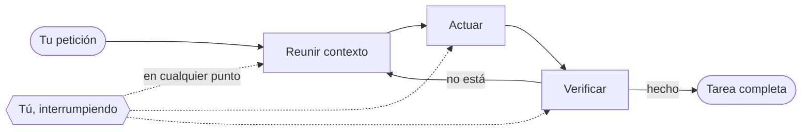

# M1 · Qué es Claude Code y cómo funciona por dentro

> **Para quién es:** todo el mundo, y es el único módulo que no se puede saltar nadie.
> **Qué resuelve:** el modelo mental. Por qué hace lo que hace, y por qué a veces no lo hace.
> **Qué NO cubre:** ni una línea de configuración. Eso empieza en el M2.

*Verificado contra Claude Code 2.1.228 el 12 de agosto de 2026.*

---

## 1.1 · El bucle agéntico

Claude Code no es un chat que además escribe archivos. Es un **arnés agéntico**
alrededor de un modelo: le da herramientas, gestión de contexto y un entorno donde
ejecutar. Eso es lo que convierte un modelo de lenguaje en algo que trabaja.

El bucle tiene tres fases que se mezclan entre sí: **reunir contexto**, **actuar**
y **verificar**. Claude usa herramientas en las tres, ya sea buscando archivos
para entender el código, editando para cambiarlo o lanzando los tests para
comprobar su propio trabajo.

El bucle **se adapta a lo que pides**. Una pregunta sobre el código puede
resolverse solo con la primera fase. Un bug pasa por las tres varias veces. Una
refactorización se va casi entera en verificar. Claude decide qué requiere cada
paso a partir de lo que aprendió en el anterior, encadena decenas de acciones y
corrige el rumbo por el camino.

**Tú también estás en el bucle.** Puedes interrumpir en cualquier punto para
llevarlo a otro sitio, darle más contexto o pedirle otro enfoque. Trabaja solo,
pero no trabaja sordo.

💡 **Opinión operativa.** La consecuencia práctica de que el bucle sea adaptativo
es que **la calidad de la fase de verificación la pones tú**. Si el repositorio no
tiene nada contra lo que verificar (tests, un linter, un esquema), el bucle se
queda en dos fases y lo que sale es plausible en vez de correcto. Es la diferencia
más grande entre un proyecto donde esto funciona y uno donde no, y no depende del
modelo.

---

## 1.2 · Qué puede tocar

Cuando ejecutas `claude` en un directorio, el agente accede a:

| Acceso | Alcance |
|---|---|
| Tu proyecto | Archivos del directorio y subdirectorios. Fuera de ahí, solo con permiso |
| Tu terminal | Cualquier comando que pudieras ejecutar tú: build, git, gestores de paquetes, scripts |
| Tu estado de git | Rama actual, cambios sin confirmar e historial reciente |
| Tu `CLAUDE.md` | Instrucciones y convenciones del proyecto, cargadas en cada sesión |
| Auto memory | Lo que aprende solo. Se cargan **las primeras 200 líneas o 25 KB** de `MEMORY.md`, lo que llegue antes |
| Extensiones | Servidores MCP, skills, subagentes y Claude en Chrome |

La frase que importa de esa tabla es la segunda: **cualquier comando que pudieras
ejecutar tú**. No es una integración con permisos recortados, es tu propia cuenta.
Todo el M5 existe por esa línea.

Y como ve el proyecto entero, trabaja a lo ancho: para "arregla el bug de
autenticación" busca los archivos, lee varios para entender el contexto, hace
ediciones coordinadas entre ellos, lanza los tests y confirma los cambios si se lo
pides. Es otra categoría de herramienta que un asistente en línea que solo ve el
archivo abierto.

---

## 1.3 · Entornos de ejecución frente a interfaces

Dos ejes que se confunden constantemente, y confundirlos hace perder tardes:

- **Dónde se ejecuta**: tu máquina, un contenedor, un entorno cloud, un runner
  self-hosted dentro de tu red.
- **Desde dónde lo pilotas**: terminal, VS Code, JetBrains, escritorio, web,
  móvil, Slack.

Son independientes. Puedes pilotar desde el móvil algo que corre en tu servidor.
La tabla de paridad completa, con qué falta en cada superficie, está en el M12.

---

## 1.4 · Sesiones

Una sesión es una conversación con su contexto. Se puede **reanudar**,
**bifurcar** y **nombrar**, y las transcripciones se guardan en disco, así que son
accesibles desde scripts.

Lo que conviene interiorizar ya: **una sesión larga no es gratis**. Cada turno
arrastra los anteriores, y esa es la razón número uno de las facturas que
sorprenden. Los números medidos están en el M15.

---

## 1.5 · La ventana de contexto

En la ventana caben el historial de la conversación, el contenido de los archivos
leídos, la salida de los comandos, el `CLAUDE.md`, la auto memory, las skills
cargadas y las instrucciones del sistema.

Este es el reparto de una sesión de ejemplo de la documentación oficial, y merece
mirarse con calma porque desmonta un par de creencias:

| Componente | Tokens (ejemplo oficial) |
|---|---:|
| System prompt | 4.200 |
| `CLAUDE.md` del proyecto | 1.800 |
| Auto memory | 680 |
| Descripciones de skills | 450 |
| `~/.claude/CLAUDE.md` | 320 |
| Información del entorno | 280 |
| **Herramientas MCP (diferidas)** | **120** |
| Tu prompt | 45 |

⚠️ **Esto corrige un error que circula mucho, y que este mismo proyecto tenía
publicado.** Las definiciones de herramientas MCP **están diferidas por defecto**:
solo se cargan los **nombres**, para que Claude sepa qué hay disponible, y los
esquemas completos se traen bajo demanda mediante *tool search* cuando la tarea lo
necesita. No es un peaje permanente proporcional al número de servidores, salvo
que tú lo conviertas en uno:

- `ENABLE_TOOL_SEARCH=auto` carga los esquemas por adelantado **si caben en el 10 %
  de la ventana**.
- `ENABLE_TOOL_SEARCH=false` carga todo, siempre. Aquí sí vuelve el peaje.

Verificable en `/docs/en/mcp#scale-with-mcp-tool-search`. Ejecuta `/mcp` para ver
el coste por servidor y `/context` para ver el reparto real de tu sesión.

**Los subagentes son la otra pieza que la tabla explica.** En ese mismo ejemplo,
todo lo que hace un subagente (su system prompt, su copia del `CLAUDE.md`, sus
herramientas, sus lecturas) computa **cero** en la sesión principal. Lo único que
vuelve es el resumen, 420 tokens. Eso es aislamiento de contexto, y es la razón
por la que el M9 existe.

### Cuando el contexto se llena

Claude Code lo gestiona solo: primero descarta salidas de herramientas antiguas y
después resume la conversación. **Se conservan tus peticiones y los fragmentos de
código clave; las instrucciones detalladas del principio se pueden perder.** De
ahí la regla que gobierna el M4 entero: lo que tiene que sobrevivir va en
`CLAUDE.md`, no en el historial.

Para dirigir qué se conserva, añade una sección *Compact Instructions* al
`CLAUDE.md` o lanza `/compact` con un foco, por ejemplo `/compact céntrate en los
cambios de la API`.

Caso de fallo documentado: si un solo archivo o salida es tan grande que el
contexto se vuelve a llenar justo después de cada resumen, Claude Code deja de
auto-compactar tras unos intentos y muestra un error en vez de entrar en bucle.

---

## 1.6 · Checkpoints

**Las ediciones de archivos son reversibles.** Antes de editar, Claude guarda una
instantánea del contenido. Con `Esc` dos veces se rebobina a un estado anterior, o
se le pide que deshaga.

Tres límites que hay que saber antes de confiarse:

1. Los checkpoints **son independientes de git** y siguen disponibles al reanudar.
2. **Solo cubren cambios en archivos.** Al restaurar se saltan los enlaces
   simbólicos y los enlaces duros.
3. **Lo que toca sistemas remotos no se puede rebobinar**: bases de datos, APIs,
   despliegues. Por eso Claude pregunta antes de ejecutar comandos con efectos
   externos, y por eso ese permiso no se concede a la ligera.

---

## Checklist de verificación

- [ ] Sé decir en qué fase del bucle está fallando cuando algo sale mal.
- [ ] He ejecutado `/context` en un proyecto real y he mirado el reparto.
- [ ] Sé cuánto ocupa mi `CLAUDE.md` y si eso es proporcionado.
- [ ] He comprobado con `/mcp` el coste de mis servidores, sabiendo que por
      defecto van diferidos.
- [ ] He rebobinado con `Esc` `Esc` al menos una vez, a propósito, para saber
      cómo se siente.
- [ ] Tengo claro qué acciones de mi trabajo **no** son reversibles.

## Errores típicos

| Síntoma | Qué está pasando de verdad |
|---|---|
| "Se le olvida lo que le dije al principio" | Compactó. Esa instrucción tenía que estar en `CLAUDE.md`, no en el chat |
| "Desconecto los MCP para ahorrar contexto" | Por defecto solo pesan los nombres. Mide con `/mcp` antes de amputar |
| "Deshice con `Esc` `Esc` y la base de datos seguía modificada" | Los checkpoints solo cubren archivos. Nunca sistemas remotos |
| "Da respuestas plausibles pero incorrectas" | No hay contra qué verificar. El bucle se quedó en dos fases |
| "El resumen automático se repite sin avanzar" | Un archivo o salida gigante. Es el error de *thrashing*, está documentado |

---

## Fuentes usadas en este módulo

Descargadas el 12 de agosto de 2026 desde `code.claude.com/docs/en/`:

| Página | Bytes | Para qué |
|---|---:|---|
| `how-claude-code-works.md` | 20.582 | Bucle, accesos, entornos, sesiones, checkpoints |
| `context-window.md` | 58.687 | Reparto del contexto, MCP diferido, compactación |
| `sessions.md` | 24.950 | Reanudar, bifurcar, nombrar, transcripciones |
| `overview.md` | 16.422 | Encuadre general |
| `features-overview.md` | 31.711 | Encuadre general |
| `quickstart.md` | 13.117 | Encuadre general |

**Marcas pendientes:** ninguna `⚠️ VERIFICAR` abierta en este módulo. La única
marca de aviso corrige material propio y ya está resuelta contra la documentación.
