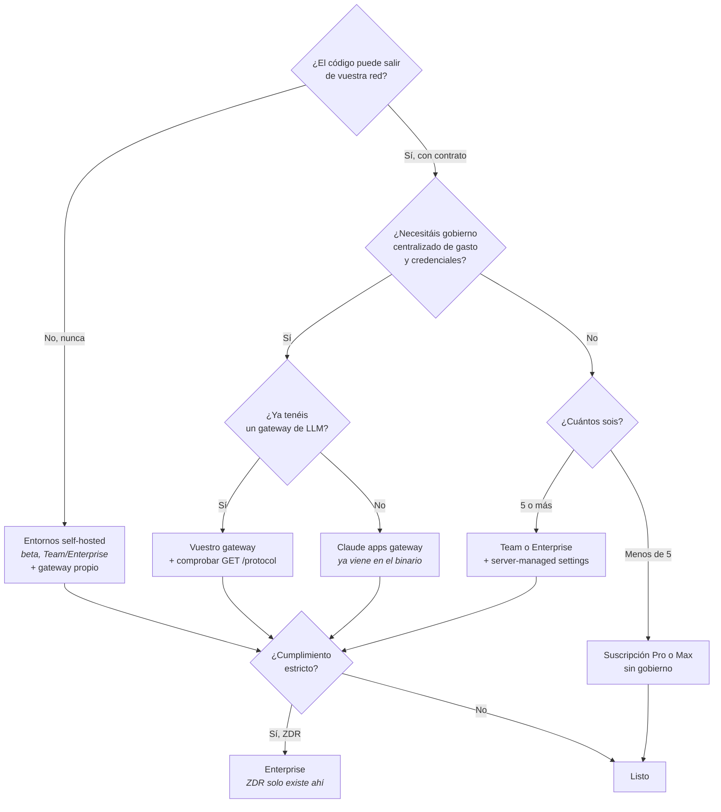

# M14 · Despliegue empresarial

> **Para quién es:** [C]. Este es su módulo, y el más largo de la guía.
> **Qué resuelve:** qué arquitectura elegir, y qué pierdes con cada una.
> **Qué NO cubre:** la política de datos y el RGPD en detalle (M16), aunque aquí se decide dónde acaban los datos.

*Verificado contra Claude Code 2.1.228 el 12 de agosto de 2026.*

---

## 14.1 · La pregunta que va primero

Casi todo el mundo empieza por "¿qué proveedor de modelo usamos?". Es la segunda
pregunta. La primera es:

> **¿Qué funciones estás dispuesto a perder?**

Porque una parte grande de Claude Code **no es el modelo**: es la suscripción. Y
esas funciones **no son alcanzables con una clave de API de la consola ni desde un
proveedor externo**. La lista es larga y conviene leerla despacio antes de decidir
nada:

Claude Code en la web, en móvil y en Slack · Claude Code Desktop · Routines
(`/schedule`) · **Ultrareview** · **Code Review** (Team y Enterprise) · Remote
Control · extensión de Chrome · computer use · **Artifacts** · dictado por voz.

Desktop es la excepción parcial: su enrutado por gateway se puede configurar en la
aplicación o por un administrador.

💡 **Opinión operativa.** Esta lista, y no el precio por token, es lo que decide la
arquitectura en la mayoría de los equipos que he visto. Un CTO que se lleva su
tráfico a Bedrock por cumplimiento y descubre tres meses después que su gente ha
perdido la revisión de código y el trabajo desde el móvil ha tomado una decisión
correcta con información incompleta. **Enséñale esta lista antes, no después.**

---

## 14.2 · Tabla 2 · Disponibilidad por plan y por proveedor

### Por plan de suscripción

| Función | Pro | Max | Team | Enterprise |
|---|:--:|:--:|:--:|:--:|
| Claude Code en la web | ✓ | ✓ | ✓ | ✓ |
| Routines | ✓ | ✓ | ✓ | ✓ |
| Remote Control | ✓ | ✓ | Lo activa el admin | Lo activa el admin |
| Channels | ✓ | ✓ | Lo activa el admin | Lo activa el admin |
| Computer use | ✓ | ✓ | ✗ | ✗ |
| Dispatch (Desktop) | ✓ | ✓ | ✗ | ✗ |
| **Code Review** | ✗ | ✗ | ✓ | ✓ |
| Artifacts | ✓ | ✓ | ✓ | Lo activa el admin |
| Panel de analítica | ✗ | ✗ | ✓ | ✓ |
| API de analítica Enterprise | ✗ | ✗ | ✗ | ✓ |
| **Server-managed settings** | ✗ | ✗ | ✓ | ✓ |
| SSO | ✗ | ✗ | ✓ | ✓ |
| SCIM | ✗ | ✗ | ✗ | ✓ |
| API de cumplimiento | ✗ | ✗ | ✗ | ✓ |
| **Zero Data Retention** | ✗ | ✗ | ✗ | ✓ |

Fíjate en las dos inversiones: **Code Review no existe en Pro ni en Max**, y
**computer use y dispatch no existen en Team ni en Enterprise**. No es una escalera
lineal donde el plan caro incluye todo lo del barato.

### Por proveedor

En **Amazon Bedrock, Agent Platform de Google, Microsoft Foundry y Claude Platform
on AWS**, el reporte de errores y la telemetría hacia Anthropic **están apagados
por defecto**.

Lo que **no** está disponible en Amazon Bedrock, además de todo lo que requiere
suscripción: **búsqueda web, fast mode, Advisor, Channels, mensajería entre
sesiones, panel de analítica, server-managed settings**, y los comandos
`/design-sync`, `/import` y `/radio`. Con soporte parcial: Desktop solo vía
Claude Desktop de terceros, **auto mode solo en Sonnet 5, Opus 4.7 o posterior y
Fable 5**, y `/loop` solo con intervalos explícitos.

Y del M8: **tool search no está soportado en despliegues de Microsoft Foundry
alojados en Azure**, que lo rechazan en el servidor.

---

## 14.3 · Gateways: el que ya tienes dentro

Un gateway es un proxy que tu organización pone entre Claude Code y el proveedor.
Claude Code manda el tráfico al gateway, y el gateway lo reenvía con una
credencial que tiene tu organización. **Los desarrolladores se autentican contra
el gateway en vez de tener credenciales del proveedor**, así que autenticación,
seguimiento de uso, presupuestos y auditoría ocurren **en un solo sitio que
controlas**.

⚠️ **Y el dato que casi nadie sabe:** Claude Code **incluye un gateway
autoalojado, Claude apps gateway, dentro del propio binario `claude`**. No hace
falta adoptar un producto de gateway aparte para tener uno. Si tu organización ya
opera un gateway de LLM, también funciona con ese.

Eso cambia la conversación: montar control de credenciales y de gasto deja de ser
un proyecto de plataforma y pasa a ser una decisión de configuración.

---

## 14.4 · El protocolo, y qué se degrada si tu gateway no colabora

Esta es la sección que evita el 90 % de los problemas de una arquitectura con
gateway, y la que más nos toca por lo que vimos en el M8.

El contrato entre Claude Code y un gateway documenta **los endpoints que llama,
las cabeceras y campos del cuerpo que el gateway debe reenviar, y qué funciones
dejan de funcionar cuando no los reenvía**.

Y trae un regalo para quien opera: **un Claude apps gateway en marcha sirve una
versión legible por máquina de ese contrato en `GET /protocol`**, incluyendo sus
propios endpoints de inicio de sesión SSO, entrega de settings gestionados y
telemetría. Como corre desde el mismo binario que el CLI, levantar una instancia
y descargarse la especificación es el camino más corto para saber qué tiene que
cumplir tu gateway actual.

**El caso concreto que ya nos ha mordido:** si tu gateway no reenvía los bloques
`tool_reference`, **tool search se desactiva** y MCP vuelve a ser un peaje
permanente en cada turno. Claude Code lo desactiva solo, de forma preventiva,
cuando `ANTHROPIC_BASE_URL` apunta a un host que no es de primera parte. Comprueba
el protocolo **antes** de forzar `ENABLE_TOOL_SEARCH`.

Además, el contrato incluye **cabeceras de atribución para seguimiento de coste** y
**descubrimiento de modelos**. Si quieres saber quién gasta qué, eso viaja por ahí.

---

## 14.5 · Gobierno de la configuración

Del M3, con lo que aquí importa:

- **Server-managed settings** frente a los gestionados por endpoint (plist,
  registro, `managed-settings.json`). **No se fusionan entre sí**, salvo las lock
  keys y el bloque `env`. Elige una fuente.
- **`policyHelper`** preempta a todo lo demás dentro del nivel gestionado.
- **`forceRemoteSettingsRefresh: true`** para arranque a prueba de fallos: bloquea
  hasta tener settings frescos y **sale si la descarga falla**. Se autoperpetúa.
- **`requiredMinimumVersion` falla abierto por diseño**, para que una política mal
  empujada no impida arrancar.
- Los settings gestionados **toleran** entradas inválidas retirándolas; los de
  usuario, proyecto y local **rechazan el archivo entero**.

Y recuerda que **server-managed settings requiere Team o Enterprise**, y **no está
disponible en Bedrock**. Si tu arquitectura combina Bedrock con gobierno
centralizado, ahí tienes un conflicto que resolver de antemano.

---

## 14.6 · La red corporativa

Tres piezas, y la tercera tiene una trampa excelente:

**Configuración de red.** Proxies corporativos, CA propia y mTLS están
documentados. Es la parte previsible.

**Devcontainers.** Del M5: entorno de desarrollo completo aislado, con Docker.

**Lanzador corporativo, y la trampa.** Algunas organizaciones exigen que todo
proceso arranque a través de un lanzador obligatorio que aplica el sandbox, los
controles de red o la inyección de credenciales. `CLAUDE_CODE_PROCESS_WRAPPER`
hace que **todos los procesos que Claude Code lanza desde su propio binario** pasen
por tu lanzador: el servicio en segundo plano, cada sesión de agent view, y los
relanzamientos tras una actualización. Requiere **v2.1.208 o posterior**; las
versiones anteriores **ignoran la variable y arrancan todo sin envolver**.

⚠️ Y aquí está lo que hay que subrayar en rojo:

> **Un lanzador que envuelve el comando `claude` de tu `PATH` no puede alcanzar
> esos procesos**, porque arrancan desde la ruta directa del binario sin consultar
> el `PATH`.

Es decir: una organización puede creer que tiene todo envuelto por su lanzador y
tener el servicio en segundo plano y las sesiones de agent view corriendo fuera de
la política. Si tienes lanzador obligatorio, **esa variable no es opcional**.

---

## 14.7 · Dónde corren las sesiones

| Opción | Dónde ejecuta | Requisitos |
|---|---|---|
| Local | La máquina del desarrollador | Ninguno |
| Devcontainer o contenedor | La máquina, aislado | Docker |
| **Cloud environments** | Infraestructura de Anthropic | Suscripción |
| **Self-hosted environments** | **Tu red** | **Beta pública, Team y Enterprise, apagado por defecto** |

Los **entornos self-hosted** son la novedad de la semana 32 y la respuesta a "no
puede salir de nuestra red". Una sesión cloud es cualquiera que corre en otro
sitio que la máquina del desarrollador: se arrancan desde claude.ai, desde las
apps de móvil y escritorio, desde `claude --cloud` y desde las routines
programadas, y **por defecto ejecutan en infraestructura de Anthropic**. Con un
entorno self-hosted, esas mismas sesiones **ejecutan dentro de tu red**, con acceso
a tus servicios internos, y la experiencia del desarrollador es por lo demás la
misma.

Se levanta con `claude self-hosted-runner setup`, y un propietario o admin tiene
que activar **Allow self-hosted environments** en la configuración de
administración primero.

Nota honesta: está en **beta pública** y **apagado por defecto**, y tiene su propia
lista de exclusiones y de problemas conocidos. Del changelog de 2.1.228 se
arreglaron dos fallos suyos, lo que da una idea de su madurez.

---

## 14.8 · El árbol de decisión de arquitectura

Tres avisos sobre el árbol, porque un diagrama siempre miente un poco:

1. **Cada rama que se aleja de la suscripción cuesta funciones**, y la lista está
   en el 14.1. Recórrela con el equipo antes de elegir.
2. **Zero Data Retention solo existe en Enterprise.** Si es un requisito, la rama
   está decidida antes de empezar.
3. **Un proveedor externo y un gateway son decisiones independientes.** Puedes
   tener gateway contra la API de Anthropic, o ir directo a Bedrock sin gateway.
   Se combinan.

---

## 14.9 · Lo que hay que dejar escrito antes de desplegar

Un despliegue empresarial no se termina cuando funciona, sino cuando está escrito.
El mínimo:

- **Qué proveedor y con qué contrato**, y qué tráfico sigue llegando a Anthropic
  aunque la telemetría esté apagada. Está documentado por proveedor.
- **Qué funciones habéis renunciado a tener**, firmado por quien decidió.
- **Cómo se rotan las credenciales**, con `apiKeyHelper` si aplica.
- **Qué versión mínima se exige**, sabiendo que falla abierto.
- **Si hay lanzador obligatorio**, con `CLAUDE_CODE_PROCESS_WRAPPER` puesto.
- **Quién puede activar entornos self-hosted** y quién los opera.
- La política interna de uso de agentes del M16, que es el folio que firma alguien.

---

## Checklist de verificación

- [ ] He enseñado al equipo la lista de funciones que se pierden fuera de la suscripción.
- [ ] Sé que Code Review no existe en Pro ni en Max.
- [ ] Sé que server-managed settings no está en Bedrock.
- [ ] Si uso gateway, he comprobado su contrato contra `GET /protocol`.
- [ ] He verificado si mi gateway reenvía `tool_reference`.
- [ ] Uso **una sola** fuente de settings gestionados.
- [ ] Si hay lanzador obligatorio, tengo `CLAUDE_CODE_PROCESS_WRAPPER` (v2.1.208+).
- [ ] Sé que ZDR solo existe en Enterprise.
- [ ] Tengo escrito qué tráfico sigue llegando a Anthropic.

## Errores típicos

| Síntoma | Qué está pasando |
|---|---|
| "Nos fuimos a Bedrock y perdimos la revisión de código" | Requiere suscripción. Estaba en la lista del 14.1 |
| "No me funcionan los server-managed settings" | No están en Bedrock, y requieren Team o Enterprise |
| "Con el gateway se nos come el contexto" | No reenvía `tool_reference`. Mira `GET /protocol` |
| "Pedimos ZDR y no aparece" | Solo Enterprise |
| "Nuestro lanzador no envuelve el servicio en segundo plano" | Envuelve el `claude` del `PATH`. Usa `CLAUDE_CODE_PROCESS_WRAPPER` |
| "Puse la variable del lanzador y no hace nada" | Requiere v2.1.208+. Antes se ignora en silencio |
| "Los settings del plist se ignoran" | Los de servidor entregaron claves. Dentro de managed no se fusionan |
| "Auto mode no va en Bedrock" | Soporte parcial: solo Sonnet 5, Opus 4.7+ y Fable 5 |

---

## Fuentes usadas en este módulo

Descargadas el 12 de agosto de 2026 desde `code.claude.com/docs/en/`:

| Página | Bytes | Para qué |
|---|---:|---|
| `feature-availability.md` | 23.493 | Tabla 2 completa, por plan y por proveedor |
| `gateways.md` | 8.811 | Arquitectura, el gateway dentro del binario |
| `llm-gateway-protocol.md` | 30.442 | Contrato, `GET /protocol`, degradación |
| `claude-apps-gateway.md` | 53.813 | Gateway propio de Anthropic |
| `llm-gateway.md` | 6.166 | Gateway de terceros |
| `self-hosted-environments.md` | 17.596 | Beta, activación, alcance |
| `corporate-launcher.md` | 13.425 | `CLAUDE_CODE_PROCESS_WRAPPER` y su trampa |
| `network-config.md` | 28.322 | Proxies, CA propia, mTLS |
| `amazon-bedrock.md` | 39.296 | Bedrock |
| `google-vertex-ai.md` | 20.207 | Agent Platform de Google |
| `microsoft-foundry.md` | 10.396 | Foundry |
| `third-party-integrations.md` | 13.300 | Panorama de proveedores |
| `server-managed-settings.md` | 32.770 | Precedencia y fail-closed |

**Marcas pendientes:** las páginas de detalle de `claude-apps-gateway`
(configuración, límites de gasto, despliegue, AWS y GCP) y de
`self-hosted-environments` (quickstart, deploy, configuración, pruebas,
referencia, identidad) están inventariadas y **no leídas en profundidad** en esta
pasada. Son 11 páginas de detalle operativo que alimentan el playbook 20.4, no
afirmaciones de este módulo.
