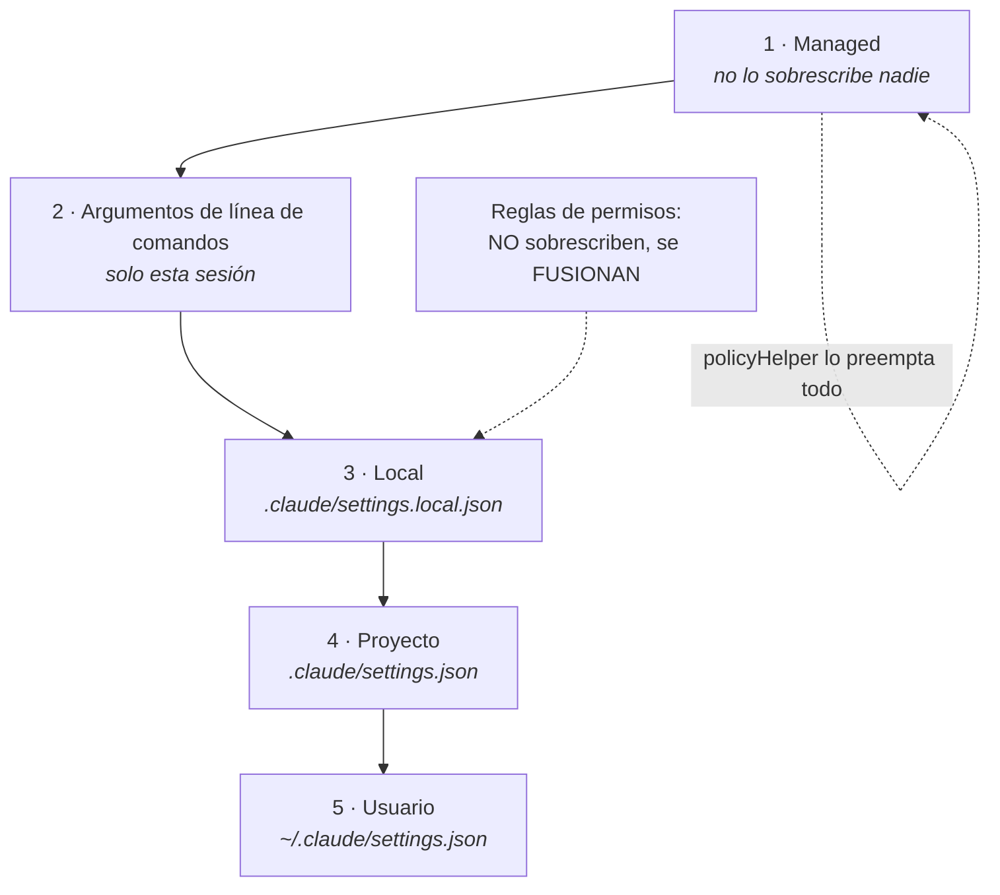

# M3 · El directorio `.claude/` y el sistema de configuración

> **Para quién es:** quien configura para otros, y quien lleva media hora peleándose con un ajuste que no se aplica.
> **Qué resuelve:** el "no me hace caso". Casi siempre es un problema de capas, no de sintaxis.
> **Qué NO cubre:** memoria y `CLAUDE.md` (M4), ni permisos en detalle (M5). Aquí solo va **dónde** vive cada cosa y **quién gana**.

*Verificado contra Claude Code 2.1.228 el 12 de agosto de 2026.*

---

## 3.1 · Dónde vive cada cosa

Lo primero que hay que interiorizar: no hay un archivo de configuración, hay
**cuatro ámbitos** y cada característica se coloca en el suyo.

| Característica | Usuario | Proyecto | Local |
|---|---|---|---|
| Settings | `~/.claude/settings.json` | `.claude/settings.json` | `.claude/settings.local.json` |
| Subagentes | `~/.claude/agents/` | `.claude/agents/` | no existe |
| Servidores MCP | `~/.claude.json` | `.mcp.json` | `~/.claude.json` (por proyecto) |
| Plugins | `~/.claude/settings.json` | `.claude/settings.json` | `.claude/settings.local.json` |
| `CLAUDE.md` | `~/.claude/CLAUDE.md` | `CLAUDE.md` o `.claude/CLAUDE.md` | `CLAUDE.local.md` |

En Windows, `~/.claude` se resuelve a `%USERPROFILE%\.claude`.

Fíjate en la fila de MCP, que es la que más despista: los servidores de usuario
**no** van en `~/.claude/settings.json` sino en `~/.claude.json`, que es otro
archivo. Buscar servidores MCP en el settings de usuario es una tarde perdida.

Y los **subagentes no tienen ámbito local**. O son tuyos para todo, o son del
repositorio y por tanto de todo el equipo. No hay término medio.

---

## 3.2 · Los cuatro ámbitos y quién gana

### Tabla 3 · Precedencia de settings

| Ámbito | Dónde | A quién afecta | ¿Va a git? |
|---|---|---|---|
| **Managed** | Servidor, plist/registro, o `managed-settings.json` del sistema | Toda la organización, o todos los usuarios de la máquina | Lo despliega sistemas |
| **Usuario** | `~/.claude/` | Tú, en todos tus proyectos | No |
| **Proyecto** | `.claude/` del repositorio | Todos los colaboradores | Sí, se confirma en git |
| **Local** | `.claude/settings.local.json` | Tú, solo en este repositorio | No, se ignora en git |

### La precedencia exacta



De arriba abajo: **managed** gana siempre, después los **argumentos de línea de
comandos**, luego **local**, luego **proyecto**, y **usuario** solo se aplica
cuando nadie más ha dicho nada.

Ejemplo de conflicto resuelto, para que quede sin ambigüedad: tu configuración de
usuario pone `spinnerTipsEnabled` en `true` y la del proyecto lo pone en `false`.
**Gana el proyecto**, porque está más cerca. Si además tu `settings.local.json` lo
pusiera en `true`, ganaría el local. Y si managed lo fija, no gana ninguno de los
tres.

### Las tres excepciones que hay que saber

**1. Las reglas de permisos no sobrescriben: se fusionan.** Esta es la que más
sorpresas da. Si esperas que tu `allow` local sustituya al del proyecto, no pasa
eso: se suman. Y unos pocos ajustes sensibles a seguridad **honran el valor más
restrictivo** aunque venga de un ámbito que normalmente no podría imponerse.

**2. `policyHelper` preempta a todo lo demás dentro del nivel managed**, incluidos
los settings servidos desde el servidor: su salida pasa a ser la única
configuración gestionada de esa ejecución.

**3. Dentro de managed, las fuentes no se fusionan.** Se usa la primera que
entregue una configuración no vacía: primero los settings de servidor, después los
de endpoint (plist, registro). Si los de servidor entregan **cualquier** clave,
los de endpoint se ignoran enteros. Con dos excepciones por clave: las *cross-source
lock keys* (como los candados de la lista blanca del sandbox) y el bloque `env`,
que sí se fusiona variable a variable, donde la fuente de mayor prioridad que la
defina gana y las inferiores rellenan lo que quede sin fijar. `env` fusionado
requiere **v2.1.223 o posterior**.

💡 **Opinión operativa.** Si vas a desplegar para una flota, la regla práctica es
no mezclar fuentes managed. Elige una y deja la otra vacía. La combinación de "no
se fusionan salvo dos excepciones" con "los settings cacheados persisten hasta el
siguiente fetch correcto" produce diagnósticos imposibles. `/status` te dice qué
fuente managed está activa; úsalo antes de teorizar.

### Arranque a prueba de fallos

Por defecto, si la descarga de settings remotos falla al arrancar, el CLI
**continúa sin ellos**. Hay una ventana breve sin política aplicada. Si eso no es
aceptable, `forceRemoteSettingsRefresh: true` hace que el CLI bloquee al arrancar
hasta tener settings frescos, y **salga** si la descarga falla.

Dos detalles que importan: se **autoperpetúa**, porque una vez servido se cachea
localmente y las siguientes arrancadas aplican el mismo comportamiento; y desde
**v2.1.191** es una excepción a la regla de precedencia, así que se honra puesto
en cualquier fuente managed administrada.

Contraste deliberado: `requiredMinimumVersion` y `requiredMaximumVersion`
**fallan abiertos por diseño**. Un valor inválido se descarta en vez de aplicarse,
para que una política mal empujada no pueda impedir que Claude Code arranque.

### Tolerancia a errores, que no es igual en todas partes

- **Managed** es tolerante: una entrada inválida se retira o se degrada, y el
  resto se sigue aplicando. Los ajustes de credenciales del sandbox se degradan a
  `mode: "deny"` con aviso, para que la credencial quede **bloqueada, no
  enmascarada**, hasta que arregles la entrada.
- **Usuario, proyecto y local son estrictos**: un archivo que no valida se
  **rechaza entero** y se reporta.

Los errores de validación aparecen en tres sitios: un diálogo al arrancar en
sesiones interactivas, un resumen por `stderr` en ejecuciones con `-p`, y en
`claude doctor` con su origen y su campo.

---

## 3.3 · Settings de worktree

Controlan cómo `--worktree` crea y gestiona los árboles de trabajo de git.

| Clave | Qué hace |
|---|---|
| `worktree.baseRef` | `"fresh"` (por defecto) ramifica desde `origin/<rama-por-defecto>`, árbol limpio igual que el remoto. `"head"` ramifica desde tu `HEAD` local, así que arrastra commits sin publicar |
| `worktree.symlinkDirectories` | Directorios que se enlazan desde el repositorio principal para no duplicarlos en disco. Ninguno por defecto |
| `worktree.sparsePaths` | Solo esos directorios y los archivos de raíz se escriben en disco. Es lo que hace viable un monorepo grande |
| `worktree.bgIsolation` | `"worktree"` (por defecto) bloquea `Edit` y `Write` en el checkout principal hasta llamar a `EnterWorktree`. `"none"` deja que los trabajos en segundo plano editen la copia de trabajo directamente. Requiere v2.1.143+ |

`worktree.symlinkDirectories` con `["node_modules", ".cache"]` es de las cosas que
más tiempo ahorran y casi nadie configura.

---

## 3.4 · Ver los settings que de verdad se están aplicando

Tres comandos, y conviene saber cuál hace qué:

- **`/status`**: qué fuentes de settings están activas, incluida cuál managed.
- **`/doctor`**: revisa configuración e instalación, reporta settings inválidos,
  instalaciones duplicadas, extensiones sin usar y contenido de `CLAUDE.md` que
  Claude podría deducir solo del código, y **propone arreglos que aplica solo si
  confirmas**. La revisión de recorte del `CLAUDE.md` requiere **v2.1.206 o
  posterior**.
- **`claude doctor`** desde la terminal: diagnóstico de solo lectura, sin abrir
  sesión.

⚠️ **Trampa de tutoriales viejos.** Antes de la v2.1.205, `/doctor` abría una
pantalla de diagnóstico de solo lectura y se pulsaba `f` para mandarle el informe
a Claude. Ya no funciona así.

---

## 3.5 · Depurar la configuración

El procedimiento, en el orden que ahorra tiempo:

1. **Mira qué se ha cargado en contexto**, antes de tocar nada.
2. **`/status`** para saber qué fuentes mandan.
3. **`/doctor`** para los errores de validación con su origen.
4. **Arranca contra una configuración limpia** para separar tu culpa de la del
   programa. Si en limpio no pasa, el problema es tuyo y está en una de tus capas.

Cuando un ajuste no parece aplicarse, la causa casi siempre es que **otro ámbito o
una variable de entorno lo están sobrescribiendo**. Las variables de entorno son
una capa de override más, y es la que la gente olvida.

---

## 3.6 · Excluir archivos sensibles

Se hace con reglas `deny` en los permisos, y es la configuración más rentable del
repositorio entero:

```json
{
  "permissions": {
    "deny": [
      "Read(./.env)",
      "Read(./.env.*)",
      "Read(./secrets/**)",
      "Bash(curl *)"
    ]
  }
}
```

Recuerda la excepción de 3.2: **las reglas de permisos se fusionan entre ámbitos**.
Un `deny` puesto en el proyecto no lo puede quitar nadie con su configuración
local, y esa es exactamente la propiedad que quieres.

Dos ajustes con blindaje propio que conviene conocer aquí:

- **`autoMode`** solo se lee de la configuración de usuario, del flag `--settings`
  y de managed. **Se ignora en el `.claude/settings.json` del proyecto y en el
  local.** Es decir: un repositorio clonado no puede relajarte el clasificador.
- **`autoMemoryDirectory`** puesto desde proyecto o local solo se honra **después
  de que aceptes el diálogo de confianza del espacio de trabajo**, porque un
  repositorio clonado podría traer ese archivo.

Los dos son el mismo patrón, y es un patrón que merece la pena reconocer: **lo que
un repositorio ajeno podría usar para bajarte las defensas, no se lee del
repositorio**.

---

## Checklist de verificación

- [ ] Sé decir de memoria el orden: managed, línea de comandos, local, proyecto, usuario.
- [ ] Sé que las reglas de permisos se fusionan y no se sobrescriben.
- [ ] He ejecutado `/status` y sé qué fuentes mandan en mi máquina.
- [ ] He ejecutado `claude doctor` y no tengo entradas inválidas.
- [ ] Mi `.claude/settings.json` está en git y mi `settings.local.json` no.
- [ ] Tengo reglas `deny` para `.env` y secretos, puestas en el **proyecto**.
- [ ] Si despliego para una flota, uso **una sola** fuente managed.

## Errores típicos

| Síntoma | Qué está pasando |
|---|---|
| "Mi ajuste no se aplica" | Otro ámbito o una variable de entorno lo sobrescriben. `/status` primero |
| "Mi `allow` local no sustituye al del proyecto" | Los permisos se fusionan, no se sobrescriben. Es por diseño |
| "No encuentro mis servidores MCP en settings.json" | Están en `~/.claude.json`, otro archivo |
| "Cambié la política en el servidor y no llega" | Los settings cacheados persisten hasta el siguiente fetch correcto |
| "Puse los settings de servidor y los del plist se ignoran" | Correcto: dentro de managed no se fusionan, salvo `env` y las lock keys |
| "Mi settings.json entero dejó de aplicarse" | Usuario, proyecto y local son estrictos: si no valida, se rechaza completo |
| "Pulso `f` en `/doctor` y no pasa nada" | Eso era anterior a v2.1.205 |

---

## Fuentes usadas en este módulo

Descargadas el 12 de agosto de 2026 desde `code.claude.com/docs/en/`:

| Página | Bytes | Para qué |
|---|---:|---|
| `settings.md` | 285.543 | Ámbitos, precedencia, worktree, deny, autoMode |
| `claude-directory.md` | 90.641 | Mapa del directorio |
| `server-managed-settings.md` | 32.770 | Precedencia managed, excepciones por clave, fail-closed |
| `debug-your-config.md` | 23.449 | `/status`, `/doctor`, configuración limpia |

**Marcas pendientes:** ninguna `⚠️ VERIFICAR` abierta. La marca de aviso del 3.4
señala una trampa de tutoriales viejos, no una duda.
