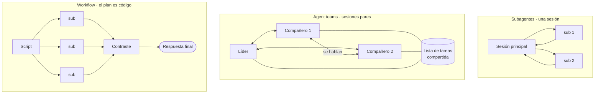

# M9 · Paralelismo y agentes

> **Para quién es:** [C], y quien ya nota que una sola sesión se le queda corta.
> **Qué resuelve:** la decisión que más dinero y más tiempo mueve de toda la guía.
> **Qué NO cubre:** hooks del ciclo de vida (M10) ni coste medido (M15).

*Verificado contra Claude Code 2.1.228 el 12 de agosto de 2026.*

---

## 9.1 · Cuatro formas de correr agentes, y tres cosas que no lo son

⚠️ **Reencuadre respecto al índice de la Fase 1.** Yo lo había planteado como
"siete formas de paralelizar". La taxonomía oficial es más limpia y más útil:
**cuatro formas de correr agentes**, y **tres herramientas de apoyo** que la gente
confunde con formas de paralelizar y no lo son.

Las cuatro formas:

- **Subagentes**: trabajadores delegados **dentro de una sesión**, que hacen una
  tarea lateral en su propio contexto y devuelven un resumen.
- **Agent view**: una pantalla para despachar y vigilar sesiones que corren en
  segundo plano, que se abre con `claude agents`. **Research preview.**
- **Agent teams**: varias sesiones coordinadas con una lista de tareas compartida
  y mensajería entre ellas, dirigidas por un líder. **Experimental y desactivado
  por defecto.**
- **Workflows dinámicos**: un **script** que corre muchos subagentes y contrasta
  sus resultados entre sí.

Las tres que no son formas de correr agentes:

- **Worktrees**: dan a cada sesión un checkout de git separado. Son el mecanismo
  de aislamiento, no de paralelismo.
- **Cross-session messaging**: deja que Claude liste y escriba a tus otras
  sesiones. Es un canal, no un orquestador.
- **`/batch`**: una **skill** que parte un cambio grande en **de 5 a 30 subagentes
  aislados en worktrees**, cada uno abriendo su propia pull request. Es un uso
  empaquetado de subagentes más worktrees, no un estilo de coordinación aparte.

Y una frase de la documentación que ahorra discusiones enteras:

> En todos los enfoques, los trabajadores son sesiones de Claude. Para meter una
> herramienta distinta, expónsela a Claude como un servidor MCP.

---

## 9.2 · La decisión

### Tabla 8 · Comparativa de formas de paralelizar

| | Subagentes | Skills | Agent teams | Workflows |
|---|---|---|---|---|
| **Qué es** | Un trabajador que Claude lanza | Instrucciones que Claude sigue | Un líder supervisando sesiones pares | Un script que ejecuta el runtime |
| **Quién decide lo siguiente** | Claude, turno a turno | Claude, siguiendo el prompt | El líder, turno a turno | El script |
| **Dónde viven los resultados intermedios** | En el contexto de Claude | En el contexto de Claude | En una lista de tareas compartida | En variables del script |
| **Qué es repetible** | La definición del trabajador | Las instrucciones | La definición del equipo | **La orquestación misma** |
| **Escala** | Unas pocas tareas por turno | Igual que subagentes | Un puñado de pares longevos | **Decenas o cientos por ejecución** |
| **Si interrumpes** | Reinicia el turno | Reinicia el turno | Los compañeros siguen | Reanudable en la misma sesión |

La fila que decide casi siempre es la primera: **quién sostiene el plan.**

> Un workflow **mueve el plan a código**. Con subagentes, skills y agent teams,
> Claude es el orquestador: decide turno a turno qué lanzar y cada resultado
> aterriza en una ventana de contexto. Un script de workflow se queda él con el
> bucle, las ramificaciones y los resultados intermedios, así que **el contexto de
> Claude solo guarda la respuesta final**.

Esa es la razón real por la que un workflow escala a cientos de agentes y unos
subagentes no: no es potencia, es dónde se acumula el resultado intermedio.

### Diagrama 3 · Topología



La diferencia visual entre los dos primeros es exacta y viene de la
documentación: **los subagentes solo reportan al agente principal y nunca hablan
entre ellos.** En un agent team, los compañeros comparten lista de tareas,
reclaman trabajo y se comunican directamente.

---

## 9.3 · Subagentes

Es el caso de uso más común y el que más contexto ahorra: **una tarea lateral que
inundaría tu conversación con resultados de búsqueda, registros o contenido de
archivos que no vas a volver a mirar**.

Del M1, con cifras oficiales: el system prompt del subagente, su copia del
`CLAUDE.md`, sus herramientas y todas sus lecturas computan **cero** en tu sesión.
Lo único que vuelve es el resumen.

### Límites de concurrencia

Hay **dos límites distintos**, con su propia variable cada uno, y conviene no
mezclarlos: el de **concurrencia** impide lanzar más mientras haya demasiados
corriendo, y el de **profundidad** limita cuánto pueden anidarse.

- Por defecto, con **20 subagentes corriendo** en una sesión, lanzar otro falla con
  `Concurrent subagent limit reached`, y **el error le dice a Claude que no
  reintente**. Vuelve a funcionar cuando bajan.
- Se cambia con `CLAUDE_CODE_MAX_CONCURRENT_SUBAGENTS`.
- Las sesiones con **ultracode** activo están **exentas**.
- Requiere **v2.1.217 o posterior**.
- **No hay límite del total** de subagentes que Claude puede lanzar a lo largo de
  una sesión.

⚠️ **Trampa de tutoriales viejos:** existía un tope de **200 subagentes por
sesión** y **se eliminó en la semana 32**. Si lees en algún sitio que las sesiones
largas dejan de aceptar subagentes, ya no es cierto: siguen aplicando la
concurrencia y la profundidad, no el total.

Detalle que despista al medir: un fork dentro de la sesión iniciado con
`/subtask` **ocupa una plaza** mientras corre.

---

## 9.4 · Agent view · *research preview*

Se abre con `claude agents`. Es una pantalla para **despachar tareas
independientes, ver el estado de un vistazo y entrar solo cuando alguna te
necesita**.

Dos propiedades que la hacen más segura de lo que parece:

- **Mueve cada sesión despachada a su propio worktree automáticamente.** No hay
  que acordarse.
- Desde la semana 32, las sesiones en segundo plano que cambiaron código en un
  worktree **confirman y publican antes de terminar**, abren una pull request en
  borrador solo cuando la tarea lo pide, y **siguen las instrucciones de git de tu
  `CLAUDE.md`**.

Ese último punto es de las mejores razones para tener escrito en el `CLAUDE.md`
cómo se hacen los commits en tu casa: no es cosmética, gobierna lo que hace un
agente que trabaja sin ti delante.

---

## 9.5 · Agent teams · *experimental, desactivado por defecto*

Varias sesiones coordinadas con **lista de tareas compartida** y mensajería
directa, bajo un líder. Se usa cuando quieres que Claude **parta un proyecto en
piezas, las asigne y mantenga a los trabajadores sincronizados**.

La documentación ofrece controles que conviene conocer antes de encenderlo: elegir
modo de visualización, especificar compañeros y modelos, **exigir aprobación del
plan a los compañeros**, hablar con un compañero directamente, asignar y reclamar
tareas, apagarlos, e **imponer puertas de calidad con hooks**.

💡 **Opinión operativa.** "Experimental y desactivado por defecto" hay que
tomárselo al pie de la letra: es la pieza más cara de las cuatro, porque son
sesiones completas y longevas, cada una con su propio contexto que crece. Antes de
encender un equipo, la pregunta honesta es si el trabajo **necesita que los
trabajadores hablen entre sí**. Si no la necesitan, subagentes o un workflow salen
mucho más baratos y se depuran mejor.

---

## 9.6 · Workflows dinámicos

Un script que corre muchos subagentes y **contrasta sus resultados entre sí**. Su
sitio es el trabajo que se le queda grande a un puñado de subagentes o que
necesita **más de una pasada**: una auditoría de todo el código, una migración de
500 archivos, investigación con verificación cruzada, o un plan redactado desde
varios ángulos y comparado.

Se pueden usar los que vienen incluidos, pedirle a Claude que escriba uno, dejar
que decida con **ultracode**, **aprobar el plan antes de que corra**, guardarlo
para reutilizarlo, **distribuirlo dentro de un plugin** y pasarle entrada.

Ese conjunto es lo que convierte un workflow en un activo de equipo: **lo
repetible no es el trabajador, es la orquestación**.

---

## 9.7 · Worktrees: las cuatro comprobaciones

Un worktree da a cada sesión un checkout de git separado, de forma que dos
sesiones en paralelo **nunca editan los mismos archivos**.

Mientras una sesión está aislada en un worktree, Claude Code aplica **cuatro
comprobaciones**, y las mismas reglas valen tanto si arrancaste con `--worktree`,
como si Claude entró con `EnterWorktree`, como si reanudaste una sesión de
worktree. **Cubren también a todos los subagentes** que se lancen desde ahí, en
interactivo y en segundo plano:

1. **Ediciones de archivo**: se bloquea `Edit`, `Write` o `NotebookEdit` que
   apunte a una ruta del checkout principal.
2. **Directorio de trabajo del comando**: se bloquea un comando de Bash,
   PowerShell o Monitor cuyo directorio de trabajo caiga en el checkout principal,
   **o cuyo directorio no se pueda verificar** que queda fuera.
3. **Redirecciones de git**: se bloquea el comando que redirige git al checkout
   principal, venga por `git -C`, `--git-dir`, las variables `GIT_DIR` o
   `GIT_WORK_TREE`, o un `cd` al principal antes de lanzar git.
4. **Forma del comando**: se bloquea el comando que no se puede verificar.

Fíjate en el patrón de las comprobaciones 2 y 4: **lo que no se puede verificar se
bloquea**. No es una lista negra de trucos conocidos, es una postura por defecto.
Es la diferencia entre un aislamiento que aguanta y uno decorativo, y explica por
qué en la semana 32 se amplió de "solo ediciones de archivo" a también Bash y
redirecciones de git.

---

## 9.8 · Mensajería entre sesiones

Requiere **v2.1.224 o posterior**, y está en **macOS y Linux**.

Cuando una de tus sesiones aprende algo que otra necesita, Claude se lo pasa en
vez de que copies y pegues entre terminales. **Descubre el destino con
`ListAgents` y envía con `SendMessage`, y tú no llamas nunca a ninguna de las
dos.** Puede decidir enviar un mensaje sin que se lo pidas, por ejemplo cuando un
cambio suyo afecta a lo que hace otra.

Tú escribes la intención, no el mensaje:

```text
Pregúntale a la sesión del otro terminal si terminó la migración
```

```text
Explícale a la sesión que lleva la API de pagos lo que acabamos de hacer
```

**Qué viaja exactamente:** texto que Claude escribe para la otra sesión. **Nunca
tu historial de conversación ni tus archivos.** Es la propiedad que hace esto
aceptable en un entorno con datos sensibles, y merece decirlo en voz alta cuando
alguien de seguridad pregunte.

La sesión receptora lee el mensaje **entre llamadas a herramientas** durante un
turno activo. `/list-agents` muestra a quién alcanza.

Desde **v2.1.225**, `SendMessage` además puede **iniciar** conversación con tus
sesiones de Remote Control en otras máquinas, llamándolas por nombre, en lugar de
solo responder cuando ellas escriben primero.

---

## 9.9 · Tres recorridos que sí valen la pena

**Revisión adversarial.** El autor no puede ser el revisor: comparte contexto y
comparte sesgo. Un subagente revisor con contrato propio, que no ha visto cómo se
llegó al código, encuentra lo que el principal ya dio por bueno. Es la aplicación
del 9.3 con el aislamiento como característica, no como coste.

**Hipótesis en competencia.** Ante un fallo con tres explicaciones posibles, se
lanza un subagente por hipótesis y **se comparan las conclusiones**. Lo que se
gana no es velocidad: es no enamorarse de la primera explicación.

**Fan-out sobre N archivos.** El mismo cambio en cien sitios es el caso canónico
de `/batch`, que reparte en 5 a 30 subagentes aislados en worktrees, cada uno con
su pull request. Si pasa de ahí, es un workflow.

---

## 9.10 · Qué cuesta y cómo se para

| Enfoque | Contexto | Coste | Cómo se para |
|---|---|---|---|
| Subagentes | Ventana aparte, solo vuelve el resumen | Tokens del subagente, invisibles en tu ventana | Interrumpir reinicia tu turno |
| Agent view | Sesión completa por tarea, en su worktree | Una sesión entera cada una | Desde la propia pantalla |
| Agent teams | Sesión completa y longeva por compañero | **El más caro de los cuatro** | Apagado explícito de compañeros |
| Workflows | Los intermedios viven en el script | Muchos subagentes, pero contexto principal mínimo | Reanudable en la misma sesión |

La regla de decisión, en una línea: **si el trabajo cabe en unas pocas tareas por
turno, subagentes; si son tareas independientes que quieres despachar, agent view;
si los trabajadores necesitan hablarse, agent teams; y si son decenas o cientos,
un workflow.**

---

## Checklist de verificación

- [ ] Sé quién sostiene el plan en cada uno de los cuatro enfoques.
- [ ] Sé que agent view es research preview y agent teams experimental.
- [ ] He comprobado si mi trabajo **necesita** que los trabajadores se hablen.
- [ ] Conozco mi límite de concurrencia y sé que no hay límite total por sesión.
- [ ] Mis sesiones en paralelo van en worktrees, no compartiendo checkout.
- [ ] Mi `CLAUDE.md` dice cómo se hacen los commits, porque gobierna el trabajo en segundo plano.
- [ ] Sé que la mensajería entre sesiones **no** manda historial ni archivos.

## Errores típicos

| Síntoma | Qué está pasando |
|---|---|
| "Mis subagentes no se coordinan entre sí" | Por diseño: solo reportan al principal. Si deben hablarse, es un equipo |
| "`Concurrent subagent limit reached`" | 20 corriendo. Sube `CLAUDE_CODE_MAX_CONCURRENT_SUBAGENTS` o espera |
| "Leí que hay un tope de 200 por sesión" | Se eliminó en la semana 32 |
| "El workflow me llena el contexto" | No debería: los intermedios viven en el script. Revisa qué devuelves |
| "Dos sesiones se pisan los archivos" | No están en worktrees |
| "Mi comando se bloquea en un worktree y no entiendo por qué" | Cuarta comprobación: lo que no se puede verificar, se bloquea |
| "La otra sesión no recibe nada" | Requiere v2.1.224+, macOS o Linux. Comprueba con `/list-agents` |
| "El equipo de agentes se ha comido el presupuesto" | Es el enfoque más caro: sesiones completas y longevas |

---

## Fuentes usadas en este módulo

Descargadas el 12 de agosto de 2026 desde `code.claude.com/docs/en/`:

| Página | Bytes | Para qué |
|---|---:|---|
| `agents.md` | 8.554 | La taxonomía oficial de los cuatro enfoques |
| `sub-agents.md` | 96.838 | Límites de concurrencia y profundidad |
| `agent-view.md` | 167.566 | Despacho, worktree automático, segundo plano |
| `agent-teams.md` | 35.119 | Comparación con subagentes, controles del equipo |
| `workflows.md` | 31.576 | Tabla 8, quién sostiene el plan |
| `worktrees.md` | 29.041 | Las cuatro comprobaciones de aislamiento |
| `cross-session-messaging.md` | 25.555 | Qué viaja y qué no |
| `whats-new/2026-w32.md` | 8.830 | Tope de 200 eliminado, commit y push en segundo plano |

**Marcas pendientes:** ninguna. El reencuadre del 9.1 corrige el índice de la
Fase 1, que hablaba de siete formas de paralelizar; el índice queda actualizado.
